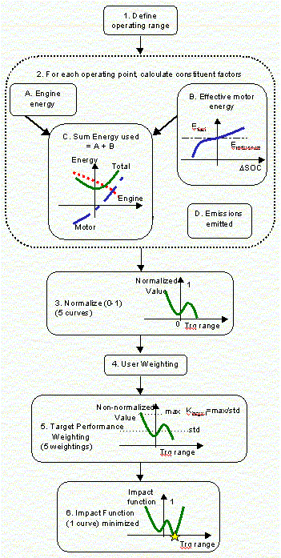
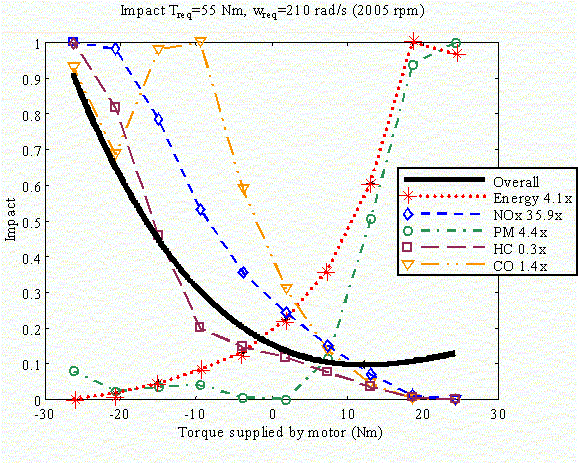

% Adaptive Control Strategy
% 
% 

### **Adaptive Control Strategy (previously named Real-Time Control Strategy)**

**<u>Role of subsystem in vehicle</u>** \
The Adaptive Control Strategy (ACS) for a parallel hybrid considers both
fuel economy and emissions in its choice of operating points.  ACS
attempts to optimize at each time step the torque distribution between
the electric motor and the engine

**<u>Description of modeling approach</u>** \
Over the valid range of operating torques, ACS normalizes five competing
metrics (energy use, HC, CO, NOx, and PM emissions) by using user- and
standards-based weightings of time-averaged fuel economy and emissions
performance determine an overall impact function.  The Adaptive Control
Strategy has the following characteristics:

-   The instantaneous efficiencies of the engine, exhaust removal,
    motor, and batteries are all included in the vehicle optimization.
-   The ACS adjusts its behavior based on driving conditions:  e.g.
    engine, motor and battery temperatures and amount of available
    regenerative braking.  The amount of ‘free regenerative energy’ is
    calculated as the vehicle drives.
-   There are user-definable fuel economy and emissions targets.
-   For each operating point (e.g. a given speed), ACS looks at all the
    entire range of possible motor-engine torque combinations to
    determine optimum operation point.
-   Performance is weighted sum of instantaneous mpg and g/mi by
    minimizing Impact Function.

The ACS calculations follow the 6-step path described in the figure
below.

A sample Impact function is shown below.

For detailed information on the implementation, see the
[paper](real_time.pdf) and
[presentation](http://www.ctts.nrel.gov/analysis/pdfs/future_car.pdf)
presented at FutureCar Congress (April, 2000).

**<u>Variables used in subsystem</u>** \
There are 13 variables that determine the operation of the Adaptive
Control Strategy. \
 

  ---------------------- ----------------------------------------------------------------------------------------------------------------------------------------
  **Variable**           **Description**
  cs\_hi\_soc            highest desired battery state of charge
  cs\_lo\_soc            lowest desired battery state of charge
  cs\_soc\_range         SOC index for cs\_scale\_factor
  cs\_scale\_factor      Scale factor by which to multiply electrical energy cost.  Allows for SOC balancing
  cs\_regen\_avg\_time   Averaging time for looking at free regenerative braking
  cs\_mph\_avg\_time     Averaging time for looking at vehicle speed (which is used in determining operating performance with respect to desired metrics)
  K\_Energy              Weight for energy usage, cannot be zero, may be \>=1
  K\_Emis                Weight for emissions [HC CO NOx PM] in picking operating point.  0=ignore that emission, \>0(e.g. 1)=include analysis of that emission
  mpg\_desired           Desired fuel economy (affects weighting in the performance function)
  hc\_desired            Desired HC emissions
  co\_desired            Desired CO emissions
  nox\_desired           Desired NOx emissions
  pm\_desired            Desired PM emissions
  ---------------------- ----------------------------------------------------------------------------------------------------------------------------------------

  : **Adaptive Control Strategy Variables**

* * * * *

\
[Back to Chapter 3](advisor_ch3.html)

Last Revised: 02/08/01:VHJ
