% CI Engine Cold-to-Hot Fuel Use and Emissions Comparison
% 
% 

 

**Updating ADVISOR’s CI Engine Cold-to-Hot Fuel Use and
Emissions Predictions Based on ORNL’s Test Data on VW 1.9L and Mercedes
1.7L Engines**

January 2001

[Introduction](#intro) \
[Experimental Cold-to-Hot Correction Factors](#expt)

> [Fuel Use](#fuel) \
> [HC](#hc) \
> [CO](#co) \
> [NOx](#nox) \
> [PM](#pm)

[Conclusions](#conclusions) \
[New ADVISOR Cold-to-Hot Engine Map Correction
Factors](#new%20ADV%20corr%20factors)

> [Option 1: Change the values of ADVISOR’s Cold-Hot Adjustment
> Factors](#op1) \
> [Option 2: Correction Factors as Functions of Speed and Torque, in
> addition to Temperature through l, Map Fits
> Based on Trends](#op2) \
> [Option 3: Cold Maps Input by User](#op3)

\
**Introduction**

Previous ADVISOR cold-to-hot engine fuel and emissions penalties are
based on data generated by Dill Murrell in 1994. This testing covered SI
engines, and was extrapolated based on vehicle performance over cycles
(e.g. FTP). The penalties are determined by the following equations.

Equation 1 defines a normalized temperature factor
(l) related to the thermostat set point of
the coolant (*fc\_tstat*) and the dynamic coolant temperature
(*T~coolant~*).

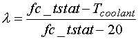 Eqn 1

where temperatures are in degrees C. For example, if the coolant
temperature were 20° C (cold engine),
l would be 1, and if the engine were at the
set point of 95° C (hot engine),
l would be zero.

The fuel and emissions are then computed by the following equation:

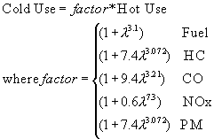 Eqn 2

Dill Murrell did not perform experiments on a CI engine, so there was no
experimental curve fit available for PM. Therefore, PM was assumed to
have the same characteristics as HC.

These correction factors were applied across the entire torque-speed map
for each of the five variables of interest in Equation 2. This constant
factor approach introduced significant error, as the ratio of
cold-to-hot usage varied throughout a given map.

Data collected at Oak Ridge National Laboratory on two CI engines showed
discrepancies between ADVISOR’s current cold-to-hot correction factors
and actual operating conditions. This data also created previously
unknown PM correction factors for ADVISOR.

**Experimental Cold-to-Hot Correction Factors**

ORNL produced steady-state engine maps (fuel use, HC, CO, NOx, PM) for
two engines over two scenarios: 1) a hot engine, and 2) an engine that
was force cooled with water. ). The experiments were performed on a
Volkswagen 1.9L TDI diesel engine and a Mercedes A 1.7L diesel engine.
The VW engine was held at 21.1° C
(70° F) for scenario 2 (cold), and the
Mercedes engine was held at 32.2° C
(90° F). With an assumed typical coolant set
point of 95° C, ADVISOR’s normalized
temperature, l, was 0.985 for VW and 0.837
for Mercedes (see Equation 1). For convenience, the Volkswagen engine
will be noted by VW and the Mercedes engine will be noted by MB.

For the VW engine, force-cooled data was taken over the entire map
(800-4400 rpm). For the MB engine, cold data was taken only over the low
speed region (1200-2800 rpm). To keep the map in context, the MB graphs
have an x axis which corresponds to the entire engine operating region
(1200-4200 rpm).

The current predictions by ADVISOR are shown at the top of each graph
presented below.

<u>Fuel Use</u>

ADVISOR predicts a cold-to-hot factor of 1.95 (VW) and 1.58 (MB). Figure
1 shows that for most of the fuel use map, the ratio does not exceed 1.
Only at very low torque outputs does the fuel use increase; the maximum
increase is \~30%. Figure 2 shows that for high torques, the cold
penalty is \~3%, and for low torques the penalty can again reach 30%.
Therefore, ADVISOR is currently over predicting fuel use at cold
temperatures.

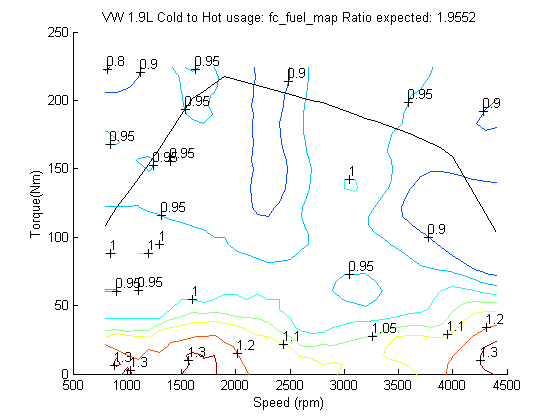

**Figure 1: VW Fuel Use Cold to Hot Ratio**

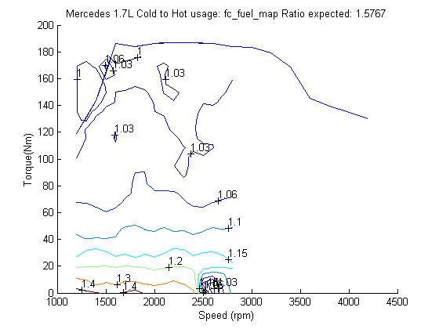

**Figure 2: Mercedes Fuel Use Cold to Hot
Ratio**

<u>HC</u>

ADVISOR predicts cold-to-hot factors of 8.07 (VW) and 5.3 (MB). Figure 3
shows that for a large range on the HC map, the ratio is 1, i.e. no
additional emissions over the hot levels are expected when the engine is
cold. However, the HC map has an island near 2800 rpm and 150 Nm where
up to 30 X the hot emissions were seen. At low torque outputs, the ratio
also increased up to 50 X. The MB map shows less sensitivity to
temperature (Figure 4), as the ratio was 1.25-2 for high torques and 4X
for low speed-low torque combinations. In comparison to the current
ratio of 8 (VW), ADVISOR could be over or under predicting HC emissions,
depending on where in the map the engine was operating. On the MB
engine, ADVISOR is over-predicting HC emissions.

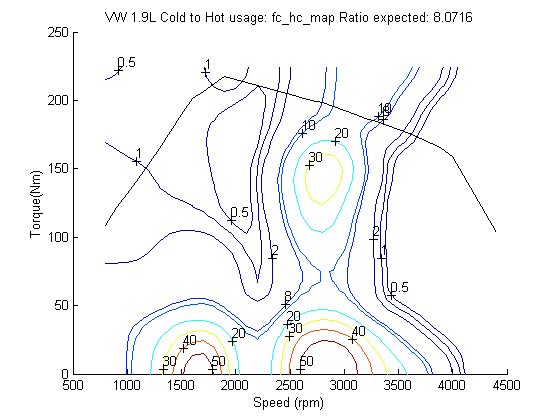

**Figure 3: VW HC Cold to Hot Ratio**

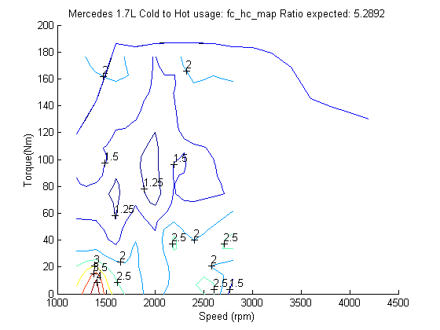

**Figure 4: Mercedes HC Cold to Hot Ratio**

<u>CO</u>

ADVISOR predicts cold-to-hot factors of 9.96 (VW) and 6.3 (MB). Figure 5
and Figure 6 show that this is over predicting cold CO emissions. For
VW, the maximum ratio reached at low torque outputs was near 7, with a
large section lying near 3. For MB, the maximum was near 3.5 with a
large area near 1.25. For most of the VW map, the ratio is lower than
one. This means that emissions at cold temperatures were lower than
emissions at high temperatures. This behavior is counter-intuitive, but
could have many causes, including: 1) experimental error, and 2) that
the behavior observed is real, and that CO emissions are lower at colder
temperatures at high speed/torque ranges.

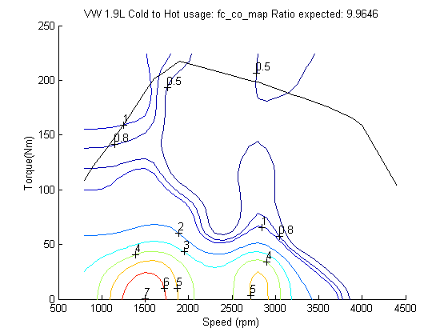

**Figure 5: VW CO Cold to Hot Ratio**

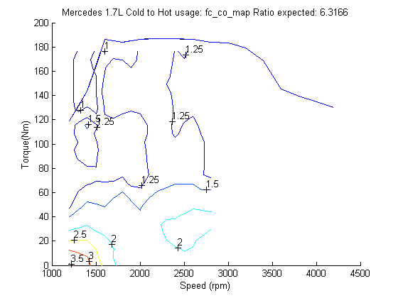

**Figure 6: Mercedes CO Cold to Hot Ratio**

<u>NOx</u>

ADVISOR predicts cold-to-hot factors of 1.54 (VW) and 1.16 (MB). For a
large section of the map, Figure 7 shows that ADVISOR is over-predicting
NOx emissions. However, at low torque-speed points, the ratio reached a
maximum near 2.5. As with the CO map, the VW ratio is less than one for
speeds above \~2000 rpm, though data was not available for this area of
the MB map. Figure 7 shows that NOx emissions are substantially lower
(0.25X) than hot emissions at high speeds. For the MB map in Figure 8,
ADVISOR’s prediction is close to observed behavior.

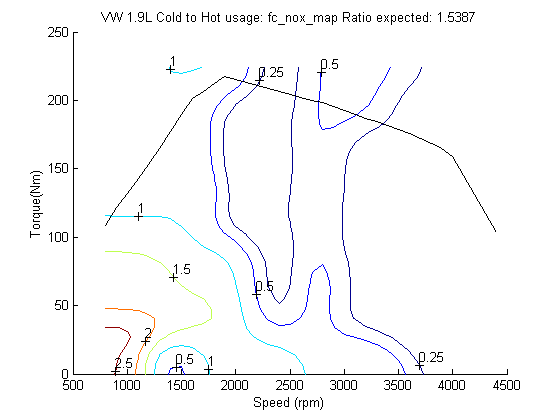

**Figure 7: VW NOx Cold to Hot Ratio**

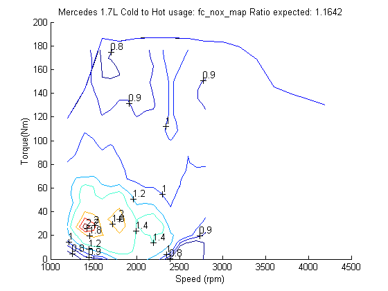

**Figure 8: Mercedes NOx Cold to Hot Ratio**

<u>PM</u>

ADVISOR predicts cold-to-hot factors of 8.07 (VW) and 5.3 (MB). This was
based on the assumption that the PM emissions responded in the same
manner as the HC emissions, as data was previously unavailable. Figure 9
and Figure 10 show that ADVISOR is over predicting PM emissions at low
temperatures, as most of the VW map does not show any increase in PM
with temperature and the MB map shows a factor ranging from 1-2X.
However, the VW map in the low speed/low torque range shows PM emissions
increase drastically, with ratios reaching 20 X.

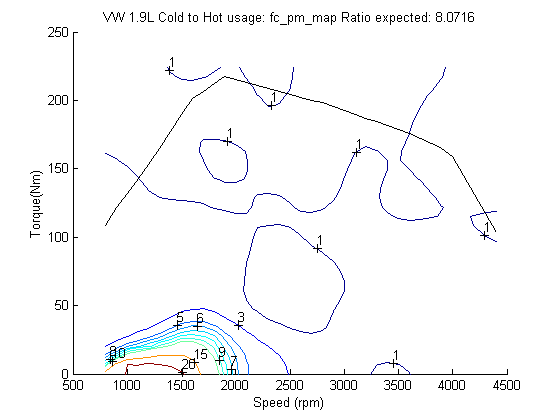

**Figure 9: VW PM Cold to Hot Ratio**

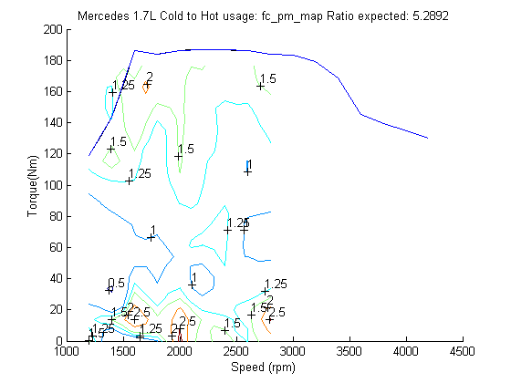

**Figure 10: Mercedes PM Cold to Hot Ratio**

<u>Exhaust Temperature</u>

ADVISOR does not currently predict a cold-to-hot factor for exhaust
temperature. Figure 11 and Figure 12 confirm this omission, as the ratio
over most of the map is 1.

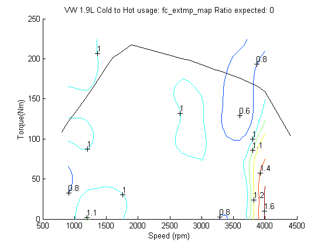

**Figure 11: VW Exhaust Temperature Cold to
Hot Ratio**

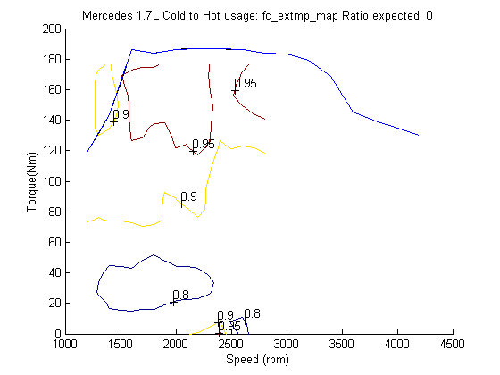

**Figure 12: Mercedes Exhaust Temperature
Cold to Hot Ratio**

<u>Exhaust Flow</u>

ADVISOR does not currently predict a cold-to-hot factor for exhaust
flow. Figure 13 and Figure 14 again mostly confirm this, as the ratio is
near 1.

**Figure 13: Exhaust Flow Cold to Hot
Ratio**

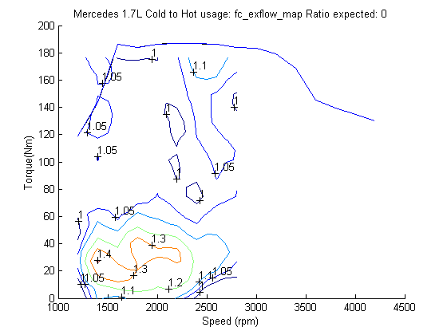

**Figure 14: Mercedes Exhaust Flow Cold to
Hot Ratio**

**Conclusions**

The comparisons of hot-to-cold engine maps showed that a constant
adjustment factor over the entire speed-torque maps results in erroneous
predictions. The graphs above (Figure 1 through Figure 14) show that the
cold-to-hot ratios can vary substantially through the torque-speed map.

Table 1 shows the Cold-to-Hot factors in the current ADVISOR model and
the range shown by the data. \
  \
  \

**Table 1: Correction Factors–ADVISOR
Predictions and Data Ranges**

<table border cellpadding="7" width="507">
<tr>
<td valign="TOP" width="19%" height="19">

**Parameter**

</td>
<td valign="TOP" colspan="2" width="34%" height="19">

**ADVISOR Factor**

</td>
<td valign="TOP" colspan="2" width="47%" height="19">

**Factor Range from Data**

</td>
</tr>
<tr>
<td valign="TOP" width="19%" height="19">
</td>
<td valign="TOP" width="18%" height="19">

*VW*

</td>
<td valign="TOP" width="16%" height="19">

*MB*

</td>
<td valign="TOP" width="24%" height="19">

*VW*

</td>
<td valign="TOP" width="23%" height="19">

*MB*

</td>
</tr>
<tr>
<td valign="TOP" width="19%" height="19">

*Fuel Use*

</td>
<td valign="TOP" width="18%" height="19">

1.95

</td>
<td valign="TOP" width="16%" height="19">

1.58

</td>
<td valign="TOP" width="24%" height="19">

0.9-1.3

</td>
<td valign="TOP" width="23%" height="19">

1.03-1.3

</td>
</tr>
<tr>
<td valign="TOP" width="19%" height="19">

*HC*

</td>
<td valign="TOP" width="18%" height="19">

8

</td>
<td valign="TOP" width="16%" height="19">

5.29

</td>
<td valign="TOP" width="24%" height="19">

0.5-50

</td>
<td valign="TOP" width="23%" height="19">

1.25-4

</td>
</tr>
<tr>
<td valign="TOP" width="19%" height="19">

*CO*

</td>
<td valign="TOP" width="18%" height="19">

10

</td>
<td valign="TOP" width="16%" height="19">

6.32

</td>
<td valign="TOP" width="24%" height="19">

0.5-7

</td>
<td valign="TOP" width="23%" height="19">

1-3

</td>
</tr>
<tr>
<td valign="TOP" width="19%" height="19">

*NOx*

</td>
<td valign="TOP" width="18%" height="19">

1.5

</td>
<td valign="TOP" width="16%" height="19">

1.16

</td>
<td valign="TOP" width="24%" height="19">

0.25-2.5

</td>
<td valign="TOP" width="23%" height="19">

0.8-2.2

</td>
</tr>
<tr>
<td valign="TOP" width="19%" height="19">

*PM*

</td>
<td valign="TOP" width="18%" height="19">

8

</td>
<td valign="TOP" width="16%" height="19">

5.29

</td>
<td valign="TOP" width="24%" height="19">

1-20

</td>
<td valign="TOP" width="23%" height="19">

1-2.5

</td>
</tr>
<tr>
<td valign="TOP" width="19%" height="19">

*Exhaust Temperature*

</td>
<td valign="TOP" width="18%" height="19">

N/A

</td>
<td valign="TOP" width="16%" height="19">

N/A

</td>
<td valign="TOP" width="24%" height="19">

0.6-1.6

</td>
<td valign="TOP" width="23%" height="19">

0.8-0.95

</td>
</tr>
<tr>
<td valign="TOP" width="19%" height="19">

*Exhaust Flow*

</td>
<td valign="TOP" width="18%" height="19">

N/A

</td>
<td valign="TOP" width="16%" height="19">

N/A

</td>
<td valign="TOP" width="24%" height="19">

1-1.3

</td>
<td valign="TOP" width="23%" height="19">

1-1.3

</td>
</tr>
</table>

This shows that ADVISOR is currently over predicting cold fuel use and
CO emissions. HC, NOx, and PM emissions are over predicted for a
majority of the operating points on the maps, but may be under predicted
in other areas. Additionally, some emissions (e.g. NOx) showed lower
emissions at cold temperatures than hot. ADVISOR’s constant adjustment
factors do not drop below one, such that this type of behavior is
unaccounted for. \
 

**New ADVISOR
Cold-to-Hot Engine Map Correction Factors**

To address these differences between the data and the current
cold-to-hot usage model in ADVISOR, three options were explored.

1.  Change ADVISOR’s constant adjustment factor to be an average of that
    shown by the data.
2.  Change the model to have the factor vary with both torque and speed.
    This could involve sectioning out the maps into similar areas, each
    with a constant factor, or creating an equation to define the factor
    based on torque and speed.
3.  Have the user input cold maps (one or more) when available and
    interpolate between the available maps.

Of the three options, options 2 and 3 are the most comprehensive. Option
1 was explored as a simple baseline case to increase the accuracy of
ADVISOR while development on the other two occurred.

**Option 1: Change the values of ADVISOR’s Cold-Hot
Adjustment Factors** \
The form of the equation (see Equation 2) relating cold engine outputs
to hot outputs was assumed to be the same, and the variable parameters
were updated. As a reminder, the form is as follows:

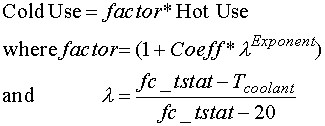 Eqn 3

Updated values for *Coeff* and *Exponent* could be obtained by assuming
a constant *factor* by using the factor maps available for two different
l values (VW:
l=0.985 MB: l=0.837). In order to have
a first-pass guess at which *factor* values to assume from the maps, a
simple simulation of a conventional vehicle over the FTP was performed
(default conventional with ADVISOR 3.1 with the FC\_CI60\_emis engine
chosen). The locus of operating points on the engine is shown in Figure
15. A large majority of the points lie below 2500 rpm and 100 Nm, with a
concentration below 1500 rpm and 50 Nm. Of course this will vary with
the chosen shift schedule, but this behavior was taken as
representative.

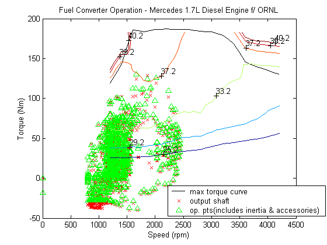

**Figure 15: Engine Operating Points on an
FTP Cycle**

Table 2 shows the assumed values for the *factors* and the resulting
values for the *Coeff*and *Exponent* in Equation 3. The ‘previous’
values for *Coeff*and *Exponen*are also shown for reference.

**Table 2: Assumed Correction Factors,
Updated and Previous Coeff’s and Exponents**

<table border cellpadding="2" width="520">
<tr>
<td valign="TOP" width="10%" height="17">
</td>
<td valign="TOP" colspan="3" width="23%" height="17">

**<u>Factor from
Data</u>**

</td>
<td valign="TOP" colspan="2" width="21%" height="17">

**<u>Previous
Factor</u>**

</td>
<td valign="TOP" colspan="2" width="25%" height="17">

**<u>Updated </u>**

</td>
<td valign="TOP" colspan="2" width="21%" height="17">
**<u>Previous</u>**

</td>
</tr>
<tr>
<td valign="TOP" colspan="2" width="13%" height="17">
</td>
<td valign="TOP" width="9%" height="17">

**<u>VW</u>**

</td>
<td valign="TOP" width="11%" height="17">

**<u>MB</u>**

</td>
<td valign="TOP" width="10%" height="17">

**<u>VW</u>**

</td>
<td valign="TOP" width="11%" height="17">

**<u>MB</u>**

</td>
<td valign="TOP" width="12%" height="17">

**<u>Coeff</u>**

</td>
<td valign="TOP" width="14%" height="17">

**<u>Exponent</u>**

</td>
<td valign="TOP" width="8%" height="17">

**<u>Coeff</u>**

</td>
<td valign="TOP" width="13%" height="17">

**<u>Exponent</u>**

</td>
</tr>
<tr>
<td valign="TOP" colspan="2" width="13%" height="17">
**lambda**

</td>
<td valign="TOP" width="9%" height="17">

0.985

</td>
<td valign="TOP" width="11%" height="17">

0.837

</td>
<td valign="TOP" width="10%" height="17">
</td>
<td valign="TOP" width="11%" height="17">
</td>
<td valign="TOP" width="12%" height="17">
</td>
<td valign="TOP" width="14%" height="17">
</td>
<td valign="TOP" width="8%" height="17">
</td>
<td valign="TOP" width="13%" height="17">
</td>
</tr>
<tr>
<td valign="TOP" colspan="2" width="13%" height="17">
**Fuel**

</td>
<td valign="TOP" width="9%" height="17">

1.1

</td>
<td valign="TOP" width="11%" height="17">

1.09

</td>
<td valign="TOP" width="10%" height="17">

1.95

</td>
<td valign="TOP" width="11%" height="17">

1.58

</td>
<td valign="TOP" width="12%" height="17" bgcolor="#FFFF00">

0.10

</td>
<td valign="TOP" width="14%" height="17" bgcolor="#FFFF00">

0.65

</td>
<td valign="TOP" width="8%" height="17">

1

</td>
<td valign="TOP" width="13%" height="17">

3.1

</td>
</tr>
<tr>
<td valign="TOP" colspan="2" width="13%" height="17">
**HC**

</td>
<td valign="TOP" width="9%" height="17">

8

</td>
<td valign="TOP" width="11%" height="17">

2.5

</td>
<td valign="TOP" width="10%" height="17">

8.07

</td>
<td valign="TOP" width="11%" height="17">

5.3

</td>
<td valign="TOP" width="12%" height="17" bgcolor="#FFFF00">

8.05

</td>
<td valign="TOP" width="14%" height="17" bgcolor="#FFFF00">

9.46

</td>
<td valign="TOP" width="8%" height="17">

7.4

</td>
<td valign="TOP" width="13%" height="17">

3.072

</td>
</tr>
<tr>
<td valign="TOP" colspan="2" width="13%" height="17">
**CO**

</td>
<td valign="TOP" width="9%" height="17">

3

</td>
<td valign="TOP" width="11%" height="17">

2

</td>
<td valign="TOP" width="10%" height="17">

9.96

</td>
<td valign="TOP" width="11%" height="17">

6.3

</td>
<td valign="TOP" width="12%" height="17" bgcolor="#FFFF00">

2.13

</td>
<td valign="TOP" width="14%" height="17" bgcolor="#FFFF00">

4.26

</td>
<td valign="TOP" width="8%" height="17">

9.4

</td>
<td valign="TOP" width="13%" height="17">

3.21

</td>
</tr>
<tr>
<td valign="TOP" colspan="2" width="13%" height="17">
**NOx**

</td>
<td valign="TOP" width="9%" height="17">

1.5

</td>
<td valign="TOP" width="11%" height="17">

1.4

</td>
<td valign="TOP" width="10%" height="17">

1.54

</td>
<td valign="TOP" width="11%" height="17">

1.16

</td>
<td valign="TOP" width="12%" height="17" bgcolor="#FFFF00">

0.51

</td>
<td valign="TOP" width="14%" height="17" bgcolor="#FFFF00">

1.37

</td>
<td valign="TOP" width="8%" height="17">

0.6

</td>
<td valign="TOP" width="13%" height="17">

7.3

</td>
</tr>
<tr>
<td valign="TOP" colspan="2" width="13%" height="17">
**PM**

</td>
<td valign="TOP" width="9%" height="17">

5

</td>
<td valign="TOP" width="11%" height="17">

1.25

</td>
<td valign="TOP" width="10%" height="17">

8.07

</td>
<td valign="TOP" width="11%" height="17">

5.3

</td>
<td valign="TOP" width="12%" height="17" bgcolor="#FFFF00">

5.14

</td>
<td valign="TOP" width="14%" height="17" bgcolor="#FFFF00">

17.04

</td>
<td valign="TOP" width="8%" height="17">

7.4

</td>
<td valign="TOP" width="13%" height="17">

3.072

</td>
</tr>
</table>

The following points were noted in the assumed values for each factor:

-   Fuel: in the locus area (from Figure 15), the fuel factor is
    approximately linear with increasing speed.
-   HC: assuming a constant factor is not a very good approximation.
-   CO: the CO factor behaves approximately linear with increasing speed
    and increasing torque
-   NOx: *factor* islands exist in the locus area, assuming a constant
    factor across the map is not a good approximation here.
-   PM: the PM factor behaves approximately linear with increasing speed
    and increasing torque, again a single factor is not a good
    approximation for PM, as the value dramatically increases at low
    speeds and low torques.

The notes for each parameter show that this approach, while an
improvement over the previous values listed in ADVISOR, are still not
very accurate.

**Option 2: Correction Factors as Functions of Speed
and Torque, in addition to Temperature through l,
Map Fits Based on Trends** \
The implementation of correction factor maps was postponed until
implementation of Option 3.

**Option 3: Cold Maps Input by User** \
The user has the ability to enter cold engine maps, if the data is
available. The two engines tested at ORNL have their maps available in
ADVISOR (FC\_CI60\_emis for the Mercedes engine and FC\_CI67\_emis for
the Volkswagen engine).

The engine input m-files have new variables denoted by \*\_cold for cold
maps (e.g. fc\_fuel\_map\_cold). These are processed to determine a
cold-to-hot ratio map denoted by \*\_c2h (e.g. fc\_fuel\_map\_c2h).
These ratios and the temperature of the cold testing (fc\_cold\_tmp) are
used to determine the cold use by the following equation (a linear
relationship between the temperature and change in use is assumed):

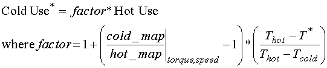              Eqn 4

Simulations were run on a conventional vehicle to determine the effect
of using the map-based approach (Option 3) instead of the constant ratio
equation-based approach (Option 1). A default conventional vehicle with
the VW and then the MB engine was ran over a cold FTP cycle. Note: to
select the ‘equation’ correction (based on Equation 3), set the variable
fc\_cold=0, and to select the ‘cold map’ correction option. Table 3
shows the large differences that can be seen in the different
approaches. Using the map-based approach had a 1-2% effect on fuel
economy, and up to 53% effect on emissions. Using the cold maps for
interpolation is much more accurate than the equation-based approach.

**Table 3: Equation vs. Map Based Cold
Corrections over an FTP**

<table border cellpadding="2" width="520">
<tr>
<td valign="TOP" width="18%" height="17">
</td>
<td valign="TOP" width="17%" height="17">
</td>
<td valign="TOP" width="13%" height="17">

**MPG**

</td>
<td valign="TOP" width="13%" height="17">

**HC**

</td>
<td valign="TOP" width="13%" height="17">

**CO**

</td>
<td valign="TOP" width="13%" height="17">

**NOx**

</td>
<td valign="TOP" width="13%" height="17">

**PM**

</td>
</tr>
<tr>
<td valign="TOP" width="18%" height="17">
**Volkswagen**

</td>
<td valign="TOP" width="17%" height="17">
**Equation**

</td>
<td valign="TOP" width="13%" height="17">

44.4

</td>
<td valign="TOP" width="13%" height="17">

0.349

</td>
<td valign="TOP" width="13%" height="17">

1.751

</td>
<td valign="TOP" width="13%" height="17">

0.734

</td>
<td valign="TOP" width="13%" height="17">

0.049

</td>
</tr>
<tr>
<td valign="TOP" width="18%" height="17">
</td>
<td valign="TOP" width="17%" height="17">
**Cold Map**

</td>
<td valign="TOP" width="13%" height="17">

44.8

</td>
<td valign="TOP" width="13%" height="17">

0.731

</td>
<td valign="TOP" width="13%" height="17">

2.321

</td>
<td valign="TOP" width="13%" height="17">

0.698

</td>
<td valign="TOP" width="13%" height="17">

0.065

</td>
</tr>
<tr>
<td valign="TOP" width="18%" height="17">
</td>
<td valign="TOP" width="17%" height="17">
**% difference**

</td>
<td valign="TOP" width="13%" height="17" bgcolor="#FFFF99">

0.9%

</td>
<td valign="TOP" width="13%" height="17" bgcolor="#FFFF99">

52.3%

</td>
<td valign="TOP" width="13%" height="17" bgcolor="#FFFF99">

24.6%

</td>
<td valign="TOP" width="13%" height="17" bgcolor="#FFFF99">

-5.2%

</td>
<td valign="TOP" width="13%" height="17" bgcolor="#FFFF99">

24.6%

</td>
</tr>
<tr>
<td valign="TOP" width="18%" height="17">
**Mercedes**

</td>
<td valign="TOP" width="17%" height="17">
**Equation**

</td>
<td valign="TOP" width="13%" height="17">

46.1

</td>
<td valign="TOP" width="13%" height="17">

0.609

</td>
<td valign="TOP" width="13%" height="17">

1.812

</td>
<td valign="TOP" width="13%" height="17">

1.027

</td>
<td valign="TOP" width="13%" height="17">

0.073

</td>
</tr>
<tr>
<td valign="TOP" width="18%" height="17">
</td>
<td valign="TOP" width="17%" height="17">
**Cold Map**

</td>
<td valign="TOP" width="13%" height="17">

45.1

</td>
<td valign="TOP" width="13%" height="17">

0.63

</td>
<td valign="TOP" width="13%" height="17">

2.106

</td>
<td valign="TOP" width="13%" height="17">

0.927

</td>
<td valign="TOP" width="13%" height="17">

0.061

</td>
</tr>
<tr>
<td valign="TOP" width="18%" height="17">
</td>
<td valign="TOP" width="17%" height="17">
**% difference**

</td>
<td valign="TOP" width="13%" height="17" bgcolor="#FFFF99">

-2.2%

</td>
<td valign="TOP" width="13%" height="17" bgcolor="#FFFF99">

3.3%

</td>
<td valign="TOP" width="13%" height="17" bgcolor="#FFFF99">

14.0%

</td>
<td valign="TOP" width="13%" height="17" bgcolor="#FFFF99">

-10.8%

</td>
<td valign="TOP" width="13%" height="17" bgcolor="#FFFF99">

-19.7%

</td>
</tr>
<tr>
<td valign="TOP" width="18%" height="17">

\* Simulation:

</td>
<td valign="TOP" colspan="4" width="56%" height="17">
Conventional default, then engines
specified,

</td>
<td valign="TOP" width="13%" height="17">
</td>
<td valign="TOP" width="13%" height="17">
</td>
</tr>
<tr>
<td valign="TOP" width="18%" height="7">
</td>
<td valign="TOP" colspan="3" width="43%" height="7">
cold FTP cycle (not test
procedure)

</td>
<td valign="TOP" width="13%" height="7">
</td>
<td valign="TOP" width="13%" height="7">
</td>
<td valign="TOP" width="13%" height="7">
</td>
</tr>
</table>

* * * * *

[Back to Chapter 3](advisor_ch3.html)

Last Revised: 02/01/01: VHJ
