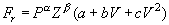
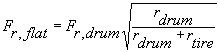
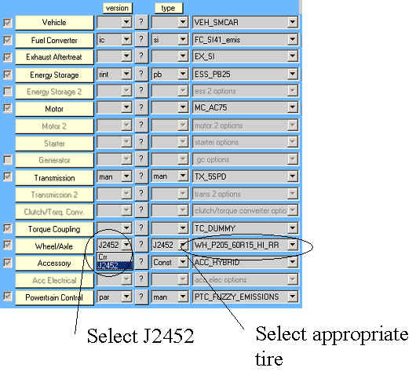
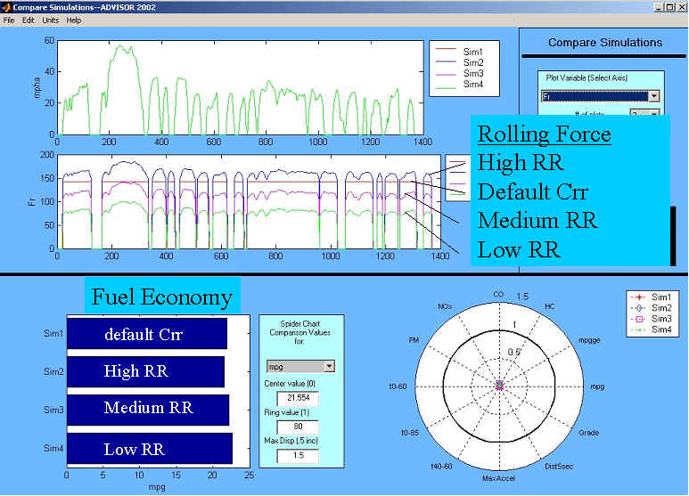

% ADVISOR 2002 includes a new dynamic rolling resistance model based on
  the SAE J2452 test procedure and tire rolling resistance data
% 
% 

**SAE J2452 Tire Model in ADVISOR**

ADVISOR 2002 includes a new dynamic rolling resistance model based on
the SAE J2452 test procedure and tire rolling resistance data provided
by Michelin Americas Research and Development
Corporation.  The two defining
equations used in the model include a calculation of the rolling
resistance force (equation 1) and an adjustment of the test data, which
is measured on a dynamometer with a curved surface road-wheel, to an
equivalent flat-road rolling resistance force (equation 2).  

 Equation 1: 

 <o:p> </o:p>

 where:

Fr is the force due to rolling resistance

P is the tire pressure (kPa)

Z is the load on the tire (N)<o:p> </o:p>

V is the vehicle velocity (m/s)

a, b, c, alpha and beta are coefficients used to fit the test data to
the empirical model described by equation 1.<o:p> </o:p>

Equation 2:

 <o:p> </o:p>

 where:

F~r,flat~ is the rolling resistance force from the dynamometer measured
value to a flat surface

F~r,flat~ is the rolling resistance force measured on the dynamometer

r~drum~<o:p> </o:p> is the roadwheel radius

r~tire~<o:p> </o:p> is the tire radius

Equations 1 and 2 are calculated in the “vehicle” block diagram under
the force required to overcome rolling resistance.

 

<!--[if gte vml 1]><v:shapetype id="_x0000_t75"
 coordsize="21600,21600" o:spt="75" o:preferrelative="t" path="m@4@5l@4@11@9@11@9@5xe"
 filled="f" stroked="f">
 <v:stroke joinstyle="miter"/>
 <v:formulas>
  <v:f eqn="if lineDrawn pixelLineWidth 0"/>
  <v:f eqn="sum @0 1 0"/>
  <v:f eqn="sum 0 0 @1"/>
  <v:f eqn="prod @2 1 2"/>
  <v:f eqn="prod @3 21600 pixelWidth"/>
  <v:f eqn="prod @3 21600 pixelHeight"/>
  <v:f eqn="sum @0 0 1"/>
  <v:f eqn="prod @6 1 2"/>
  <v:f eqn="prod @7 21600 pixelWidth"/>
  <v:f eqn="sum @8 21600 0"/>
  <v:f eqn="prod @7 21600 pixelHeight"/>
  <v:f eqn="sum @10 21600 0"/>
 </v:formulas>
 <v:path o:extrusionok="f" gradientshapeok="t" o:connecttype="rect"/>
 <o:lock v:ext="edit" aspectratio="t"/>
</v:shapetype><v:shape id="_x0000_i1025" type="#_x0000_t75" style='width:6in;
 height:318.75pt'>
 <v:imagedata src="../../../../../../../DOCUME~1/kkelly/LOCALS~1/Temp/msoclip1/01/clip_image001.jpg"
  o:title="tire_RR_block"/>
</v:shape><![endif]--> 

The J2452 tire is accessed in the Vehicle Setup Screen by selecting
J2452 under Wheel/Axel version.  Then an appropriate tire selection can
be made for the specific application.  Tire data is included for high,
medium, and low rolling resistance for various size production tires
based on data provided by Michelin.  For each tire, the Wheel/Axel
m-file contains the a, b, c, alpha, and beta required for equation 1
along with a reference to a typical vehicle application.  The tire
pressure, rolling radius, and roadwheel radius are also defined in the
Wheel/Axel m-file.  The vehicle load fraction is defined in the Vehicle
m-file.

 

Example results are shown below comparing the rolling resistance force
(Fr) and fuel economy for the ADVISOR default constant rolling
resistance (wh\_1st\_rrc) to results using a low, medium, and high
rolling resistance tires.  The driving cycle is the EPA Urban
Dynamometer Driving Schedule (UDDS).

 

 

* * * * *

[Documentation Table of Contents](advisor_doc.html)

* * * * *

Created: [4/30/02] kk\
 Last Modified: 4/30/02 kw

 
