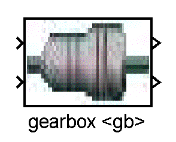
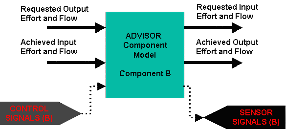
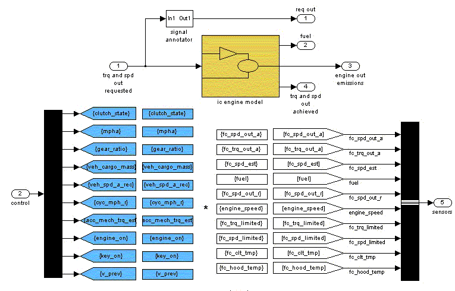
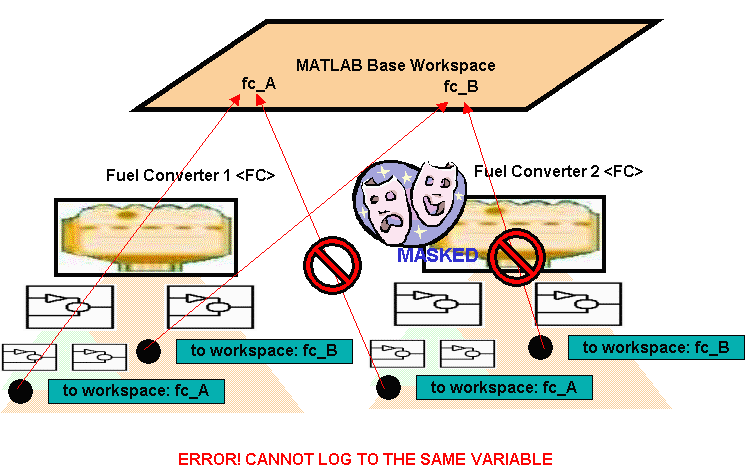
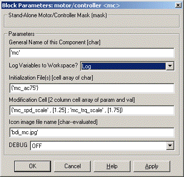

% ADVISOR Library Reorg
% 
% 

ADVISOR Library Reorganized Structure
=====================================

The Simulink block diagrams have been re-worked and re-organized to
provide a more easy to use interface. This help file overviews the
changes that have occured and their implications. In addition, a
tutorial on how to convert existing library blocks to the new structure
is presented.\

Contents
--------

1.  [Overview of the New Layout and Creating Your Own Blocks\
    ](#overview)
2.  [Using the New Library Blocks](#using)\

Overview of the New Layout
-------------------------------------------------

The new layout encapsulates all model information behind a Simulink
Masked Subsystem. All communication in and out of the block is then
routed through direct connections between other blocks (nothing new
here: these are the torque and speed requests passed from one block to
another) and through muxed sensor and control signal lines (this is
new).  These lines allow the user to pick-off specific signals using bus
select properties. \

Therefore, all communication with a model is forced through one of the
following places:\

-   Dedicated INPUT/OUTPUT ports which tie blocks together (e.g., the
    torque and speed request line from the transmission to the IC
    engine)
-   Sensor signal bus-bar which holds all of the signals available FROM
    a model
-   Control signal bus-bar which holds all of the signals that will GOTO
    a model
-   Intialization script files which can be loaded on the workspace
    (default ADVISOR behavior) or directly into each model.

Some of the advantages of this new re-organized set-up of the ADVISOR
Simulink Library versus the original ADVISOR library layout are as
follows:\

-   The external data needs of each model  are explicitly laid out. This
    makes it much easier to hook up one model block with another,
    develop new powertrain configurations, and test models.\
-   Each model is encapsulated in its own “function space”. This allows
    you to use more than one of the same component in a single block
    diagram. Furthermore, each component can be loaded with separate
    data.
-   The new layout makes it much easier to test and validate models in a
    stand-alone fashion.

Visually, there is no discernable difference at the top-most level. The
first sub-layer defines the hard-coded input output lines, the sensor
signal bus line, and the control signal bus line. The second sub-layer
defines the sensor signals and the control signals from individual
scoped GOTO/FROM blocks. The third sub-layer contains the actual model.\

\

Figure 1. Top Level of New Library Blocks

As can be seen, the top level of the new library blocks do not look
different from the previous ADVISOR library blocks.\

\

Figure 2. First Sub-Level of New ADVISOR Library Blocks\

At this level, the muxed signal bus and muxed sensor bus can be seen.
Note that these are global tags which allow the component model to
transfer data to and from other blocks such as system controllers.\

\

Figure 3. Sub-Level Two\

At this level the control and sensor signals are muxed/demuxed
respectively. It is at this level that the original model can be found.
Scoping blocks are used to scope the visibility of GOTO and FROM tags. 
Dedicated INPUT/OUTPUT signals are passed into the model from the
top-most level.\

For the most part, converting from an old-format model to the new
re-organized system stated above is straight forward. GOTO and FROM tags
must be set up as scoped but, for the most part, models can be left
as-is. However, if ToWorkspace blocks are used in the original model, a
new toWorkspace block called enhancedToWorkspace must be substituted. 
The enhancedToWorkspace block dynamically renames the toWorkspace data
to prevent name-space clashes when more than one of the same block model
is used.\

### The toWorkspace and other Name-space collision Problems

One of the design goals for the reorganized library is the ability to
use more than one component model in the same block diagram (for
example, two motors in a through-the-road hybrid configuration).
Alternately, one may wish to use more than one component from a
component family in the same block diagram (e.g., an IC Engine for main
traction power and a Fuel Cell for auxiliary loads–both components are
fuel converters). The limiting factors here are three-fold: name-space
collisions on input variables, name-space collisions on sensor and
control signal bus tags, and name-space collisions on toWorkspace
variables.\

The name space collision on input variables can be circumvented by
placing each component variable in a MASK (essentially, a “function
workspace”). That is, initialization m-files can be loaded directly into
the components they are relevant to. This would allow us to define two
motor components in the same block diagram and initialize each one with
a different data set. Thus, the new library reorganization alleviates
the first concern on input varible name-space collision.\

The second concern deals with the control and sensor bus signals. If we
use more than one component block in a block diagram, we will need to be
able to differentiate between the sensor and control signals of each
component block. This has been done by giving each component a “name”. A
MASK initialization file in the component then renames each block’s
SENSOR and CONTROL tag as “nameSensors” and “nameControl” respectively.
Thus, one can now differentiate between two instances of a component in
a block diagram. One downside is that in MATLAB version 6.1, the
renaming of the sensor and control tags requries one to disable the
library link. This prevents library updates from automatically
propogating to the component models. However, MATLAB version 6.5 appears
to support dynamic GOTO/FROM tag renaming fine (there is a check box in
the mask that says “allow library block to modify its contents”–this
must be checked).\

The third concern is regarding the toWorkspace variables and is more
difficult. The Simulink “toWorkspace” block is designed to take
variables from the Simulink “universe” and place them into the MATLAB
workspace as arrays. The original ADVISOR library uses a combination of
two different ideas to log variables to the workspace.  The first is to
place toWorkspace blocks within the component models themselves at the
areas where the information is generated.  The second is to use an SDO
(standard diagnostic output) block to log variables. That is, GOTO tags
are used to transmit all signals to a common block area where all the
toWorkspaces are used at once. \

There is no right or wrong between these two ways of logging variables.
However, Simunlink has some limitations regarding the toWorkspace block
and which type of data logging one chooses has implications for the
final library implementation. Let me explain further.\

Simulink toWorkspace blocks do not allow the same variable name to be
logged to more than once. Therefore, even if we encapsulate each
component model behind a MASK, if two component models define the same
variables for toWorkspace blocks, the Simunlink model will not run due
to variable name-space collisions during toWorkspace logging. One option
is to remove all toWorkspace blocks from a model. The variables can then
be logged by sending sensor signals to an SDO block. This idea has many
merits which we will return to later.\

Another option which has been pursued here is the use of dynamic
toworkspace block re-naming. In this option, the name given to each
component block is used to create the toWorkspace variable to log. For
example, if one motor/controller component is used named mc1 and another
is used callled mc2, then the variable \*\_trq\_out\_a will be logged to
the workspace as mc1\_trq\_out\_a and mc2\_trq\_out\_a. The major
drawback for the dynamic toWorkspace block is that it does not support
library linking in either MATLAB 6.1 or 6.5.  If the SDO approach is
taken, there will be no linking issues. The major drawback of the SDO
block is that significant manual effort is required to set it up.\

\

Figure 4. Simulink Does not Allow Logging to the Same Variable Name\

As can be seen in the figure above, even if two masked compoents exist
in a model, an error will occur upon attempt to log to the same variable
name more than once.\

\

Figure 5. The enhancedToWorkspace block allows for dynamic renaming of
the variable to log to\

The enhancedToWorkspace block allows one to get around the namespace
collision issues by using the unique component name to append to the
front of a variable name creating a unique variable to log to.\

Using the New Library Blocks
------------------------------------------------

There are two ways to use the new libary block system in ADVISOR. The
first way is basically transparent. Because of the nature of masked
sub-systems in Simulink, if input information is not defined within the
components MASK workspace (a “function workspace”), the code will open
itself up to look on the MATLAB workspace. The MATLAB workspace is where
ADVISOR traditionally loads initialization/input files and retrieves
output variables. Therefore, nothing has changed.\

\

Figure 6. Initializing Component Models from the Base Workspace\

Simulink components will look in the base workspace if a required
variable is not defined in their MASK Workspace\

\

Figure 7. Loading from the MASK Workspace\

Components can also initialize from the mask workspace.\

The alternate way to use the new library blocks is from a Simulink mode.
In this mode, one opens the Simulink block diagram and sets up the
intialization files into the dialogue boxes of the component blocks
themselves. The model is then run entirely in Simulink (though output
can be browsed by calling the gui\_post\_process.m and ResutlsFig.m file
to browse the workspace). This alternative is generally left to more
advanced users.\

The component dialogue box consists of the following:\
 \

-   General Name of the component (used for logging variables
    dynamically as well as re-naming control and sensor signal GOTO/FROM
    tags)
-   Log Variables On/Off Switch (used to turn on/off the dynamic
    toWorkspace feature)\
-   Initialization File Name (the name of the m-file to load to
    initialize the component–leave blank to look for variables in the
    base workspace)
-   Modification Cell (a cell array consisting of any number of rows and
    two columns–the first column contains variable names to
    override/modify and the second column contains the new values to
    assign)
-   Icon Image (to change the icon, type the picture file into this
    entry box)
-   DEBUG on/off flag – changes how verbose printing to the workspace
    is\

\

Figure 8. Component Initialization Mask\

The component initialization mask is used to setup individual components
for more advanced runs (i.e., runs done directly from Simulink versus
using the ADVISOR GUI)\

The new component libraries have been placed in with the other library
model files in models/library. They have a number trailing after them to
distinguish them from the original model files. For example,
lib\_electric\_machine2.mdl contains re-organized motor/controller
library components. In addition, if one types simulink from the MATLAB
command and looks at the Simulink Library Browser, you will note that
the reorganized ADVISOR library models are all available from the
Library Browser (click on the “+” sign to load the libraries"). \

[Return to ADVISOR Documentation](advisor_doc.html)\

last modified: 8/5/2003: mpo\

\
 \
 \
