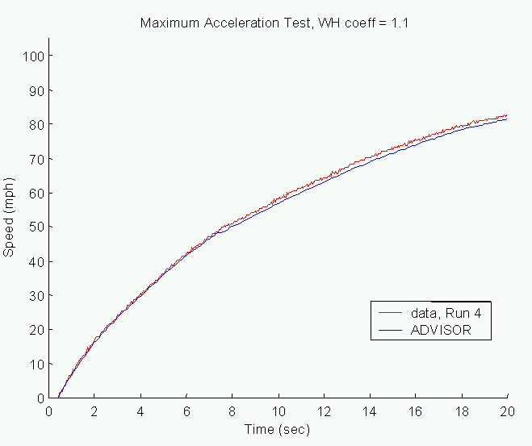

% New Automatic Transmission Model
% 
% 

****

Creation and Validation of a

New Automatic Transmission Model in ADVISOR

</b>

August, 2000

 

Nomenclature

<dir>
<dir>
</b>

K: K factor, defined as w~in~/(T~in~)0.5

K\_ADV: ADVISOR K factor, defined as w~out~/(T~out~)0.5

SR: Speed Ratio, defined as w~out~/win

TC: Torque Converter, or hydrodynamic torque converter

TR: Torque Ratio, defined as T~out~/Tin<a name="_Toc483223098">

</dir>
</dir>

Background</a>

</b>

ADVISOR previously had an automatic transmission model in ADVISOR that
was based on algorithms that were developed by J. D. Murrell &
Associates under subcontract to Argonne National Laboratory, as
presented in JDMA’s “Drive\_line” simulation program dated May 1998.
Several problems were encountered with the implementation of this model
in ADVISOR, including:

-   The torque converter (TC) had limited usage on only a conventional
    drivetrain.
-   The model included substantial correlation factors that were
    specific to the vehicle and configuration tested.
-   The input files were difficult to understand and did not represent
    typical data obtained from a manufacturer on a TC. As examples, the
    input file included a torque converter capacity (C) and the K
    factors were computed based on impeller exit angles, diameters,
    stall torque ratios, etc.
-   Using the TC model on different configurations or different sized
    vehicles resulted in unusual behavior. At startup, the speed would
    overshoot typical performance, and during shifting, unrealistic
    drops in engine speed occurred.
-   Inertial losses of the TC were not modeled.

In an effort to increase the robustness of the automatic transmission
model in ADVISOR, NREL collaborated with an industry partner to develop
a new automatic transmission model. This report describes development of
the new model and validation of the model on a truck over an
acceleration test.

<a name="_Toc483223100">The Backward
Facing Torque Converter Model</a>

</b>

A cross-section and a schematic of a typical hydraulic torque converter
are found in Figure 1.

<a name="_Ref481838318"><a name="_Toc483223103">Figure 1</a>:
Cross-section (a) and Schematic (b) of a Torque Converter</a>

</b>

In creating the backward torque converter model for ADVISOR, some
assumptions about the TC operation are made (e.g. that the desired
performance will be met). If engine limits are reached further down the
simulation path, this information is passed back to the TC model through
the backward path. This feedback is used to minimize errors in the
model.

There is one assumption of backward model, however, that is not present
in a forward model. Instead of meeting torque request first, the torque
is used to overcome inertia and spin up the turbine, then the extra
torque is passed along to the driveline. A forward model would assume
that the torque is first supplied to the driveline, then the extra
available torque is used to accelerate the turbine (thus increasing the
speed ratio). This behavior could lead to the backward model predicting
higher efficiencies (SR is higher), or slower accelerations (torque
available is lower).

Two approaches were considered in modeling the torque converter. The
first was aimed at making the backward model similar to a forward model.
This approach required many assumptions about the torque converter
operation, and was considered too restrictive, particularly in reference
to the speeds of the TC.

In order to eliminate the assumptions about speed of the TC, and to use
all the information available in the backward model, an alternate K
factor was chosen to represent the behavior of the torque converter.
This K\_ADV factor was defined as follows:

<dir>
<dir>
 Eqn. 1

</dir>
</dir>
Figure 2 shows the Torque Ratio (TR), Efficiency (=SR\*TR), K factor,
and K\_ADV. Note that the K\_ADV curve is not flat, or constant, with
speed ratio. Therefore, using K\_ADV to predict the SR and TR of the
torque converter will not result in efficiency errors.

<a name="_Ref481846773"><a name="_Toc483223104">Figure 2</a>: 10.75",
144K Torque Converter TR, K and Efficiency vs. SR (0-1, driving)</a>

</b>

The K\_ADV factor was also used to predict speed and torque during
coasting. The Torque Ratio (TR), Efficiency (=SR\*TR), K factor, and
K\_ADV for SR\>1 is shown in Figure 3. The coasting data shown below is
typical of a 10.75" torque converter

<a name="_Ref483014116"><a name="_Toc483223105">Figure 3</a>: 10.75" TC.
TR, K and Efficiency vs. SR (1-20, coasting)</a>

</b>

The model (shown in Figure 4) incorporated the following aspects:

-   SR and TR were determined from K\_ADV.
-   Turbine inertia was considered (Impeller inertia was added to the
    engine).
-   During shifting, torque request was assumed to stay constant. Engine
    speed drop was rate limited to less than –3200 rpm/second.
-   Lockup is currently a function of gear ratio.

<a name="_Ref482177901"><a name="_Toc483223106">[Figure
4](htc_fig1.gif): New Torque Converter Model in ADVISOR</a></a>

<a name="_Toc483223101">Validation of TC Model with a Truck over an
Acceleration Test</a>

</b>

Presented below are ‘old’ and ‘new’ simulation results of a truck on an
acceleration test. The old simulation results came from model and test
comparisons with the old automatic transmission model. The new
simulation results are from ADVISOR predictions with the new torque
converter model.

Description of the modeled vehicle:

-   An input torque converter file was created from the 144K, 10.75"
    torque converter data supplied by an industry partner. Inputs into
    the model include SR, TR, K factor, and turbine and impeller
    inertias.
-   The vehicle tested was a conventional 6 L, 5900 lb truck with an
    automatic transmission.

For agreement with the test data several model assumptions were changed.
These include:

-   Wheel slip was increased 10% from default SUV slip characteristics
    to agree with acceleration data (specifically,
    wh\_slip\_force\_coeff).
-   The shifting in ADVISOR was changed to be a function of output shaft
    speed instead of engine speed. The test behavior was used to
    determine the shifting strategy as it varied with vehicle speed.

In the following graphs, ‘Old Model’ refers to the previous ADVISOR
torque converter model based on Dill Murrell’s work. ‘New Model’ refers
to the new model under initial development. ‘New Model \#2’ refers to
the most recent model developed. Updates to the torque converter model
for ‘New Model \#2’ include the following:

-   Coasting SR and TR are now functional. Maximum speed ratios during
    coasting is limited by engine idle speed.
-   SR blending was eliminated. Engine speed is rate limited to –3200
    rpm/second during decreasing engine speed.
-   Torque due to torque converter inertia during upshifting is ignored
    in requested engine torque.
-   Engine speed estimator was changed to be the previous engine speed
    achieved.

Figure 5, Figure 6, and Figure 7 show the speed during a maximum
acceleration of the vehicle. The agreement between the data and the
model for both models is seen to be excellent.

<a name="_Ref482178845"><a name="_Toc483223107">Figure 5</a>: Old Model
vs. Data, MPH<a name="_Ref482178851">
</a></a>

</b>

 

Figure 6: New Model vs. Data, MPH

 

<a name="_Ref483221727"><a name="_Toc483223109">Figure 7</a>: New Model
\#2 vs. Data, MPH</a>

</b>

Figure 8, Figure 9, and Figure 10 show the maximum acceleration of the
vehicle during the acceleration test.

<a name="_Ref482178966"><a name="_Toc483223110">Figure 8</a>: Old Model
vs. Data, Acceleration</a>

</b>

<a name="_Ref482178960"><a name="_Toc483223111">Figure 9</a>: New Model
vs. Data, Acceleration</a>

</b>

A comparison between the acceleration graphs for the Old and New models
shows the following:

-   Maximum acceleration is much more closely predicted.
-   The general shape of the data curve is maintained in the new model.
-   During shifting, the magnitude of the jump in acceleration
    associated with the drop in speed of the TC was reduced in the new
    model because of the SR blending function. The SR blending was
    needed to reduce the overshoot in speed drop of the engine (see
    Figure 13).
-   On startup, ADVISOR assumes that launch speed is immediately
    obtained, and the observed engine took \~0.5 seconds to reach launch
    speed (and maximum acceleration).

<a name="_Ref483220328"><a name="_Toc483223112">Figure 10</a>: New Model
\#2 vs. Data, Acceleration</a>

</b>

The New Model \#2 in Figure 10 shows the following enhancements to the
New Model:

-   Maximum acceleration is even more accurately modeled. The smoothing
    out of the initial maximum acceleration curve is due to the change
    in engine speed estimator. A higher amount of torque was actually
    available from the engine, which allowed this more gradual
    transition (see 0.5-1.5 seconds in Figure 10).
-   The drop in acceleration during shift is much reduced. This is a
    result of eliminating the SR blending during shifts and rate
    limiting the requested engine speed.
-   The drop in acceleration just before shifting is due to the drop of
    maximum torque of the engine at high speeds.
-   There is a small jump in acceleration during the shift due to the
    energy from dropping turbine speeds.

ADVISOR does not allow the negative torque from slowing the engine down
during a shift to reach the torque converter if the requested speed is
not being met (see the “\>=0 saturation block in fc/engine torque/effect
of inertia”). This is why the jump in acceleration during the shift was
smaller than observed—only the torque converter inertia torque was
allowed to pass through to the vehicle. This TC turbine acceleration
jump is shown in Figure 10.

In order to allow the engine inertia torque to reach the torque
converter, the saturation block was removed, resulting in a slightly
higher acceleration torque seen in the left graph in Figure 11. To get
the acceleration jumps to agree between model and test data, the engine
inertia needed to be increased 60% (note that this includes the impeller
inertia).

<a name="_Ref483220507"><a name="_Toc483223113">Figure 11</a>: New Model
\#2 vs. Data, Acceleration, Engine Inertia Torque passed during shifting
(bottom: engine inertia increased 60%)</a>

</b>

Figure 12, Figure 13, and Figure 14 show the engine speed during the
acceleration test. Note that Figure 12 compares the test data to the
estimated engine speed, not actual engine speed achieved.

<a name="_Ref482179501"><a name="_Toc483223114">Figure 12</a>: Old Model
vs. Data, Engine RPM<a name="_Ref482179185">
</a></a>

</b>

Figure 13: New Model \#1 vs. Data, Engine RPM

</b>

<a name="_Ref483222345"><a name="_Toc483223116">Figure 14</a>: New Model
\#2 vs. Data, Engine RPM</a>

</b>

Figure 13 and Figure 14 also plot the speed out of the TC, showing
smooth behavior.

The engine behavior in the models has the following characteristics:

-   Both New Models eliminate overshoot on startup (this was a byproduct
    of empirical correction factors).
-   New Model \#2 eliminates the drop in engine speed directly after
    launch seen in New Model \#1 (see behavior at 1 second).
-   The new models eliminate the drop in speed during shifting. New
    Model \#1 does this with SR blending, while New Model \#2 does this
    with a rate limiter.
-   Shifting occurs at same vehicle speeds. ADVISOR’s previous shifting
    strategy determined shifting as a funtion of engine speed. ADVISOR’s
    new shifting scheme is a function of output shaft speed. Therefore,
    the ADVISOR simulation is pegged at its maximum engine speed until
    the vehicle reaches its shifting speed. The ‘old’ simulation showed
    the ADVISOR model shifting when the maximum engine speed was
    reached.
-   The new models over predicted engine speed by up to11% (e.g. at 6
    sec, 4741/4324=1.096, at 10 sec, 4014/3016=1.11).

Figure 15 shows the SR and TR in the simulation, as well as an estimated
SR for the data. The estimated SR was found by:

<dir>
<dir>
 Eqn. 2

</dir>
</dir>
During shifts, a linear transition between gear ratios was assumed to
occur over 0.5 seconds. The SR and SR\_est have excellent agreement.

 

<a name="_Ref482180157"><a name="_Toc483223117">Figure 15</a>: New Model
vs. Estimated Data, SR and TR</a>

</b>

<a name="_Toc483223118">Figure 16: New Model \#2 vs. Estimated Data, SR
and TR</a>

<a name="_Toc483223102">Conclusions and Future Work</a>

</b>

The new model is more robust than previous model and more closely agrees
with the acceleration test data. Vehicle speed was accurately predicted,
vehicle acceleration was close to test data, and the SR behavior was
consistent. The engine speed behavior with the new model is much closer
to test data than with the old model, eliminating overshoot and
undershoot of transient engine speeds, however the new model over
predicts engine speed by approximately 10%.

The updated model (New Model \#2) shows further refinements to the
torque converter behavior. Coasting behavior is now included in the
model. Acceleration behavior on launch more closely agrees with data due
to engine speed estimator updates. Acceleration drop during shift was
reduced to reasonable levels. Acceleration rise during shifts increased
from Model \#1. This was due to adjustment of the engine torque request
during shifts. Acceleration jumps from dropping engine speeds during
shifts are not allowed in ADVISOR currently. This restraint was
temporarily lifted, and the acceleration was seen to increase. In order
to get the peaks to agree, engine (plus impeller) inertia needed to be
increased 60%.

Remaining issues to be addressed in the torque converter model include:

-   Validation of the TC model over vehicle coasting.
-   Add lockup to be a function of vehicle speed and gear ratio.
-   Possible further validation over other vehicles.

* * * * *

[Back to Chapter 3](advisor_ch3.html)

Last Revised: 8/10/00: vhj
