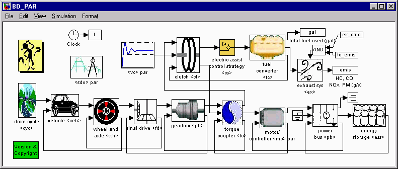
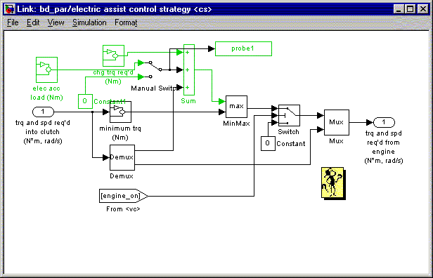

% Parallel Control Strategy
% 
% March 26, 2013

# Parallel Electric Assist Control Strategy

## Role of subsystem in vehicle

The parallel electric assist control strategy uses the motor for
additional power when needed by the vehicle and maintains charge in the
batteries.

## Description of modeling approach

The parallel assist strategy can use the electric
motor in a variety of ways:

1.  The motor can be used for all driving torque
    below a certain minimum vehicle speed.
2.  The motor is used for torque assist if the
    required torque is greater than the maximum producable by the engine
    at the engine’s operating speed.
3.  The motor charges the batteries by
    regenerative braking.
4.  When the engine would run inefficiently at the
    required engine torque at a given speed, the engine will shut off
    and the motor will produce the required torque.
5.  When the battery SOC is low, the engine will
    provide excess torque which will be used by the motor to charge the
    battery.

## Variables used in subsystem

There are six variables that determine the limits of the control
strategy.  Their influence on the engine operation are shown in the
schematics below, and they are described in the following table.

 \

[Parallel Control Strategy Tips](cs_tips.html#parallel)

  --------------------------- ----------------------------------------------------------------------------------------------------------------------------------------------------------------------------------------------------------------------------------------------
  **Variable**                **Description**
  cs\_hi\_soc                 highest desired battery state of charge
  cs\_lo\_soc                 lowest desired battery state of charge
  cs\_electric\_launch\_spd   vehicle speed below which vehicle operates as a Zero Emissions Vehicle
  cs\_off\_trq\_frac           cs\_off\_trq\_frac\*(torque capability of engine at current speed) = minimum torque threshold; when commanded at a lower torque, the engine will shut off if SOC \> cs\_lo\_soc
  cs\_min\_trq\_frac          cs\_min\_trq\_frac\*(torque capability of engine at current speed) = minimum torque threshold; when commanded at a lower torque, the engine will operate at the threshold torque and the motor acts as a generator if the SOC \< cs\_lo\_soc
  cs\_charge\_trq             cs\_charge\_trq\*((cs\_lo\_soc+cs\_hi\_soc)/2-SOC) = an accessory like torque loading on the engine to recharge the battery pack whenever the engine is on.
  --------------------------- ----------------------------------------------------------------------------------------------------------------------------------------------------------------------------------------------------------------------------------------------

  : **Parallel Control Strategy Variables**

The “Off torque envelope” and the “Minimum torque envelope” are
specified separately.  Since transfering energy
into and out of the battery incurs losses, it may be preferable to set
the charging torque at a higher level than the engine off torque.  This
could allow the overall efficiency of charging and discharging the
battery to be higher than it would be at a lower torque, where the
engine efficiency would be lower.

**<u>Implementation</u>**

*Parallel block diagram* \
The implementation of the parallel control stategy is found in two main
blocks: the electric assist control strategy block and the vehicle
controls block.

*Electric assist control strategy block diagram* \
The torque and speed load due to driving
conditions is presented to the engine through the clutch.  The energy
management strategy determines how the torques from the engine and motor
will combine to produce the required torque while maintaining charge in
the battery.

1.  When the battery SOC is below cs\_soc\_lo,
    additional torque is required from the engine to charge the
    battery.  This additional charging torque is proportional to the
    difference between SOC and the average of cs\_lo\_soc and
    cs\_hi\_soc.
2.  This engine torque is prevented from being
    below a certain fraction, cs\_min\_trq\_frac, of the maximum engine
    torque at the current operating speed.  This is intended to prevent
    the engine from operating at an inefficiently low torque.
3.  Engine torque is only requested when the
    engine is on.

*Vehicle controls/Engine On block diagram* \
The state of the engine (on or off) is determined by the following block
diagram.

1.  If the speed required is less than the electric launch speed,
    cs\_electric\_launch\_spd, the engine could turn off.
2.  If the SOC is higher than its low limit, the engine could turn off. 
    If both the requested speed is less than the launch speed and the
    SOC is higher than the low limit, the engine will turn off.
3.  If the torque required is less than a cutoff torque,
    cs\_off\_trq\_frac fraction of the maximum torque, the engine could
    turn off.  If both the requested torque is lower than this cutoff
    and the SOC is higher than the low limit, the engine will turn off.

* * * * *

\
[Back to Chapter 3](advisor_ch3.html)

Last Revised: 7/20/00:AB
