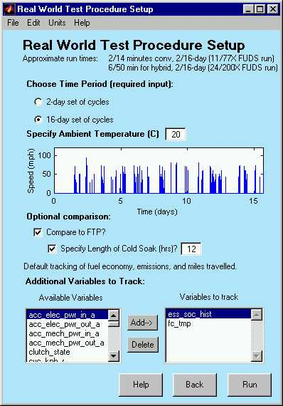
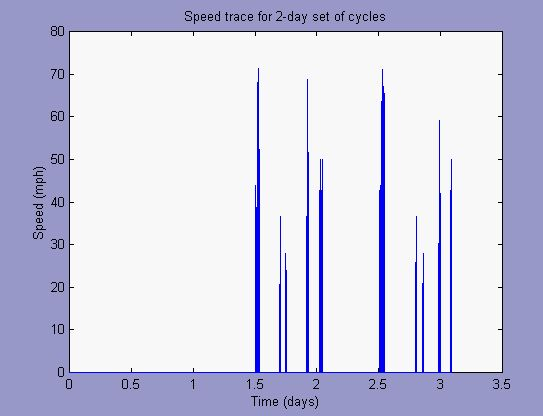
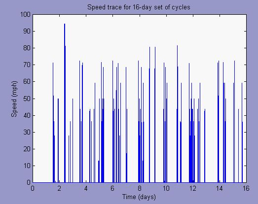
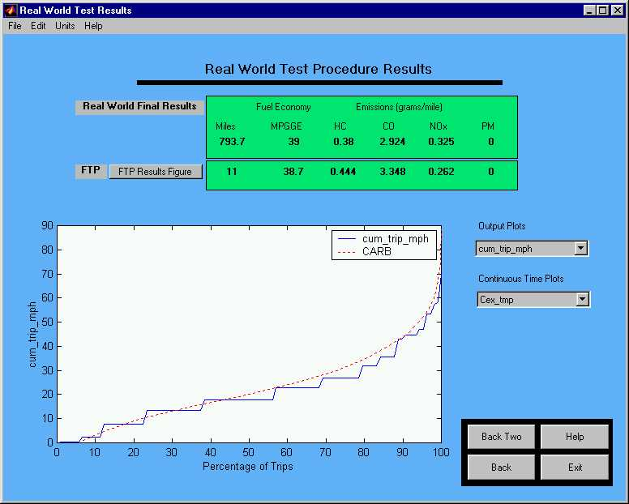

% Real World Test Procedure
% 
% 

**Real World Test Procedure**

* * * * *

**Test Procedure Description** \
The Real World Test Procedure is intended to capture real-world driving
patterns by running simulations and soaks over a period of several
days.  It is based on data available from CARB on real-world driving
patterns.  The setup screen shown below shows the various input
options.  The user can choose from a 2-day set of cycles, or a more
comprehensive 16-day set of cycles.  The user also specifies the ambient
temperature during the entire test.

As a benchmark, the user can compare the Real-World results to FTP
results.  The user may specify the length of the cold soak between the
preparation cycle (UDDS) and the FTP.  The official test procedure
specifies a soak period of 12-36 hours after the prep cycle.  If this
option is not checked, the FTP will run with no preparation cycle or
soak, but with cold start initial conditions.

In addition to tracking the fuel economy, emissions, and miles during
the set of cycles, the user has the option to track time variables. 
These are added by the user to the ‘Variables to track’ section in the
setup screen.

The initial conditions of the vehicle are set to hot, indicating that
the vehicle had just stopped driving.  The first soak is a 36 hour
soak.  The average velocity of the trips ranges from 5 mph to 75 mph. 
The 2-day option runs a set of 13 soak/driving trips.  The total cycle
is shown below:

 The 16-day option simulated 107 soak/driving trips.

**Results** \
The Real-World results screen is shown below:

**Real World Final Results** \
The final Real-World results presented are the raw distance, gas
equivalent fuel economy/consumption, and emissions.  If checked to run,
the button for the FTP results pulls up the normal ADVISOR results
screen for the FTP time history plots.

**Output Plots** \
There are 8 generic output plots available:

1.  cum\_soak\_dur: Cumulative soak duration, given in hours.  A
    comparison plot is made to the data from CARB.
2.  cum\_trip\_mi/km: Cumulative trip mileage; in the plot above, 80% of
    the trips were approximately 9 miles or less.  Again, a comparison
    plot is made to the data from CARB.
3.  cum\_trip\_mph/kph: Cumulative trip speed with a comparison to the
    CARB study.
4.  cum\_starts\_perday: Cumulative starts per day; comparison to CARB.
5.  trip\_tot\_emis\_\*: Cumulative values for the four emissions given
    per trip.

**Continuous Time Plots** \
The continuous time plots available are those variables selected by the
user in the input screen.  The variable name has a ‘C’ added to the
beginning of the name to indicate that it is continuous through the
entire 2 or 16-day set of cycles.  Note for hybrid vehicles:  it is
useful to track SOC to observe the final value and compare to the
initial value for the lengthy execution time of the test procedure means
that ‘zero-delta’ SOC correction is not employed.

* * * * *

[Return to Chapter 3](advisor_ch3.html#3.3)

