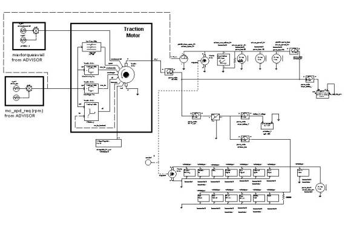
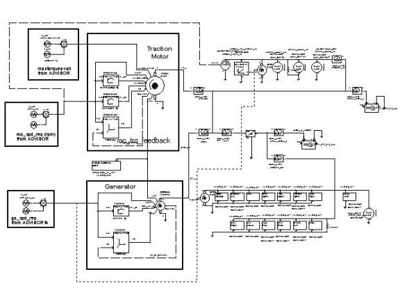
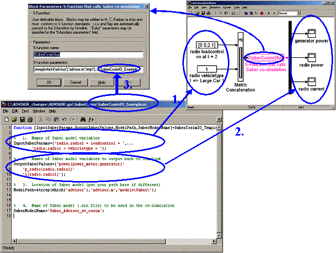

% aux\_loads\_help
% 
% 

<!DOCTYPE html> Saber Co-simulation Help<o:p></o:p>
=========================================================================================

<!--[if !vml]--><!--[endif]-->

<!--[if !supportEmptyParas]--> <!--[endif]--><o:p></o:p>

[Overview](#_Overview)

[ADVISOR/Saber Co-simulation
Requirements](#_ADVISOR/Saber_Co-simulation_Requirement)

[Using Existing ADVISOR/Saber Co-Simulation
Configurations](#_Using_Existing_ADVISOR/Saber)

[Creating A Custom Co-simulation](#_Creating_A_Custom)

<!--[if !supportEmptyParas]--> <!--[endif]--><o:p></o:p>

Overview
--------------------------------

The ADVISOR/Saber co-simulation improves and expands ADVISOR’s electric
modeling capability.  It improves
ADVISOR by providing the option for a more detailed voltage and current
based analysis to capture fluctuations in the electrical power
bus.  It expands ADVISOR by
providing the capability to use industry-contributed models and Saber
library models in ADVISOR.  These
models include:

<!--[if !supportLists]-->·       
<!--[endif]-->Industry-contributed:

<!--[if !supportLists]-->o      
<!--[endif]-->Generator

<!--[if !supportLists]-->o      
<!--[endif]-->DC/DC Converter

<!--[if !supportLists]-->o      
<!--[endif]-->Regulator

<!--[if !supportLists]-->o      
<!--[endif]-->Many Electrical Loads

<!--[if !supportLists]-->·       
<!--[endif]-->Saber library

<!--[if !supportLists]-->o      
<!--[endif]-->Lead Acid / Lithium Ion Batteries

<!--[if !supportLists]-->o      
<!--[endif]-->Integrated Starter Generator, Alternator,
Crankshaft Mounted Generators

<!--[if !supportLists]-->o      
<!--[endif]-->Electrical Load Models And Characterization
Tools

<!--[if !supportLists]-->o      
<!--[endif]-->Behavioral To Detailed Electronic, Digital,
Electrical, Mechanical, Hydraulic, and Pneumatic System Models

<!--[if !supportLists]-->o      
<!--[endif]-->Top Down DC/DC Converters (Behavioral To
Physical Models)

<!--[if !supportLists]-->o      
<!--[endif]-->Bus Systems (CAN, FlexRay, TTP Etc.)

<!--[if !supportLists]-->o      
<!--[endif]-->Power Management System

<!--[if !supportLists]-->o      
<!--[endif]-->PEM And SOFC Fuel Cells (Models And Building
Blocks)

<!--[if !supportLists]-->o      
<!--[endif]-->Over 150 Complete Automotive Systems (From
ABS To X-By-Wire)

Using models from both industry and the Saber library, additional
vehicle configurations have been created:

<!--[if !supportLists]-->·       
<!--[endif]-->Conventional, single voltage vehicle
including a battery, generator, and electrical loads:

<!--[if !vml]--><!--[endif]-->

Figure
1. 
Electrical Portion of Single Voltage Vehicle Configuration.

<!--[if !supportEmptyParas]--> <!--[endif]--><o:p></o:p>

<!--[if !supportLists]-->·       
<!--[endif]-->Conventional (14V/42V) dual voltage vehicle
configuration:

<!--[if !supportEmptyParas]--> <!--[endif]--><o:p></o:p>

<!--[if !vml]--><!--[endif]-->

Figure
2. 
Electrical Portion of Dual Voltage Vehicle Configuration

<!--[if !supportLists]-->·       
<!--[endif]-->Parallel electric hybrid vehicle
configuration:

<!--[if !supportEmptyParas]--> <!--[endif]--><o:p></o:p>

<!--[if !vml]--><!--[endif]-->

Figure
3. 
Electrical Portion of Parallel Hybrid Electric Vehicle
Configuration

<!--[if !supportLists]-->·       
<!--[endif]-->Series electric hybrid vehicle
configuration:

<!--[if !vml]--><!--[endif]-->

Figure
4. 
Electrical Portion of Series Hybrid Electric Vehicle
Configuration

<!--[if !supportEmptyParas]--> <!--[endif]--><o:p></o:p>

ADVISOR/Saber Co-simulation Requirements
-----------------------------------------------------------------------------------------------

### Co-simulation Requirements:

<!--[if !supportLists]-->·       
<!--[endif]-->Standard Saber License

<!--[if !supportLists]-->·       
<!--[endif]-->Optional Template Library License or Vehicle
Electric Library License

### How To Get Saber

If you want Saber please contact:

[http://www.avanticorp.com/sales](http://www.avanticorp.com/sales)

or mailto:

[saber-info@avanticorp.com](saber-info@avanticorp.com)

Using Existing ADVISOR/Saber Co-Simulation Configurations
-----------------------------------------------------------------------------------------------------

<!--[if !vml]--><!--[endif]-->

Figure
5. 
Selecting ADVISOR/Saber
co-simulation.<o:p></o:p>

### Choose Saved Vehicle Configuration

An ADVISOR/Saber co-simulation is run by selecting a “saber\_\*” saved
vehicle on the load file menu from the “Vehicle Input” screen, such as
CONV\_cosim\_dv\_in (dual voltage) seen in Figure
3.  Choosing a saved vehicle
configuration automatically makes the correct combination of component
selections.  These menu
selections define parameters that correspond to the models created in
Saber.  The parallel Saber model
includes a 14-volt and a high voltage battery, a motor, and Saber
auxiliary load models.

When choosing one of the “saber” drivetrain configurations, ADVISOR will
only allow appropriate component
selections.  The mapping for
these selections are outlined in Table 1.

<table border="1" cellspacing="0" cellpadding="0" style="border-collapse:collapse;
 border:none;mso-border-alt:solid windowtext .5pt;mso-padding-alt:0in 5.4pt 0in 5.4pt">
<tr style="height:31.35pt">
<td width="196" valign="top" style="width:146.65pt;border:solid windowtext .5pt;
  padding:0in 5.4pt 0in 5.4pt;height:31.35pt">
**Load File (Saved Vehicle Name)<o:p></o:p>**

</td>
<td width="173" valign="top" style="width:129.8pt;border:solid windowtext .5pt;
  border-left:none;mso-border-left-alt:solid windowtext .5pt;padding:0in 5.4pt 0in 5.4pt;
  height:31.35pt">
**Components<o:p></o:p>**

</td>
<td width="172" valign="top" style="width:128.7pt;border:solid windowtext .5pt;
  border-left:none;mso-border-left-alt:solid windowtext .5pt;padding:0in 5.4pt 0in 5.4pt;
  height:31.35pt">
**Valid Versions<o:p></o:p>**

</td>
<td width="170" valign="top" style="width:127.85pt;border:solid windowtext .5pt;
  border-left:none;mso-border-left-alt:solid windowtext .5pt;padding:0in 5.4pt 0in 5.4pt;
  height:31.35pt">
**Valid Types<o:p></o:p>**

</td>
<td width="177" valign="top" style="width:132.95pt;border:solid windowtext .5pt;
  border-left:none;mso-border-left-alt:solid windowtext .5pt;padding:0in 5.4pt 0in 5.4pt;
  height:31.35pt">
**Valid File Names<o:p></o:p>**

</td>
</tr>
<tr style="height:15.6pt">
<td width="196" valign="top" style="width:146.65pt;border:solid windowtext .5pt;
  border-top:none;mso-border-top-alt:solid windowtext .5pt;background:#E0E0E0;
  padding:0in 5.4pt 0in 5.4pt;height:15.6pt">
Conv\_cosim\_dv\_in

</td>
<td width="173" valign="top" style="width:129.8pt;border-top:none;border-left:
  none;border-bottom:solid windowtext .5pt;border-right:solid windowtext .5pt;
  mso-border-top-alt:solid windowtext .5pt;mso-border-left-alt:solid windowtext .5pt;
  background:#E0E0E0;padding:0in 5.4pt 0in 5.4pt;height:15.6pt">
Energy Storage (HiV)

</td>
<td width="172" valign="top" style="width:128.7pt;border-top:none;border-left:
  none;border-bottom:solid windowtext .5pt;border-right:solid windowtext .5pt;
  mso-border-top-alt:solid windowtext .5pt;mso-border-left-alt:solid windowtext .5pt;
  background:#E0E0E0;padding:0in 5.4pt 0in 5.4pt;height:15.6pt">
saber2

</td>
<td width="170" valign="top" style="width:127.85pt;border-top:none;border-left:
  none;border-bottom:solid windowtext .5pt;border-right:solid windowtext .5pt;
  mso-border-top-alt:solid windowtext .5pt;mso-border-left-alt:solid windowtext .5pt;
  background:#E0E0E0;padding:0in 5.4pt 0in 5.4pt;height:15.6pt">
pb

</td>
<td width="177" valign="top" style="width:132.95pt;border-top:none;border-left:
  none;border-bottom:solid windowtext .5pt;border-right:solid windowtext .5pt;
  mso-border-top-alt:solid windowtext .5pt;mso-border-left-alt:solid windowtext .5pt;
  background:#E0E0E0;padding:0in 5.4pt 0in 5.4pt;height:15.6pt">
all

</td>
</tr>
<tr style="height:15.6pt">
<td width="196" valign="top" style="width:146.65pt;border:solid windowtext .5pt;
  border-top:none;mso-border-top-alt:solid windowtext .5pt;background:#E0E0E0;
  padding:0in 5.4pt 0in 5.4pt;height:15.6pt">
<!--[if !supportEmptyParas]--> <!--[endif]--><o:p></o:p>

</td>
<td width="173" valign="top" style="width:129.8pt;border-top:none;border-left:
  none;border-bottom:solid windowtext .5pt;border-right:solid windowtext .5pt;
  mso-border-top-alt:solid windowtext .5pt;mso-border-left-alt:solid windowtext .5pt;
  background:#E0E0E0;padding:0in 5.4pt 0in 5.4pt;height:15.6pt">
<!--[if !supportEmptyParas]--> <!--[endif]--><o:p></o:p>

</td>
<td width="172" valign="top" style="width:128.7pt;border-top:none;border-left:
  none;border-bottom:solid windowtext .5pt;border-right:solid windowtext .5pt;
  mso-border-top-alt:solid windowtext .5pt;mso-border-left-alt:solid windowtext .5pt;
  background:#E0E0E0;padding:0in 5.4pt 0in 5.4pt;height:15.6pt">
rint

</td>
<td width="170" valign="top" style="width:127.85pt;border-top:none;border-left:
  none;border-bottom:solid windowtext .5pt;border-right:solid windowtext .5pt;
  mso-border-top-alt:solid windowtext .5pt;mso-border-left-alt:solid windowtext .5pt;
  background:#E0E0E0;padding:0in 5.4pt 0in 5.4pt;height:15.6pt">
all

</td>
<td width="177" valign="top" style="width:132.95pt;border-top:none;border-left:
  none;border-bottom:solid windowtext .5pt;border-right:solid windowtext .5pt;
  mso-border-top-alt:solid windowtext .5pt;mso-border-left-alt:solid windowtext .5pt;
  background:#E0E0E0;padding:0in 5.4pt 0in 5.4pt;height:15.6pt">
all

</td>
</tr>
<tr style="height:15.6pt">
<td width="196" valign="top" style="width:146.65pt;border:solid windowtext .5pt;
  border-top:none;mso-border-top-alt:solid windowtext .5pt;background:#E0E0E0;
  padding:0in 5.4pt 0in 5.4pt;height:15.6pt">
<!--[if !supportEmptyParas]--> <!--[endif]--><o:p></o:p>

</td>
<td width="173" valign="top" style="width:129.8pt;border-top:none;border-left:
  none;border-bottom:solid windowtext .5pt;border-right:solid windowtext .5pt;
  mso-border-top-alt:solid windowtext .5pt;mso-border-left-alt:solid windowtext .5pt;
  background:#E0E0E0;padding:0in 5.4pt 0in 5.4pt;height:15.6pt">
Energy Storage 2 (12v)

</td>
<td width="172" valign="top" style="width:128.7pt;border-top:none;border-left:
  none;border-bottom:solid windowtext .5pt;border-right:solid windowtext .5pt;
  mso-border-top-alt:solid windowtext .5pt;mso-border-left-alt:solid windowtext .5pt;
  background:#E0E0E0;padding:0in 5.4pt 0in 5.4pt;height:15.6pt">
saber

</td>
<td width="170" valign="top" style="width:127.85pt;border-top:none;border-left:
  none;border-bottom:solid windowtext .5pt;border-right:solid windowtext .5pt;
  mso-border-top-alt:solid windowtext .5pt;mso-border-left-alt:solid windowtext .5pt;
  background:#E0E0E0;padding:0in 5.4pt 0in 5.4pt;height:15.6pt">
pb

</td>
<td width="177" valign="top" style="width:132.95pt;border-top:none;border-left:
  none;border-bottom:solid windowtext .5pt;border-right:solid windowtext .5pt;
  mso-border-top-alt:solid windowtext .5pt;mso-border-left-alt:solid windowtext .5pt;
  background:#E0E0E0;padding:0in 5.4pt 0in 5.4pt;height:15.6pt">
all

</td>
</tr>
<tr style="height:15.6pt">
<td width="196" valign="top" style="width:146.65pt;border:solid windowtext .5pt;
  border-top:none;mso-border-top-alt:solid windowtext .5pt;background:#E0E0E0;
  padding:0in 5.4pt 0in 5.4pt;height:15.6pt">
<!--[if !supportEmptyParas]--> <!--[endif]--><o:p></o:p>

</td>
<td width="173" valign="top" style="width:129.8pt;border-top:none;border-left:
  none;border-bottom:solid windowtext .5pt;border-right:solid windowtext .5pt;
  mso-border-top-alt:solid windowtext .5pt;mso-border-left-alt:solid windowtext .5pt;
  background:#E0E0E0;padding:0in 5.4pt 0in 5.4pt;height:15.6pt">
<!--[if !supportEmptyParas]--> <!--[endif]--><o:p></o:p>

</td>
<td width="172" valign="top" style="width:128.7pt;border-top:none;border-left:
  none;border-bottom:solid windowtext .5pt;border-right:solid windowtext .5pt;
  mso-border-top-alt:solid windowtext .5pt;mso-border-left-alt:solid windowtext .5pt;
  background:#E0E0E0;padding:0in 5.4pt 0in 5.4pt;height:15.6pt">
rint

</td>
<td width="170" valign="top" style="width:127.85pt;border-top:none;border-left:
  none;border-bottom:solid windowtext .5pt;border-right:solid windowtext .5pt;
  mso-border-top-alt:solid windowtext .5pt;mso-border-left-alt:solid windowtext .5pt;
  background:#E0E0E0;padding:0in 5.4pt 0in 5.4pt;height:15.6pt">
all

</td>
<td width="177" valign="top" style="width:132.95pt;border-top:none;border-left:
  none;border-bottom:solid windowtext .5pt;border-right:solid windowtext .5pt;
  mso-border-top-alt:solid windowtext .5pt;mso-border-left-alt:solid windowtext .5pt;
  background:#E0E0E0;padding:0in 5.4pt 0in 5.4pt;height:15.6pt">
all

</td>
</tr>
<tr style="height:15.6pt">
<td width="196" valign="top" style="width:146.65pt;border:solid windowtext .5pt;
  border-top:none;mso-border-top-alt:solid windowtext .5pt;background:#E0E0E0;
  padding:0in 5.4pt 0in 5.4pt;height:15.6pt">
<!--[if !supportEmptyParas]--> <!--[endif]--><o:p></o:p>

</td>
<td width="173" valign="top" style="width:129.8pt;border-top:none;border-left:
  none;border-bottom:solid windowtext .5pt;border-right:solid windowtext .5pt;
  mso-border-top-alt:solid windowtext .5pt;mso-border-left-alt:solid windowtext .5pt;
  background:#E0E0E0;padding:0in 5.4pt 0in 5.4pt;height:15.6pt">
Generator (HiV)

</td>
<td width="172" valign="top" style="width:128.7pt;border-top:none;border-left:
  none;border-bottom:solid windowtext .5pt;border-right:solid windowtext .5pt;
  mso-border-top-alt:solid windowtext .5pt;mso-border-left-alt:solid windowtext .5pt;
  background:#E0E0E0;padding:0in 5.4pt 0in 5.4pt;height:15.6pt">
saber

</td>
<td width="170" valign="top" style="width:127.85pt;border-top:none;border-left:
  none;border-bottom:solid windowtext .5pt;border-right:solid windowtext .5pt;
  mso-border-top-alt:solid windowtext .5pt;mso-border-left-alt:solid windowtext .5pt;
  background:#E0E0E0;padding:0in 5.4pt 0in 5.4pt;height:15.6pt">
all

</td>
<td width="177" valign="top" style="width:132.95pt;border-top:none;border-left:
  none;border-bottom:solid windowtext .5pt;border-right:solid windowtext .5pt;
  mso-border-top-alt:solid windowtext .5pt;mso-border-left-alt:solid windowtext .5pt;
  background:#E0E0E0;padding:0in 5.4pt 0in 5.4pt;height:15.6pt">
all

</td>
</tr>
<tr style="height:15.6pt">
<td width="196" valign="top" style="width:146.65pt;border:solid windowtext .5pt;
  border-top:none;mso-border-top-alt:solid windowtext .5pt;background:#E0E0E0;
  padding:0in 5.4pt 0in 5.4pt;height:15.6pt">
<!--[if !supportEmptyParas]--> <!--[endif]--><o:p></o:p>

</td>
<td width="173" valign="top" style="width:129.8pt;border-top:none;border-left:
  none;border-bottom:solid windowtext .5pt;border-right:solid windowtext .5pt;
  mso-border-top-alt:solid windowtext .5pt;mso-border-left-alt:solid windowtext .5pt;
  background:#E0E0E0;padding:0in 5.4pt 0in 5.4pt;height:15.6pt">
Accessory

</td>
<td width="172" valign="top" style="width:128.7pt;border-top:none;border-left:
  none;border-bottom:solid windowtext .5pt;border-right:solid windowtext .5pt;
  mso-border-top-alt:solid windowtext .5pt;mso-border-left-alt:solid windowtext .5pt;
  background:#E0E0E0;padding:0in 5.4pt 0in 5.4pt;height:15.6pt">
sabDV

</td>
<td width="170" valign="top" style="width:127.85pt;border-top:none;border-left:
  none;border-bottom:solid windowtext .5pt;border-right:solid windowtext .5pt;
  mso-border-top-alt:solid windowtext .5pt;mso-border-left-alt:solid windowtext .5pt;
  background:#E0E0E0;padding:0in 5.4pt 0in 5.4pt;height:15.6pt">
all

</td>
<td width="177" valign="top" style="width:132.95pt;border-top:none;border-left:
  none;border-bottom:solid windowtext .5pt;border-right:solid windowtext .5pt;
  mso-border-top-alt:solid windowtext .5pt;mso-border-left-alt:solid windowtext .5pt;
  background:#E0E0E0;padding:0in 5.4pt 0in 5.4pt;height:15.6pt">
all

</td>
</tr>
<tr style="height:15.6pt">
<td width="196" valign="top" style="width:146.65pt;border:solid windowtext .5pt;
  border-top:none;mso-border-top-alt:solid windowtext .5pt;background:#E0E0E0;
  padding:0in 5.4pt 0in 5.4pt;height:15.6pt">
<!--[if !supportEmptyParas]--> <!--[endif]--><o:p></o:p>

</td>
<td width="173" valign="top" style="width:129.8pt;border-top:none;border-left:
  none;border-bottom:solid windowtext .5pt;border-right:solid windowtext .5pt;
  mso-border-top-alt:solid windowtext .5pt;mso-border-left-alt:solid windowtext .5pt;
  background:#E0E0E0;padding:0in 5.4pt 0in 5.4pt;height:15.6pt">
Powertrain Control

</td>
<td width="172" valign="top" style="width:128.7pt;border-top:none;border-left:
  none;border-bottom:solid windowtext .5pt;border-right:solid windowtext .5pt;
  mso-border-top-alt:solid windowtext .5pt;mso-border-left-alt:solid windowtext .5pt;
  background:#E0E0E0;padding:0in 5.4pt 0in 5.4pt;height:15.6pt">
sabDV

</td>
<td width="170" valign="top" style="width:127.85pt;border-top:none;border-left:
  none;border-bottom:solid windowtext .5pt;border-right:solid windowtext .5pt;
  mso-border-top-alt:solid windowtext .5pt;mso-border-left-alt:solid windowtext .5pt;
  background:#E0E0E0;padding:0in 5.4pt 0in 5.4pt;height:15.6pt">
man

</td>
<td width="177" valign="top" style="width:132.95pt;border-top:none;border-left:
  none;border-bottom:solid windowtext .5pt;border-right:solid windowtext .5pt;
  mso-border-top-alt:solid windowtext .5pt;mso-border-left-alt:solid windowtext .5pt;
  background:#E0E0E0;padding:0in 5.4pt 0in 5.4pt;height:15.6pt">
PTC\_CONV\_Saber\_dv

</td>
</tr>
<tr style="height:15.6pt">
<td width="196" valign="top" style="width:146.65pt;border:solid windowtext .5pt;
  border-top:none;mso-border-top-alt:solid windowtext .5pt;background:#E0E0E0;
  padding:0in 5.4pt 0in 5.4pt;height:15.6pt">
<!--[if !supportEmptyParas]--> <!--[endif]--><o:p></o:p>

</td>
<td width="173" valign="top" style="width:129.8pt;border-top:none;border-left:
  none;border-bottom:solid windowtext .5pt;border-right:solid windowtext .5pt;
  mso-border-top-alt:solid windowtext .5pt;mso-border-left-alt:solid windowtext .5pt;
  background:#E0E0E0;padding:0in 5.4pt 0in 5.4pt;height:15.6pt">
Torque Coupling

</td>
<td width="172" valign="top" style="width:128.7pt;border-top:none;border-left:
  none;border-bottom:solid windowtext .5pt;border-right:solid windowtext .5pt;
  mso-border-top-alt:solid windowtext .5pt;mso-border-left-alt:solid windowtext .5pt;
  background:#E0E0E0;padding:0in 5.4pt 0in 5.4pt;height:15.6pt">
-

</td>
<td width="170" valign="top" style="width:127.85pt;border-top:none;border-left:
  none;border-bottom:solid windowtext .5pt;border-right:solid windowtext .5pt;
  mso-border-top-alt:solid windowtext .5pt;mso-border-left-alt:solid windowtext .5pt;
  background:#E0E0E0;padding:0in 5.4pt 0in 5.4pt;height:15.6pt">
-

</td>
<td width="177" valign="top" style="width:132.95pt;border-top:none;border-left:
  none;border-bottom:solid windowtext .5pt;border-right:solid windowtext .5pt;
  mso-border-top-alt:solid windowtext .5pt;mso-border-left-alt:solid windowtext .5pt;
  background:#E0E0E0;padding:0in 5.4pt 0in 5.4pt;height:15.6pt">
TC\_GC\_TO\_FC

</td>
</tr>
<tr style="height:15.6pt">
<td width="196" valign="top" style="width:146.65pt;border:solid windowtext .5pt;
  border-top:none;mso-border-top-alt:solid windowtext .5pt;padding:0in 5.4pt 0in 5.4pt;
  height:15.6pt">
Conv\_cosim\_sv\_in

</td>
<td width="173" valign="top" style="width:129.8pt;border-top:none;border-left:
  none;border-bottom:solid windowtext .5pt;border-right:solid windowtext .5pt;
  mso-border-top-alt:solid windowtext .5pt;mso-border-left-alt:solid windowtext .5pt;
  padding:0in 5.4pt 0in 5.4pt;height:15.6pt">
Energy Storage 2

</td>
<td width="172" valign="top" style="width:128.7pt;border-top:none;border-left:
  none;border-bottom:solid windowtext .5pt;border-right:solid windowtext .5pt;
  mso-border-top-alt:solid windowtext .5pt;mso-border-left-alt:solid windowtext .5pt;
  padding:0in 5.4pt 0in 5.4pt;height:15.6pt">
saber

</td>
<td width="170" valign="top" style="width:127.85pt;border-top:none;border-left:
  none;border-bottom:solid windowtext .5pt;border-right:solid windowtext .5pt;
  mso-border-top-alt:solid windowtext .5pt;mso-border-left-alt:solid windowtext .5pt;
  padding:0in 5.4pt 0in 5.4pt;height:15.6pt">
pb

</td>
<td width="177" valign="top" style="width:132.95pt;border-top:none;border-left:
  none;border-bottom:solid windowtext .5pt;border-right:solid windowtext .5pt;
  mso-border-top-alt:solid windowtext .5pt;mso-border-left-alt:solid windowtext .5pt;
  padding:0in 5.4pt 0in 5.4pt;height:15.6pt">
all

</td>
</tr>
<tr style="height:15.6pt">
<td width="196" valign="top" style="width:146.65pt;border:solid windowtext .5pt;
  border-top:none;mso-border-top-alt:solid windowtext .5pt;padding:0in 5.4pt 0in 5.4pt;
  height:15.6pt">
<!--[if !supportEmptyParas]--> <!--[endif]--><o:p></o:p>

</td>
<td width="173" valign="top" style="width:129.8pt;border-top:none;border-left:
  none;border-bottom:solid windowtext .5pt;border-right:solid windowtext .5pt;
  mso-border-top-alt:solid windowtext .5pt;mso-border-left-alt:solid windowtext .5pt;
  padding:0in 5.4pt 0in 5.4pt;height:15.6pt">
<!--[if !supportEmptyParas]--> <!--[endif]--><o:p></o:p>

</td>
<td width="172" valign="top" style="width:128.7pt;border-top:none;border-left:
  none;border-bottom:solid windowtext .5pt;border-right:solid windowtext .5pt;
  mso-border-top-alt:solid windowtext .5pt;mso-border-left-alt:solid windowtext .5pt;
  padding:0in 5.4pt 0in 5.4pt;height:15.6pt">
rint

</td>
<td width="170" valign="top" style="width:127.85pt;border-top:none;border-left:
  none;border-bottom:solid windowtext .5pt;border-right:solid windowtext .5pt;
  mso-border-top-alt:solid windowtext .5pt;mso-border-left-alt:solid windowtext .5pt;
  padding:0in 5.4pt 0in 5.4pt;height:15.6pt">
all

</td>
<td width="177" valign="top" style="width:132.95pt;border-top:none;border-left:
  none;border-bottom:solid windowtext .5pt;border-right:solid windowtext .5pt;
  mso-border-top-alt:solid windowtext .5pt;mso-border-left-alt:solid windowtext .5pt;
  padding:0in 5.4pt 0in 5.4pt;height:15.6pt">
all

</td>
</tr>
<tr style="height:15.6pt">
<td width="196" valign="top" style="width:146.65pt;border:solid windowtext .5pt;
  border-top:none;mso-border-top-alt:solid windowtext .5pt;padding:0in 5.4pt 0in 5.4pt;
  height:15.6pt">
<!--[if !supportEmptyParas]--> <!--[endif]--><o:p></o:p>

</td>
<td width="173" valign="top" style="width:129.8pt;border-top:none;border-left:
  none;border-bottom:solid windowtext .5pt;border-right:solid windowtext .5pt;
  mso-border-top-alt:solid windowtext .5pt;mso-border-left-alt:solid windowtext .5pt;
  padding:0in 5.4pt 0in 5.4pt;height:15.6pt">
Generator

</td>
<td width="172" valign="top" style="width:128.7pt;border-top:none;border-left:
  none;border-bottom:solid windowtext .5pt;border-right:solid windowtext .5pt;
  mso-border-top-alt:solid windowtext .5pt;mso-border-left-alt:solid windowtext .5pt;
  padding:0in 5.4pt 0in 5.4pt;height:15.6pt">
saber

</td>
<td width="170" valign="top" style="width:127.85pt;border-top:none;border-left:
  none;border-bottom:solid windowtext .5pt;border-right:solid windowtext .5pt;
  mso-border-top-alt:solid windowtext .5pt;mso-border-left-alt:solid windowtext .5pt;
  padding:0in 5.4pt 0in 5.4pt;height:15.6pt">
all

</td>
<td width="177" valign="top" style="width:132.95pt;border-top:none;border-left:
  none;border-bottom:solid windowtext .5pt;border-right:solid windowtext .5pt;
  mso-border-top-alt:solid windowtext .5pt;mso-border-left-alt:solid windowtext .5pt;
  padding:0in 5.4pt 0in 5.4pt;height:15.6pt">
all

</td>
</tr>
<tr style="height:15.6pt">
<td width="196" valign="top" style="width:146.65pt;border:solid windowtext .5pt;
  border-top:none;mso-border-top-alt:solid windowtext .5pt;padding:0in 5.4pt 0in 5.4pt;
  height:15.6pt">
<!--[if !supportEmptyParas]--> <!--[endif]--><o:p></o:p>

</td>
<td width="173" valign="top" style="width:129.8pt;border-top:none;border-left:
  none;border-bottom:solid windowtext .5pt;border-right:solid windowtext .5pt;
  mso-border-top-alt:solid windowtext .5pt;mso-border-left-alt:solid windowtext .5pt;
  padding:0in 5.4pt 0in 5.4pt;height:15.6pt">
Accessory

</td>
<td width="172" valign="top" style="width:128.7pt;border-top:none;border-left:
  none;border-bottom:solid windowtext .5pt;border-right:solid windowtext .5pt;
  mso-border-top-alt:solid windowtext .5pt;mso-border-left-alt:solid windowtext .5pt;
  padding:0in 5.4pt 0in 5.4pt;height:15.6pt">
sabSV

</td>
<td width="170" valign="top" style="width:127.85pt;border-top:none;border-left:
  none;border-bottom:solid windowtext .5pt;border-right:solid windowtext .5pt;
  mso-border-top-alt:solid windowtext .5pt;mso-border-left-alt:solid windowtext .5pt;
  padding:0in 5.4pt 0in 5.4pt;height:15.6pt">
Conv

</td>
<td width="177" valign="top" style="width:132.95pt;border-top:none;border-left:
  none;border-bottom:solid windowtext .5pt;border-right:solid windowtext .5pt;
  mso-border-top-alt:solid windowtext .5pt;mso-border-left-alt:solid windowtext .5pt;
  padding:0in 5.4pt 0in 5.4pt;height:15.6pt">
all

</td>
</tr>
<tr style="height:15.6pt">
<td width="196" valign="top" style="width:146.65pt;border:solid windowtext .5pt;
  border-top:none;mso-border-top-alt:solid windowtext .5pt;padding:0in 5.4pt 0in 5.4pt;
  height:15.6pt">
<!--[if !supportEmptyParas]--> <!--[endif]--><o:p></o:p>

</td>
<td width="173" valign="top" style="width:129.8pt;border-top:none;border-left:
  none;border-bottom:solid windowtext .5pt;border-right:solid windowtext .5pt;
  mso-border-top-alt:solid windowtext .5pt;mso-border-left-alt:solid windowtext .5pt;
  padding:0in 5.4pt 0in 5.4pt;height:15.6pt">
Powertrain Control

</td>
<td width="172" valign="top" style="width:128.7pt;border-top:none;border-left:
  none;border-bottom:solid windowtext .5pt;border-right:solid windowtext .5pt;
  mso-border-top-alt:solid windowtext .5pt;mso-border-left-alt:solid windowtext .5pt;
  padding:0in 5.4pt 0in 5.4pt;height:15.6pt">
sabSV

</td>
<td width="170" valign="top" style="width:127.85pt;border-top:none;border-left:
  none;border-bottom:solid windowtext .5pt;border-right:solid windowtext .5pt;
  mso-border-top-alt:solid windowtext .5pt;mso-border-left-alt:solid windowtext .5pt;
  padding:0in 5.4pt 0in 5.4pt;height:15.6pt">
man

</td>
<td width="177" valign="top" style="width:132.95pt;border-top:none;border-left:
  none;border-bottom:solid windowtext .5pt;border-right:solid windowtext .5pt;
  mso-border-top-alt:solid windowtext .5pt;mso-border-left-alt:solid windowtext .5pt;
  padding:0in 5.4pt 0in 5.4pt;height:15.6pt">
PTC\_CONV\_Saber\_sv

</td>
</tr>
<tr style="height:15.6pt">
<td width="196" valign="top" style="width:146.65pt;border:solid windowtext .5pt;
  border-top:none;mso-border-top-alt:solid windowtext .5pt;padding:0in 5.4pt 0in 5.4pt;
  height:15.6pt">
<!--[if !supportEmptyParas]--> <!--[endif]--><o:p></o:p>

</td>
<td width="173" valign="top" style="width:129.8pt;border-top:none;border-left:
  none;border-bottom:solid windowtext .5pt;border-right:solid windowtext .5pt;
  mso-border-top-alt:solid windowtext .5pt;mso-border-left-alt:solid windowtext .5pt;
  padding:0in 5.4pt 0in 5.4pt;height:15.6pt">
Torque Coupling

</td>
<td width="172" valign="top" style="width:128.7pt;border-top:none;border-left:
  none;border-bottom:solid windowtext .5pt;border-right:solid windowtext .5pt;
  mso-border-top-alt:solid windowtext .5pt;mso-border-left-alt:solid windowtext .5pt;
  padding:0in 5.4pt 0in 5.4pt;height:15.6pt">
-

</td>
<td width="170" valign="top" style="width:127.85pt;border-top:none;border-left:
  none;border-bottom:solid windowtext .5pt;border-right:solid windowtext .5pt;
  mso-border-top-alt:solid windowtext .5pt;mso-border-left-alt:solid windowtext .5pt;
  padding:0in 5.4pt 0in 5.4pt;height:15.6pt">
-

</td>
<td width="177" valign="top" style="width:132.95pt;border-top:none;border-left:
  none;border-bottom:solid windowtext .5pt;border-right:solid windowtext .5pt;
  mso-border-top-alt:solid windowtext .5pt;mso-border-left-alt:solid windowtext .5pt;
  padding:0in 5.4pt 0in 5.4pt;height:15.6pt">
TC\_GC\_TO\_FC

</td>
</tr>
<tr style="height:15.6pt">
<td width="196" valign="top" style="width:146.65pt;border:solid windowtext .5pt;
  border-top:none;mso-border-top-alt:solid windowtext .5pt;background:#E0E0E0;
  padding:0in 5.4pt 0in 5.4pt;height:15.6pt">
SER\_Saber\_Cosim\_in

</td>
<td width="173" valign="top" style="width:129.8pt;border-top:none;border-left:
  none;border-bottom:solid windowtext .5pt;border-right:solid windowtext .5pt;
  mso-border-top-alt:solid windowtext .5pt;mso-border-left-alt:solid windowtext .5pt;
  background:#E0E0E0;padding:0in 5.4pt 0in 5.4pt;height:15.6pt">
Energy Storage

</td>
<td width="172" valign="top" style="width:128.7pt;border-top:none;border-left:
  none;border-bottom:solid windowtext .5pt;border-right:solid windowtext .5pt;
  mso-border-top-alt:solid windowtext .5pt;mso-border-left-alt:solid windowtext .5pt;
  background:#E0E0E0;padding:0in 5.4pt 0in 5.4pt;height:15.6pt">
rint

</td>
<td width="170" valign="top" style="width:127.85pt;border-top:none;border-left:
  none;border-bottom:solid windowtext .5pt;border-right:solid windowtext .5pt;
  mso-border-top-alt:solid windowtext .5pt;mso-border-left-alt:solid windowtext .5pt;
  background:#E0E0E0;padding:0in 5.4pt 0in 5.4pt;height:15.6pt">
all

</td>
<td width="177" valign="top" style="width:132.95pt;border-top:none;border-left:
  none;border-bottom:solid windowtext .5pt;border-right:solid windowtext .5pt;
  mso-border-top-alt:solid windowtext .5pt;mso-border-left-alt:solid windowtext .5pt;
  background:#E0E0E0;padding:0in 5.4pt 0in 5.4pt;height:15.6pt">
all

</td>
</tr>
<tr style="height:15.6pt">
<td width="196" valign="top" style="width:146.65pt;border:solid windowtext .5pt;
  border-top:none;mso-border-top-alt:solid windowtext .5pt;background:#E0E0E0;
  padding:0in 5.4pt 0in 5.4pt;height:15.6pt">
<!--[if !supportEmptyParas]--> <!--[endif]--><o:p></o:p>

</td>
<td width="173" valign="top" style="width:129.8pt;border-top:none;border-left:
  none;border-bottom:solid windowtext .5pt;border-right:solid windowtext .5pt;
  mso-border-top-alt:solid windowtext .5pt;mso-border-left-alt:solid windowtext .5pt;
  background:#E0E0E0;padding:0in 5.4pt 0in 5.4pt;height:15.6pt">
<!--[if !supportEmptyParas]--> <!--[endif]--><o:p></o:p>

</td>
<td width="172" valign="top" style="width:128.7pt;border-top:none;border-left:
  none;border-bottom:solid windowtext .5pt;border-right:solid windowtext .5pt;
  mso-border-top-alt:solid windowtext .5pt;mso-border-left-alt:solid windowtext .5pt;
  background:#E0E0E0;padding:0in 5.4pt 0in 5.4pt;height:15.6pt">
saber2

</td>
<td width="170" valign="top" style="width:127.85pt;border-top:none;border-left:
  none;border-bottom:solid windowtext .5pt;border-right:solid windowtext .5pt;
  mso-border-top-alt:solid windowtext .5pt;mso-border-left-alt:solid windowtext .5pt;
  background:#E0E0E0;padding:0in 5.4pt 0in 5.4pt;height:15.6pt">
all

</td>
<td width="177" valign="top" style="width:132.95pt;border-top:none;border-left:
  none;border-bottom:solid windowtext .5pt;border-right:solid windowtext .5pt;
  mso-border-top-alt:solid windowtext .5pt;mso-border-left-alt:solid windowtext .5pt;
  background:#E0E0E0;padding:0in 5.4pt 0in 5.4pt;height:15.6pt">
all

</td>
</tr>
<tr style="height:15.6pt">
<td width="196" valign="top" style="width:146.65pt;border:solid windowtext .5pt;
  border-top:none;mso-border-top-alt:solid windowtext .5pt;background:#E0E0E0;
  padding:0in 5.4pt 0in 5.4pt;height:15.6pt">
<!--[if !supportEmptyParas]--> <!--[endif]--><o:p></o:p>

</td>
<td width="173" valign="top" style="width:129.8pt;border-top:none;border-left:
  none;border-bottom:solid windowtext .5pt;border-right:solid windowtext .5pt;
  mso-border-top-alt:solid windowtext .5pt;mso-border-left-alt:solid windowtext .5pt;
  background:#E0E0E0;padding:0in 5.4pt 0in 5.4pt;height:15.6pt">
Energy Storage 2

</td>
<td width="172" valign="top" style="width:128.7pt;border-top:none;border-left:
  none;border-bottom:solid windowtext .5pt;border-right:solid windowtext .5pt;
  mso-border-top-alt:solid windowtext .5pt;mso-border-left-alt:solid windowtext .5pt;
  background:#E0E0E0;padding:0in 5.4pt 0in 5.4pt;height:15.6pt">
saber

</td>
<td width="170" valign="top" style="width:127.85pt;border-top:none;border-left:
  none;border-bottom:solid windowtext .5pt;border-right:solid windowtext .5pt;
  mso-border-top-alt:solid windowtext .5pt;mso-border-left-alt:solid windowtext .5pt;
  background:#E0E0E0;padding:0in 5.4pt 0in 5.4pt;height:15.6pt">
pb

</td>
<td width="177" valign="top" style="width:132.95pt;border-top:none;border-left:
  none;border-bottom:solid windowtext .5pt;border-right:solid windowtext .5pt;
  mso-border-top-alt:solid windowtext .5pt;mso-border-left-alt:solid windowtext .5pt;
  background:#E0E0E0;padding:0in 5.4pt 0in 5.4pt;height:15.6pt">
all

</td>
</tr>
<tr style="height:15.6pt">
<td width="196" valign="top" style="width:146.65pt;border:solid windowtext .5pt;
  border-top:none;mso-border-top-alt:solid windowtext .5pt;background:#E0E0E0;
  padding:0in 5.4pt 0in 5.4pt;height:15.6pt">
<!--[if !supportEmptyParas]--> <!--[endif]--><o:p></o:p>

</td>
<td width="173" valign="top" style="width:129.8pt;border-top:none;border-left:
  none;border-bottom:solid windowtext .5pt;border-right:solid windowtext .5pt;
  mso-border-top-alt:solid windowtext .5pt;mso-border-left-alt:solid windowtext .5pt;
  background:#E0E0E0;padding:0in 5.4pt 0in 5.4pt;height:15.6pt">
<!--[if !supportEmptyParas]--> <!--[endif]--><o:p></o:p>

</td>
<td width="172" valign="top" style="width:128.7pt;border-top:none;border-left:
  none;border-bottom:solid windowtext .5pt;border-right:solid windowtext .5pt;
  mso-border-top-alt:solid windowtext .5pt;mso-border-left-alt:solid windowtext .5pt;
  background:#E0E0E0;padding:0in 5.4pt 0in 5.4pt;height:15.6pt">
rint

</td>
<td width="170" valign="top" style="width:127.85pt;border-top:none;border-left:
  none;border-bottom:solid windowtext .5pt;border-right:solid windowtext .5pt;
  mso-border-top-alt:solid windowtext .5pt;mso-border-left-alt:solid windowtext .5pt;
  background:#E0E0E0;padding:0in 5.4pt 0in 5.4pt;height:15.6pt">
all

</td>
<td width="177" valign="top" style="width:132.95pt;border-top:none;border-left:
  none;border-bottom:solid windowtext .5pt;border-right:solid windowtext .5pt;
  mso-border-top-alt:solid windowtext .5pt;mso-border-left-alt:solid windowtext .5pt;
  background:#E0E0E0;padding:0in 5.4pt 0in 5.4pt;height:15.6pt">
all, scale voltage to 12v

</td>
</tr>
<tr style="height:15.6pt">
<td width="196" valign="top" style="width:146.65pt;border:solid windowtext .5pt;
  border-top:none;mso-border-top-alt:solid windowtext .5pt;background:#E0E0E0;
  padding:0in 5.4pt 0in 5.4pt;height:15.6pt">
<!--[if !supportEmptyParas]--> <!--[endif]--><o:p></o:p>

</td>
<td width="173" valign="top" style="width:129.8pt;border-top:none;border-left:
  none;border-bottom:solid windowtext .5pt;border-right:solid windowtext .5pt;
  mso-border-top-alt:solid windowtext .5pt;mso-border-left-alt:solid windowtext .5pt;
  background:#E0E0E0;padding:0in 5.4pt 0in 5.4pt;height:15.6pt">
Generator

</td>
<td width="172" valign="top" style="width:128.7pt;border-top:none;border-left:
  none;border-bottom:solid windowtext .5pt;border-right:solid windowtext .5pt;
  mso-border-top-alt:solid windowtext .5pt;mso-border-left-alt:solid windowtext .5pt;
  background:#E0E0E0;padding:0in 5.4pt 0in 5.4pt;height:15.6pt">
reg

</td>
<td width="170" valign="top" style="width:127.85pt;border-top:none;border-left:
  none;border-bottom:solid windowtext .5pt;border-right:solid windowtext .5pt;
  mso-border-top-alt:solid windowtext .5pt;mso-border-left-alt:solid windowtext .5pt;
  background:#E0E0E0;padding:0in 5.4pt 0in 5.4pt;height:15.6pt">
reg

</td>
<td width="177" valign="top" style="width:132.95pt;border-top:none;border-left:
  none;border-bottom:solid windowtext .5pt;border-right:solid windowtext .5pt;
  mso-border-top-alt:solid windowtext .5pt;mso-border-left-alt:solid windowtext .5pt;
  background:#E0E0E0;padding:0in 5.4pt 0in 5.4pt;height:15.6pt">
all

</td>
</tr>
<tr style="height:15.6pt">
<td width="196" valign="top" style="width:146.65pt;border:solid windowtext .5pt;
  border-top:none;mso-border-top-alt:solid windowtext .5pt;background:#E0E0E0;
  padding:0in 5.4pt 0in 5.4pt;height:15.6pt">
<!--[if !supportEmptyParas]--> <!--[endif]--><o:p></o:p>

</td>
<td width="173" valign="top" style="width:129.8pt;border-top:none;border-left:
  none;border-bottom:solid windowtext .5pt;border-right:solid windowtext .5pt;
  mso-border-top-alt:solid windowtext .5pt;mso-border-left-alt:solid windowtext .5pt;
  background:#E0E0E0;padding:0in 5.4pt 0in 5.4pt;height:15.6pt">
Accessory

</td>
<td width="172" valign="top" style="width:128.7pt;border-top:none;border-left:
  none;border-bottom:solid windowtext .5pt;border-right:solid windowtext .5pt;
  mso-border-top-alt:solid windowtext .5pt;mso-border-left-alt:solid windowtext .5pt;
  background:#E0E0E0;padding:0in 5.4pt 0in 5.4pt;height:15.6pt">
saber

</td>
<td width="170" valign="top" style="width:127.85pt;border-top:none;border-left:
  none;border-bottom:solid windowtext .5pt;border-right:solid windowtext .5pt;
  mso-border-top-alt:solid windowtext .5pt;mso-border-left-alt:solid windowtext .5pt;
  background:#E0E0E0;padding:0in 5.4pt 0in 5.4pt;height:15.6pt">
Var

</td>
<td width="177" valign="top" style="width:132.95pt;border-top:none;border-left:
  none;border-bottom:solid windowtext .5pt;border-right:solid windowtext .5pt;
  mso-border-top-alt:solid windowtext .5pt;mso-border-left-alt:solid windowtext .5pt;
  background:#E0E0E0;padding:0in 5.4pt 0in 5.4pt;height:15.6pt">
all

</td>
</tr>
<tr style="height:15.6pt">
<td width="196" valign="top" style="width:146.65pt;border:solid windowtext .5pt;
  border-top:none;mso-border-top-alt:solid windowtext .5pt;background:#E0E0E0;
  padding:0in 5.4pt 0in 5.4pt;height:15.6pt">
<!--[if !supportEmptyParas]--> <!--[endif]--><o:p></o:p>

</td>
<td width="173" valign="top" style="width:129.8pt;border-top:none;border-left:
  none;border-bottom:solid windowtext .5pt;border-right:solid windowtext .5pt;
  mso-border-top-alt:solid windowtext .5pt;mso-border-left-alt:solid windowtext .5pt;
  background:#E0E0E0;padding:0in 5.4pt 0in 5.4pt;height:15.6pt">
<!--[if !supportEmptyParas]--> <!--[endif]--><o:p></o:p>

</td>
<td width="172" valign="top" style="width:128.7pt;border-top:none;border-left:
  none;border-bottom:solid windowtext .5pt;border-right:solid windowtext .5pt;
  mso-border-top-alt:solid windowtext .5pt;mso-border-left-alt:solid windowtext .5pt;
  background:#E0E0E0;padding:0in 5.4pt 0in 5.4pt;height:15.6pt">
<!--[if !supportEmptyParas]--> <!--[endif]--><o:p></o:p>

</td>
<td width="170" valign="top" style="width:127.85pt;border-top:none;border-left:
  none;border-bottom:solid windowtext .5pt;border-right:solid windowtext .5pt;
  mso-border-top-alt:solid windowtext .5pt;mso-border-left-alt:solid windowtext .5pt;
  background:#E0E0E0;padding:0in 5.4pt 0in 5.4pt;height:15.6pt">
Const

</td>
<td width="177" valign="top" style="width:132.95pt;border-top:none;border-left:
  none;border-bottom:solid windowtext .5pt;border-right:solid windowtext .5pt;
  mso-border-top-alt:solid windowtext .5pt;mso-border-left-alt:solid windowtext .5pt;
  background:#E0E0E0;padding:0in 5.4pt 0in 5.4pt;height:15.6pt">
all

</td>
</tr>
<tr style="height:15.6pt">
<td width="196" valign="top" style="width:146.65pt;border:solid windowtext .5pt;
  border-top:none;mso-border-top-alt:solid windowtext .5pt;background:#E0E0E0;
  padding:0in 5.4pt 0in 5.4pt;height:15.6pt">
<!--[if !supportEmptyParas]--> <!--[endif]--><o:p></o:p>

</td>
<td width="173" valign="top" style="width:129.8pt;border-top:none;border-left:
  none;border-bottom:solid windowtext .5pt;border-right:solid windowtext .5pt;
  mso-border-top-alt:solid windowtext .5pt;mso-border-left-alt:solid windowtext .5pt;
  background:#E0E0E0;padding:0in 5.4pt 0in 5.4pt;height:15.6pt">
Powertrain Control

</td>
<td width="172" valign="top" style="width:128.7pt;border-top:none;border-left:
  none;border-bottom:solid windowtext .5pt;border-right:solid windowtext .5pt;
  mso-border-top-alt:solid windowtext .5pt;mso-border-left-alt:solid windowtext .5pt;
  background:#E0E0E0;padding:0in 5.4pt 0in 5.4pt;height:15.6pt">
sabSer

</td>
<td width="170" valign="top" style="width:127.85pt;border-top:none;border-left:
  none;border-bottom:solid windowtext .5pt;border-right:solid windowtext .5pt;
  mso-border-top-alt:solid windowtext .5pt;mso-border-left-alt:solid windowtext .5pt;
  background:#E0E0E0;padding:0in 5.4pt 0in 5.4pt;height:15.6pt">
man

</td>
<td width="177" valign="top" style="width:132.95pt;border-top:none;border-left:
  none;border-bottom:solid windowtext .5pt;border-right:solid windowtext .5pt;
  mso-border-top-alt:solid windowtext .5pt;mso-border-left-alt:solid windowtext .5pt;
  background:#E0E0E0;padding:0in 5.4pt 0in 5.4pt;height:15.6pt">
all

</td>
</tr>
<tr style="height:15.6pt">
<td width="196" valign="top" style="width:146.65pt;border:solid windowtext .5pt;
  border-top:none;mso-border-top-alt:solid windowtext .5pt;padding:0in 5.4pt 0in 5.4pt;
  height:15.6pt">
PAR\_Saber\_Cosim\_in

</td>
<td width="173" valign="top" style="width:129.8pt;border-top:none;border-left:
  none;border-bottom:solid windowtext .5pt;border-right:solid windowtext .5pt;
  mso-border-top-alt:solid windowtext .5pt;mso-border-left-alt:solid windowtext .5pt;
  padding:0in 5.4pt 0in 5.4pt;height:15.6pt">
Energy Storage

</td>
<td width="172" valign="top" style="width:128.7pt;border-top:none;border-left:
  none;border-bottom:solid windowtext .5pt;border-right:solid windowtext .5pt;
  mso-border-top-alt:solid windowtext .5pt;mso-border-left-alt:solid windowtext .5pt;
  padding:0in 5.4pt 0in 5.4pt;height:15.6pt">
rint

</td>
<td width="170" valign="top" style="width:127.85pt;border-top:none;border-left:
  none;border-bottom:solid windowtext .5pt;border-right:solid windowtext .5pt;
  mso-border-top-alt:solid windowtext .5pt;mso-border-left-alt:solid windowtext .5pt;
  padding:0in 5.4pt 0in 5.4pt;height:15.6pt">
all

</td>
<td width="177" valign="top" style="width:132.95pt;border-top:none;border-left:
  none;border-bottom:solid windowtext .5pt;border-right:solid windowtext .5pt;
  mso-border-top-alt:solid windowtext .5pt;mso-border-left-alt:solid windowtext .5pt;
  padding:0in 5.4pt 0in 5.4pt;height:15.6pt">
all

</td>
</tr>
<tr style="height:15.6pt">
<td width="196" valign="top" style="width:146.65pt;border:solid windowtext .5pt;
  border-top:none;mso-border-top-alt:solid windowtext .5pt;padding:0in 5.4pt 0in 5.4pt;
  height:15.6pt">
<!--[if !supportEmptyParas]--> <!--[endif]--><o:p></o:p>

</td>
<td width="173" valign="top" style="width:129.8pt;border-top:none;border-left:
  none;border-bottom:solid windowtext .5pt;border-right:solid windowtext .5pt;
  mso-border-top-alt:solid windowtext .5pt;mso-border-left-alt:solid windowtext .5pt;
  padding:0in 5.4pt 0in 5.4pt;height:15.6pt">
<!--[if !supportEmptyParas]--> <!--[endif]--><o:p></o:p>

</td>
<td width="172" valign="top" style="width:128.7pt;border-top:none;border-left:
  none;border-bottom:solid windowtext .5pt;border-right:solid windowtext .5pt;
  mso-border-top-alt:solid windowtext .5pt;mso-border-left-alt:solid windowtext .5pt;
  padding:0in 5.4pt 0in 5.4pt;height:15.6pt">
saber2

</td>
<td width="170" valign="top" style="width:127.85pt;border-top:none;border-left:
  none;border-bottom:solid windowtext .5pt;border-right:solid windowtext .5pt;
  mso-border-top-alt:solid windowtext .5pt;mso-border-left-alt:solid windowtext .5pt;
  padding:0in 5.4pt 0in 5.4pt;height:15.6pt">
all

</td>
<td width="177" valign="top" style="width:132.95pt;border-top:none;border-left:
  none;border-bottom:solid windowtext .5pt;border-right:solid windowtext .5pt;
  mso-border-top-alt:solid windowtext .5pt;mso-border-left-alt:solid windowtext .5pt;
  padding:0in 5.4pt 0in 5.4pt;height:15.6pt">
all

</td>
</tr>
<tr style="height:15.6pt">
<td width="196" valign="top" style="width:146.65pt;border:solid windowtext .5pt;
  border-top:none;mso-border-top-alt:solid windowtext .5pt;padding:0in 5.4pt 0in 5.4pt;
  height:15.6pt">
<!--[if !supportEmptyParas]--> <!--[endif]--><o:p></o:p>

</td>
<td width="173" valign="top" style="width:129.8pt;border-top:none;border-left:
  none;border-bottom:solid windowtext .5pt;border-right:solid windowtext .5pt;
  mso-border-top-alt:solid windowtext .5pt;mso-border-left-alt:solid windowtext .5pt;
  padding:0in 5.4pt 0in 5.4pt;height:15.6pt">
Energy Storage 2

</td>
<td width="172" valign="top" style="width:128.7pt;border-top:none;border-left:
  none;border-bottom:solid windowtext .5pt;border-right:solid windowtext .5pt;
  mso-border-top-alt:solid windowtext .5pt;mso-border-left-alt:solid windowtext .5pt;
  padding:0in 5.4pt 0in 5.4pt;height:15.6pt">
saber

</td>
<td width="170" valign="top" style="width:127.85pt;border-top:none;border-left:
  none;border-bottom:solid windowtext .5pt;border-right:solid windowtext .5pt;
  mso-border-top-alt:solid windowtext .5pt;mso-border-left-alt:solid windowtext .5pt;
  padding:0in 5.4pt 0in 5.4pt;height:15.6pt">
pb

</td>
<td width="177" valign="top" style="width:132.95pt;border-top:none;border-left:
  none;border-bottom:solid windowtext .5pt;border-right:solid windowtext .5pt;
  mso-border-top-alt:solid windowtext .5pt;mso-border-left-alt:solid windowtext .5pt;
  padding:0in 5.4pt 0in 5.4pt;height:15.6pt">
all

</td>
</tr>
<tr style="height:15.6pt">
<td width="196" valign="top" style="width:146.65pt;border:solid windowtext .5pt;
  border-top:none;mso-border-top-alt:solid windowtext .5pt;padding:0in 5.4pt 0in 5.4pt;
  height:15.6pt">
<!--[if !supportEmptyParas]--> <!--[endif]--><o:p></o:p>

</td>
<td width="173" valign="top" style="width:129.8pt;border-top:none;border-left:
  none;border-bottom:solid windowtext .5pt;border-right:solid windowtext .5pt;
  mso-border-top-alt:solid windowtext .5pt;mso-border-left-alt:solid windowtext .5pt;
  padding:0in 5.4pt 0in 5.4pt;height:15.6pt">
<!--[if !supportEmptyParas]--> <!--[endif]--><o:p></o:p>

</td>
<td width="172" valign="top" style="width:128.7pt;border-top:none;border-left:
  none;border-bottom:solid windowtext .5pt;border-right:solid windowtext .5pt;
  mso-border-top-alt:solid windowtext .5pt;mso-border-left-alt:solid windowtext .5pt;
  padding:0in 5.4pt 0in 5.4pt;height:15.6pt">
rint

</td>
<td width="170" valign="top" style="width:127.85pt;border-top:none;border-left:
  none;border-bottom:solid windowtext .5pt;border-right:solid windowtext .5pt;
  mso-border-top-alt:solid windowtext .5pt;mso-border-left-alt:solid windowtext .5pt;
  padding:0in 5.4pt 0in 5.4pt;height:15.6pt">
all

</td>
<td width="177" valign="top" style="width:132.95pt;border-top:none;border-left:
  none;border-bottom:solid windowtext .5pt;border-right:solid windowtext .5pt;
  mso-border-top-alt:solid windowtext .5pt;mso-border-left-alt:solid windowtext .5pt;
  padding:0in 5.4pt 0in 5.4pt;height:15.6pt">
all, scale voltage to 12v

</td>
</tr>
<tr style="height:15.6pt">
<td width="196" valign="top" style="width:146.65pt;border:solid windowtext .5pt;
  border-top:none;mso-border-top-alt:solid windowtext .5pt;padding:0in 5.4pt 0in 5.4pt;
  height:15.6pt">
<!--[if !supportEmptyParas]--> <!--[endif]--><o:p></o:p>

</td>
<td width="173" valign="top" style="width:129.8pt;border-top:none;border-left:
  none;border-bottom:solid windowtext .5pt;border-right:solid windowtext .5pt;
  mso-border-top-alt:solid windowtext .5pt;mso-border-left-alt:solid windowtext .5pt;
  padding:0in 5.4pt 0in 5.4pt;height:15.6pt">
Accessory

</td>
<td width="172" valign="top" style="width:128.7pt;border-top:none;border-left:
  none;border-bottom:solid windowtext .5pt;border-right:solid windowtext .5pt;
  mso-border-top-alt:solid windowtext .5pt;mso-border-left-alt:solid windowtext .5pt;
  padding:0in 5.4pt 0in 5.4pt;height:15.6pt">
sabPar

</td>
<td width="170" valign="top" style="width:127.85pt;border-top:none;border-left:
  none;border-bottom:solid windowtext .5pt;border-right:solid windowtext .5pt;
  mso-border-top-alt:solid windowtext .5pt;mso-border-left-alt:solid windowtext .5pt;
  padding:0in 5.4pt 0in 5.4pt;height:15.6pt">
Var

</td>
<td width="177" valign="top" style="width:132.95pt;border-top:none;border-left:
  none;border-bottom:solid windowtext .5pt;border-right:solid windowtext .5pt;
  mso-border-top-alt:solid windowtext .5pt;mso-border-left-alt:solid windowtext .5pt;
  padding:0in 5.4pt 0in 5.4pt;height:15.6pt">
all

</td>
</tr>
<tr style="height:15.6pt">
<td width="196" valign="top" style="width:146.65pt;border:solid windowtext .5pt;
  border-top:none;mso-border-top-alt:solid windowtext .5pt;padding:0in 5.4pt 0in 5.4pt;
  height:15.6pt">
<!--[if !supportEmptyParas]--> <!--[endif]--><o:p></o:p>

</td>
<td width="173" valign="top" style="width:129.8pt;border-top:none;border-left:
  none;border-bottom:solid windowtext .5pt;border-right:solid windowtext .5pt;
  mso-border-top-alt:solid windowtext .5pt;mso-border-left-alt:solid windowtext .5pt;
  padding:0in 5.4pt 0in 5.4pt;height:15.6pt">
<!--[if !supportEmptyParas]--> <!--[endif]--><o:p></o:p>

</td>
<td width="172" valign="top" style="width:128.7pt;border-top:none;border-left:
  none;border-bottom:solid windowtext .5pt;border-right:solid windowtext .5pt;
  mso-border-top-alt:solid windowtext .5pt;mso-border-left-alt:solid windowtext .5pt;
  padding:0in 5.4pt 0in 5.4pt;height:15.6pt">
<!--[if !supportEmptyParas]--> <!--[endif]--><o:p></o:p>

</td>
<td width="170" valign="top" style="width:127.85pt;border-top:none;border-left:
  none;border-bottom:solid windowtext .5pt;border-right:solid windowtext .5pt;
  mso-border-top-alt:solid windowtext .5pt;mso-border-left-alt:solid windowtext .5pt;
  padding:0in 5.4pt 0in 5.4pt;height:15.6pt">
Const

</td>
<td width="177" valign="top" style="width:132.95pt;border-top:none;border-left:
  none;border-bottom:solid windowtext .5pt;border-right:solid windowtext .5pt;
  mso-border-top-alt:solid windowtext .5pt;mso-border-left-alt:solid windowtext .5pt;
  padding:0in 5.4pt 0in 5.4pt;height:15.6pt">
all

</td>
</tr>
<tr style="height:15.6pt">
<td width="196" valign="top" style="width:146.65pt;border:solid windowtext .5pt;
  border-top:none;mso-border-top-alt:solid windowtext .5pt;padding:0in 5.4pt 0in 5.4pt;
  height:15.6pt">
<!--[if !supportEmptyParas]--> <!--[endif]--><o:p></o:p>

</td>
<td width="173" valign="top" style="width:129.8pt;border-top:none;border-left:
  none;border-bottom:solid windowtext .5pt;border-right:solid windowtext .5pt;
  mso-border-top-alt:solid windowtext .5pt;mso-border-left-alt:solid windowtext .5pt;
  padding:0in 5.4pt 0in 5.4pt;height:15.6pt">
Powertrain Control

</td>
<td width="172" valign="top" style="width:128.7pt;border-top:none;border-left:
  none;border-bottom:solid windowtext .5pt;border-right:solid windowtext .5pt;
  mso-border-top-alt:solid windowtext .5pt;mso-border-left-alt:solid windowtext .5pt;
  padding:0in 5.4pt 0in 5.4pt;height:15.6pt">
sabPar

</td>
<td width="170" valign="top" style="width:127.85pt;border-top:none;border-left:
  none;border-bottom:solid windowtext .5pt;border-right:solid windowtext .5pt;
  mso-border-top-alt:solid windowtext .5pt;mso-border-left-alt:solid windowtext .5pt;
  padding:0in 5.4pt 0in 5.4pt;height:15.6pt">
man

</td>
<td width="177" valign="top" style="width:132.95pt;border-top:none;border-left:
  none;border-bottom:solid windowtext .5pt;border-right:solid windowtext .5pt;
  mso-border-top-alt:solid windowtext .5pt;mso-border-left-alt:solid windowtext .5pt;
  padding:0in 5.4pt 0in 5.4pt;height:15.6pt">
PTC\_PAR\_Saber

</td>
</tr>
<tr style="height:15.6pt">
<td width="196" valign="top" style="width:146.65pt;border:solid windowtext .5pt;
  border-top:none;mso-border-top-alt:solid windowtext .5pt;padding:0in 5.4pt 0in 5.4pt;
  height:15.6pt">
<!--[if !supportEmptyParas]--> <!--[endif]--><o:p></o:p>

</td>
<td width="173" valign="top" style="width:129.8pt;border-top:none;border-left:
  none;border-bottom:solid windowtext .5pt;border-right:solid windowtext .5pt;
  mso-border-top-alt:solid windowtext .5pt;mso-border-left-alt:solid windowtext .5pt;
  padding:0in 5.4pt 0in 5.4pt;height:15.6pt">
Torque Coupling

</td>
<td width="172" valign="top" style="width:128.7pt;border-top:none;border-left:
  none;border-bottom:solid windowtext .5pt;border-right:solid windowtext .5pt;
  mso-border-top-alt:solid windowtext .5pt;mso-border-left-alt:solid windowtext .5pt;
  padding:0in 5.4pt 0in 5.4pt;height:15.6pt">
-

</td>
<td width="170" valign="top" style="width:127.85pt;border-top:none;border-left:
  none;border-bottom:solid windowtext .5pt;border-right:solid windowtext .5pt;
  mso-border-top-alt:solid windowtext .5pt;mso-border-left-alt:solid windowtext .5pt;
  padding:0in 5.4pt 0in 5.4pt;height:15.6pt">
-

</td>
<td width="177" valign="top" style="width:132.95pt;border-top:none;border-left:
  none;border-bottom:solid windowtext .5pt;border-right:solid windowtext .5pt;
  mso-border-top-alt:solid windowtext .5pt;mso-border-left-alt:solid windowtext .5pt;
  padding:0in 5.4pt 0in 5.4pt;height:15.6pt">
all but TC\_GC\_TO\_FC

</td>
</tr>
</table>

Table
1. 
Valid selections for each Saber co-simulation configuration
(saved vehicle file).

### Define The Simulation

After defining the vehicle inputs, “continue” to the Simulation Setup
Figure.  On that screen, the
[auxiliary loads](aux_loads_help.html), drive cycle, and other simulation
parameters can be modified.  For
running test procedures, we recommend first selecting the drive cycle
radio button.  This allows the
SOC balancing iterations to be changed to
1.  Then select the test
procedure.  This prevents SOC
balancing iterations, which may not be needed or desired for
co-simulation runs.  

### Run The Simulation

Finally, make sure Saber is not open, and click
“Run.”  ADVISOR opens and runs
Saber exchanging information between Saber and ADIVSOR at every ADVISOR
time step.  At the end of the
simulations, Saber is closed and ADVISOR displays the co-simulation
results from both Saber and ADVISOR.

Creating A Custom Co-Simulation
----------------------------------------------------------------

### Overview

<!--[if !vml]--><!--[endif]-->

Figure
6. 
Custom co-simulation structure overview.

The general structure of the co-simulation can be seen in Figure
4.  The three numbered
requirements in the figure include:

<!--[if !supportLists]-->1.     
<!--[endif]-->Input parameter lists that correspond to Simulink
inputs to Saber.  

<!--[if !supportLists]-->2.     
<!--[endif]-->An output parameter list that corresponds to Saber
outputs to Simulink.

<!--[if !supportLists]-->3.     
<!--[endif]-->The name of the input/output list file as the third
S-function parameter (for ADVISOR co-simulations, the first parameter is
“vinf.tmppath” and the second is
“time\_step.”  The S-function
name is always “SaberCosimSfun.”)

### Steps To Create A Custom Co-Simulation

<!--[if !supportLists]-->1.     
<!--[endif]-->**Copy
SaberCosimIO\_Template**.  Open and save a copy of the file
“…advisor\\gui\\SaberCosim\\SaberCosimIO\_Template” with a unique
name.  For the example, save it
as “SaberCosimIO\_Example.”

<!--[if !supportLists]-->2.     
<!--[endif]-->**Assign Input Parameter List,
InputSaberParams**.  Fill in the
empty “InputSaberParams” list with Saber parameter
names.  Follow the format as
specified in the copied file (example:  ‘primitive.ref = ParameterName
=’).  For the example change “InputSaberParams={’ ’};” to
“InputSaberParams={’radio.radio1 = loadcontrol = ‘,’radio.radio1 =
vehicletype =’};”

<!--[if !supportLists]-->3.     
<!--[endif]-->**Assign Output Parameter List,
OutputSaberValues**.  Fill in the
empty “OutputSaberValues” list with Saber parameter names that need to
be output from Saber to ADVISOR. 
Follow the format as specified in the copied file
(example: 
‘mech\_pwr(generator\_generic.generator\_generic\_42v)’). For the
example change “OutputSaberValues={’’};” to
“OutputSaberValues={’power(power\_meter.generator)’,’p\_radio(radio.radio1)’,’i(radio.radio1)’};”

<!--[if !supportLists]-->4.     
<!--[endif]-->**Create the Simulink
Model**.  Add a S-function block to a SIMULINK model where
communication between Simulink and Saber should
occur.  Similar to Figure 4, the
inputs and outputs to the S-function should be in the same order as the
parameters in the input and output
lists.  For the example, create a
SIMULINK model as seen in Figure 4. 
The “radio loadcontrol” block is a “to workspace”
block.  The “radio vehicletype”
block is a constant block.  These
input blocks go to a “Horizontal Matrix Concatenation” block, then a
“S-function” block, then a “demux” block, and finally three
“scopes.”  Double click the
“Horizontal Matrix Concatenation” block to change the number of inputs
to two.  Double click the “demux”
block to change the number of outputs to three.

<!--[if !supportLists]-->5.     
<!--[endif]-->**Assign the Parameters for the
S-Function**.  Double click the
S-function block that will control the
co-simulation.  A “Block
Parameters” dialog opens.  Change
the “S-function name:” to
“SaberCosimSfun.”  Three comma
separated inputs go in the “S-function Parameters” edit
box.  The first input is the
location for temporary files to be
written.  The second input is the
fixed time step to be used.  The third input is the name of the file that contains the
input and output lists.  For
general ADVISOR co-simulations, the first input is “vinf.tmppath” and
the second input is “time\_step.” 
For the example, enter:

**strrep(which(’advisor’),’advisor.m’,’tmp\\’),.2,’SaberCosimIO\_Example’<o:p></o:p>**

This sets the temporary file path to the folder “tmp,” the fixed time
step to 0.2 seconds, and the list file name to
“SaberCosimIO\_Example.”  Click
**OK**.

### Running The Example Custom Co-Simulation

<!--[if !supportLists]-->1.     
<!--[endif]-->Open
[“CustomSaberDemo.mdl”](..\models\customsaberdemo.mdl) from
“…advisor\\models\\.”

<!--[if !supportLists]-->2.     
<!--[endif]-->Click play.
<!--[if !vml]--><!--[endif]-->

### Known Co-Simulation Limitations

Currently the co-simulation is only developed for a fixed time step in
Simulink.  Saber can run at a
variable time step in the co-simulation.

* * * * *

[Back to Chapter 3](advisor_ch3.html)\
 [ADVISOR Documentation Contents](advisor_doc.html)

Last Revised: [26-August-2002]: ab

