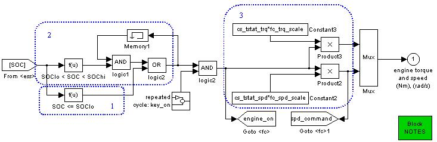

% Series Thermostat Control Strategy
% 
% 

### **Series Thermostat Control Strategy**

**<u>Role of subsystem in vehicle</u>** \
The series thermostat control strategy uses the generator and fuel
converter to generate electrical energy for use by the vehicle.

**<u>Description of modeling approach</u>** \
The series thermostat control strategy uses the fuel converter as
follows:

1.  To maintain charge in the battery, the fuel converter turns on when
    the SOC reaches the low limit, cs\_lo\_soc.
2.  The fuel converter turns off when the SOC reaches the high limit,
    cs\_hi\_soc.
3.  The fuel converter operates at the most efficient speed and torque
    level.

**<u>Variables used in subsystem</u>**

> [See Appendix A.2: Input
> Variables](advisor_appendices.html#Input%20Control%20Strategy)

**<u>Implementation</u>**

*Series Hybrid Control Strategy (Thermostat) block diagram* \
The implementation of the series thermostat control stategy is found in
the control strategy block diagram.  The State Of Charge is input into
the block, and the required engine torque and speed are the outputs.

1.  The fuel converter turns on if the SOC is below the low limit,
    cs\_lo\_soc.
2.  The fuel converter remains on until the SOC reaches the high limit,
    cs\_hi\_soc, if its previous state was on.  After reaching the high
    limit, it turns off.
3.  The fuel converter operates at the most efficient speed and torque
    level as previously determined by the control file.

* * * * *

[Back to Chapter 3](advisor_ch3.html)

