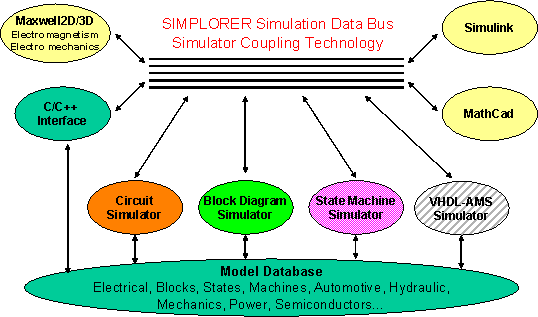
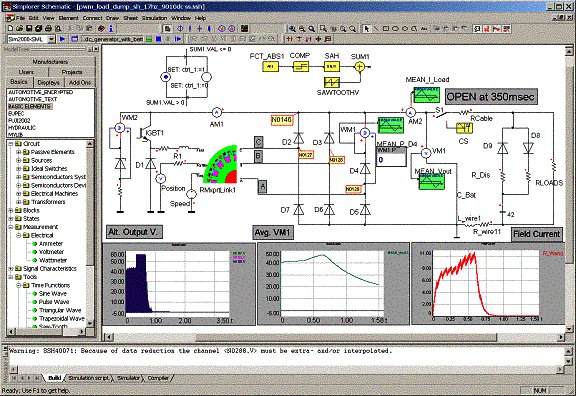
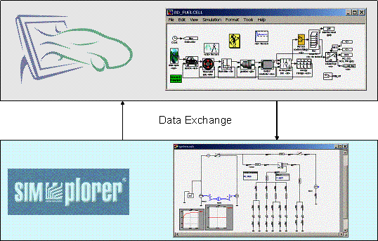
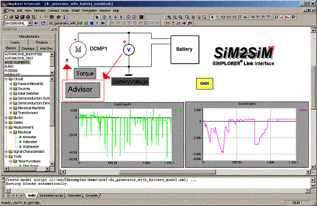
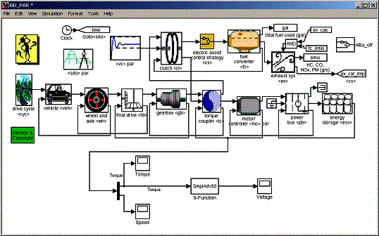

% What’s new in Advisor
% 
% 

Direct Link with Ansoft’s SIMPLORER for electrical system co-simulation<o:p></o:p>
-----------------------------------------------------------------------------------------------------------------------------------------------

<!--[if !supportEmptyParas]--> <!--[endif]--><o:p></o:p>

**System and electrical design combined <o:p></o:p>**

<!--[if !supportEmptyParas]--> <!--[endif]--><o:p></o:p>

In the light of the increased electrical content of cars and escalating
public interest in alternative propulsion systems, a detailed analysis
of the electrical subsystem becomes more and more important. Therefore,
Ansoft Corporation and NREL worked together to develop a link between
ADVISOR and SIMPLORER – Ansoft’s multi-domain simulation system for
automotive, transportation, power electronics and drives.

<!--[if !supportEmptyParas]--> <!--[endif]--><o:p></o:p>

The link is a co-simulation interface using fast acting direct memory
access for data exchange and providing step size coordination algorithms
between the two tools. The solution enables engineers to combine
SIMPLORER’s multiple simulation and modeling capabilities with ADVISOR.

<!--[if !supportEmptyParas]--> <!--[endif]--><o:p></o:p>

**How to get it?<o:p></o:p>**

<!--[if !supportEmptyParas]--> <!--[endif]--><o:p></o:p>

To operate the link users need an installed and licensed version of
Matlab^®^ and Simulink^®^ and an installed version of SIMPLORER with
enabled SIM2SIM interface (SIMPLORER to Simulink interface). Users who
are interested in testing the link and developing their own models and
solutions can obtain a full 30-day evaluation version at Ansoft’s
Website under:

<!--[if !supportEmptyParas]--> <!--[endif]--><o:p></o:p>

<http://www.ansoft.com/products/em/simplorer/advisor>

<!--[if !supportEmptyParas]--> <!--[endif]--><o:p></o:p>

**Co-Simulation<o:p></o:p>**

<!--[if !supportEmptyParas]--> <!--[endif]--><o:p></o:p>

Both software packages run in parallel on the same computer. The
foundation of the link is SIMPLORER’s simulator coupling technology.
[SIMPLORER](http://www.ansoft.com/products/em/simplorer/index.cfm)
already combines several simulator kernels that designers can use
simultaneously (circuits, block diagrams, and state machines).
Additionally, users can define their own models in programming
languages, such as C, C++ or FORTRAN..

<!--[if gte vml 1]><v:shapetype
 id="_x0000_t75" coordsize="21600,21600" o:spt="75" o:preferrelative="t"
 path="m@4@5l@4@11@9@11@9@5xe" filled="f" stroked="f">
 <v:stroke joinstyle="miter"/>
 <v:formulas>
  <v:f eqn="if lineDrawn pixelLineWidth 0"/>
  <v:f eqn="sum @0 1 0"/>
  <v:f eqn="sum 0 0 @1"/>
  <v:f eqn="prod @2 1 2"/>
  <v:f eqn="prod @3 21600 pixelWidth"/>
  <v:f eqn="prod @3 21600 pixelHeight"/>
  <v:f eqn="sum @0 0 1"/>
  <v:f eqn="prod @6 1 2"/>
  <v:f eqn="prod @7 21600 pixelWidth"/>
  <v:f eqn="sum @8 21600 0"/>
  <v:f eqn="prod @7 21600 pixelHeight"/>
  <v:f eqn="sum @10 21600 0"/>
 </v:formulas>
 <v:path o:extrusionok="f" gradientshapeok="t" o:connecttype="rect"/>
 <o:lock v:ext="edit" aspectratio="t"/>
</v:shapetype><v:shape id="_x0000_i1025" type="#_x0000_t75" style='width:403.5pt;
 height:237.75pt' o:allowoverlap="f">
 <v:imagedata src="./Simplorer_cosim_help_files/image001.emz" o:title=""/>
</v:shape><![endif]--><!--[if !vml]--><!--[endif]-->

SIMPLORER Simulator Coupling Technology

<!--[if !supportEmptyParas]--> <!--[endif]--><o:p></o:p>

**Easy graphical modeling for multi-technology applications<o:p></o:p>**

<!--[if !supportEmptyParas]--> <!--[endif]--><o:p></o:p>

SIMPLORER models are generated in a graphical, schematic-driven
environment. The following picture shows a typical setup for an
automotive problem. It illustrates a load dump analysis and combines
several of SIMPLORER’s modeling capabilities into one model circuits for
the electrical systems and state machines and blocks for the control
system.

<!--[if gte vml 1]><v:shape
 id="_x0000_i1026" type="#_x0000_t75" style='width:6in;height:297pt'>
 <v:imagedata src="./Simplorer_cosim_help_files/image003.emz" o:title=""/>
</v:shape><![endif]--><!--[if !vml]--><!--[endif]-->

Typical SIMPLORER Setup – Load Dump Analysis

<!--[if !supportEmptyParas]--> <!--[endif]--><o:p></o:p>

**Integration with external simulators<o:p></o:p>**

<!--[if !supportEmptyParas]--> <!--[endif]--><o:p></o:p>

SIMPLORER’s simulator integration interface provides the connection to
external simulators. Since ADVISOR is a Simulink^®^-based application,
the already-existing SIM2SIM interface was modified to meet the
requirements of ADVISOR simulations. The modified link now allows users
to simulate the electrical subsystem with a variable step size in
SIMPLORER while the system-level model in ADVISOR is computed with fixed
step size. Data is exchanged only at the fixed ADVISOR computation time
steps; in between, SIMPLORER operates freely until the next
synchronization time. The user can define an arbitrary number of
quantities to be transferred to the other simulator. The link and data
exchange is fully automatic. Each of the quantities can be visualized in
online oscilloscopes.

<!--[if !supportEmptyParas]--> <!--[endif]--><o:p></o:p>

<!--[if gte vml 1]><v:shape
 id="_x0000_i1027" type="#_x0000_t75" style='width:403.5pt;height:257.25pt'
 o:allowoverlap="f">
 <v:imagedata src="./Simplorer_cosim_help_files/image005.emz" o:title=""/>
</v:shape><![endif]--><!--[if !vml]--><!--[endif]-->

SIMPLORER–ADVISOR Link System Structure

<!--[if !supportEmptyParas]--> <!--[endif]--><o:p></o:p>

<!--[if gte vml 1]><v:shape
 id="_x0000_i1028" type="#_x0000_t75" style='width:402.75pt;height:261.75pt'>
 <v:imagedata src="./Simplorer_cosim_help_files/image007.emz" o:title=""/>
</v:shape><![endif]--><!--[if !vml]--><!--[endif]-->

SIM2SIM Link element in the SIMPLORER Schematic

<!--[if !supportEmptyParas]--> <!--[endif]--><o:p></o:p>

<!--[if gte vml 1]><v:shape
 id="_x0000_i1029" type="#_x0000_t75" style='width:403.5pt;height:252pt'>
 <v:imagedata src="./Simplorer_cosim_help_files/image009.emz" o:title=""/>
</v:shape><![endif]--><!--[if !vml]--><!--[endif]-->

SIMPLORER–ADVISOR Link DLL in an ADVISOR Vehicle Setup

<!--[if !supportEmptyParas]--> <!--[endif]--><o:p></o:p>

**What to expect?<o:p></o:p>**

<!--[if !supportEmptyParas]--> <!--[endif]--><o:p></o:p>

The included version is a test version for users interested in setting
up their own circuit topologies and linking them into a vehicle system
modeled in ADVISOR. There is a SIMPLORER demo project that can be opened
to see how the link works. Future versions will offer more ease-of-use
and predefined component models for automotive electrical applications.
Please share your feedback with us; we welcome any input to make the
linkage even better. Please send recommendations and comments relating
to the Simplorer co-simulation to <support@simplorer.com>.

<!--[if !supportEmptyParas]--> <!--[endif]--><o:p></o:p>

See [Simplorer link usage help](Simplorer_cosim_help2.html) for
instructions on running the demonstration link.

<!--[if !supportEmptyParas]--> <!--[endif]--><o:p></o:p>

* * * * *

[Back to What’s New](whats_new.html)

[Simplorer Link Usage Help](Simplorer_cosim_help2.html)\
 [ADVISOR Documentation Contents](advisor_doc.html)

Last Revised: [29-April-2002]: ab

<!--[if !supportEmptyParas]--> <!--[endif]--><o:p></o:p>

