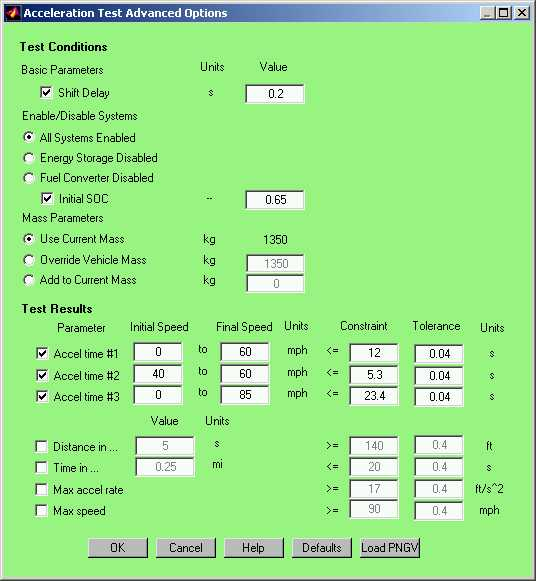

% Help on Acceleration Test
% 
% March 26, 2013

# Help on Acceleration Test

##  Overview

The acceleration test routine in ADVISOR will determine the acceleration
performance of the current vehicle. The test routine can be accessed
both from the GUI and the Matlab command window.

## From the GUI…

An acceleration test can be performed via the Simulation Setup window. 
By clicking *Accel Options* the Acceleration Test Advanced
Options window appears. Note that the Constraint and Tolerance items are
only visible and accessible when the Accel Options button is pushed from
the Autosize Setup window.

\
 \

The shift delay checkbox allows you to override the current shift delay
during the acceleration test. The Enable Systems set of radiobuttons
allows you to identify any systems that should not participate in the
test. For example, you could determine the acceleration performance of
your parallel hybrid in a worse case situation when you only have one
power source, engine only or battery only. As long as the battery is
enabled, the initial state of charge (SOC) can be specified by the
user. The initial setting defaults to 50% of the usable range
(cs\_lo\_soc to cs\_hi\_soc). The Mass Parameters allow you to override
or adjust the vehicle mass during the acceleration test. By overriding
the mass you will fix the mass at the specified value and by adding to
the current mass you will add the specified amount to current mass. The
results section allows you to specify the acceleration criteria of
interest. Available options include 3 speed range acceleration times, a
distance in a set amount of time, time in a set amount of distance, and
max acceleration rate, and a top speed. While performing an autosize
these conditions can be used as constraints.

From the Simulation Setup screen selecting the *Acceleration
Test* checkbox runs an acceleration test during a drive cycle.  To
run an acceleration test without running a drive cycle, select *Test
Procedure* and then *TEST\_ACCEL* from the pulldown menu. If
run as a test procedure the Results screen will provide access to the
time dependent variable information.

Results are reported in the Results window.

## From the Matlab command window…

An acceleration test can also be performed from the command window. The
acceleration test routine is a function and requires the following
format,

[resp]=accel\_test\_advanced(param1,value1,…param\_n,value\_n)

Inputs to the acceleration test function must be specified in parameter
name, parameter value pairs. All input parameters are optional.  \
  

<table border cellspacing="1" cellpadding="7" width="775">
<tr>
<td width="21%" valign="TOP">

Parameter

</td>
<td width="79%" valign="TOP">

Description

</td>
</tr>
<tr>
<td width="21%" valign="TOP">

spds

</td>
<td width="79%" valign="TOP">

(mph), matrix of initial speeds in first column and final speeds in
second column

</td>
</tr>
<tr>
<td width="21%" valign="TOP">

dist\_in\_time

</td>
<td width="79%" valign="TOP">

(s), time over which to measure max distance traveled (e.g. distance
traveled in 5s)

</td>
</tr>
<tr>
<td width="21%" valign="TOP">

time\_in\_dist

</td>
<td width="79%" valign="TOP">

(mi), distance over which to measure time (e.g. 1/4 mi time)

</td>
</tr>
<tr>
<td width="21%" valign="TOP">

ess\_init\_soc

</td>
<td width="79%" valign="TOP">

(–), initial state of charge of the ess

</td>
</tr>
<tr>
<td width="21%" valign="TOP">

gb\_shift\_delay

</td>
<td width="79%" valign="TOP">

(s), delay time during a shift in which no torque can be transmitted

</td>
</tr>
<tr>
<td width="21%" valign="TOP">

disp\_results

</td>
<td width="79%" valign="TOP">

(–), boolean flag 1==\> display results, 0 ==\> don’t display

</td>
</tr>
<tr>
<td width="21%" valign="TOP">

max\_rate\_bool

</td>
<td width="79%" valign="TOP">

(–), boolean flag 1==\> calc max accel rate, 0 ==\> don’t calc

</td>
</tr>
<tr>
<td width="21%" valign="TOP">

max\_speed\_bool

</td>
<td width="79%" valign="TOP">

(–), boolean flag 1==\> calc max speed, 0 ==\> don’t calc

</td>
</tr>
<tr>
<td width="21%" valign="TOP">

override\_mass

</td>
<td width="79%" valign="TOP">

(kg), override vehicle mass to be used for the accel test only

</td>
</tr>
<tr>
<td width="21%" valign="TOP">

add\_mass

</td>
<td width="79%" valign="TOP">

(kg), additional mass to be added to current vehicle mass for accel test
only

</td>
</tr>
<tr>
<td width="21%" valign="TOP">

disable\_systems

</td>
<td width="79%" valign="TOP">

(–), flag to disable power systems 1==\> disable ess, 2 ==\> disable fc

</td>
</tr>
</table>
 

## How it works

A step function speed of 200 mph is requested of the vehicle. The
vehicle will try request as much power and energy as is available while
enforcing component based limits. At the end of the cycle, the
acceleration times and other parameters are calculated from the achieved
vehicle speed trace and saved to the workspace and/or the GUI.

* * * * *

\
 [Back to Chapter 3](advisor_ch3.html#3.3)

Last Revised: 2/0/01:tm
