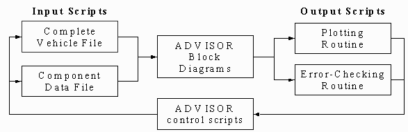
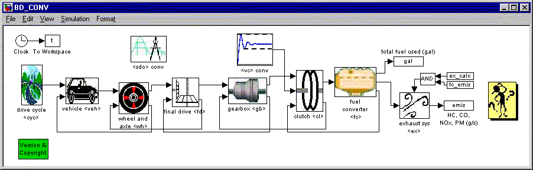

% Chapter 3: How ADVISOR works -- ADVISOR Documentation
% 
% 

3.0 How ADVISOR works
=======================================

* * * * *

[3.1 ADVISOR file structure](#3.1)

[3.1.1 File interactions](#3.1.1) \
 [3.1.2 File locations](#3.1.2) \
 [3.1.3 File naming conventions](#3.1.3) \
 [3.1.4 Adding files to ADVISOR](#3.1.4) \
 [3.1.5 Inspecting input files](#3.1.5) \
 [3.1.6 Deleting files from ADVISOR’s database](#3.1.6)

[3.2 Drivetrain model descriptions](#3.2)

[3.2.1 Fuel Converter and Exhaust Aftertreatment](#3.2.1) \
 [3.2.2 Electric Components](#3.2.2) \
 [3.2.3 Transmission](#3.2.3) \
 [3.2.4 Vehicle, Wheel and Brakes](#3.2.4) \
 [3.2.5 Hybrid Control Strategies](#3.2.5) \
 [3.2.6 Auxiliary Load Models](#3.2.6)

[3.2.7 Saber Co-simulation](#Saber_Components)

[3.2.8 Simplorer Co-simulation](#Simplorer_Components)

[3.3 ADVISOR routines](#3.3)

[3.3.1 SOC Corrections](#3.3.1) \
 [3.3.2 Autosize](#3.3.2) \
 [3.3.3 Acceleration Test](#3.3.3) \
 [3.3.4 Grade Test](#3.3.4) \
 [3.3.5 Tech Targets](#3.3.5) \
 [3.3.6 J1711 Test Procedure](#3.3.6) \
 [3.3.7 Real World Test Procedure](#3.3.7) \
 [3.3.8 City Highway Test Procedure](#3.3.8) \
 [3.3.9 Comparing Simulations](#3.3.9) \
 [3.3.10 Optimization](#3.3.10)

[3.3.11 Comparing Simulation Results with Test Data](#3.3.11)

[3.4 Data flow in ADVISOR’s block diagrams](advisor_ch3_4.html)

[3.4.1 Overview](advisor_ch3_4.html#3_4_1) \
 [3.4.2 Backward-facing calculation path](advisor_ch3_4.html#3_4_2) \
 [3.4.3 Details of motor and motor controller](advisor_ch3_4.html#3_4_3)
\
 [3.4.4 Forward-facing calculation path](advisor_ch3_4.html#3_4_4)

[3.5 Reorganized Library](#reorg)

* * * * *

3.1 ADVISOR file structure
--------------------------------------------

### 3.1.1 File interactions & data flow

The above schematic represents data flow in the ADVISOR file system. The
four main agent types are:

-   <u>Input Scripts</u> define variables in the workspace and/or call
    other input scripts. An example is **MC\_PM32.M**.

-   <u>Block Diagrams</u> are Simulink files containing the equations
    used to compute outputs such as fuel use from inputs such as an
    engine map. They are the models. One example is **BD\_PAR.MDL**.

-   <u>Output Scripts</u> post process the model outputs by querying the
    workspace. These may include plotting routines or error checking
    routines. **chkoutputs.m** is an example.

-   <u>Control Scripts</u> may both develop inputs and process outputs.
    Examples include the ADVISOR GUI and optimization routines.

### 3.1.2 File locations

The main ADVISOR directory (e.g. c:\\ADVISOR or c:\\Program
Files\\ADVISOR) contains several sub directories.  Among these are the
data, GUI, and models directories that contain the corresponding files.

### 3.1.3 File naming conventions

All model and data files use a prefix followed by an underscore (‘\_’)
that is the same as the prefix used for (nearly all of) the variables it
defines, which in turn is in pointy brackets (\<\>) at the end of the
Simulink block in which those variables are used. Here are ADVISOR’s
component file types:

**ACC\_\*.M** Accessory load files \
 **CYC\_\*.M** Driving cycle files, which define variables starting with
cyc\_, used in the block labeled \<cyc\> \
 **ESS\_\*.M** Energy storage system data files, which likewise define
variables starting with ess\_, used in the block labeled \<ess\> \
 **EX\_\*.M** Exhaust after treatment files (such as catalysts) \
 **FC\_\*.M** Fuel converter data files \
 **TX\_\*.M**Transmission data files (these include gearbox-gb and final
drive-fd variables) \
 **GC\_\*.M** Generator/controller data files \
 **MC\_\*.M** Motor/controller data files \
 **PTC\_\*.M** Powertrain control data files, which define engine
control, clutch control, and hybrid control strategy variables starting
with vc\_ and cs\_, used in blocks labeled \<vc\> and \<cs\> \
 **TC\_\*.M**Torque coupler data files \
 **VEH\_\*.M** Vehicle data files \
 **WH\_\*.M** Wheel/axle data files

In addition to the above component data files, there is one other type
that use prefixes:

**BD\_\*.MDL** Simulink block diagrams (models)

All filenames that include prefixes are entirely in capital letters to
avoid confusion with variable names, which are entirely in lower-case
letters.

### 3.1.4 Adding files to ADVISOR

The easiest way to add a particular kind of file to ADVISOR is to modify
an existing file of that kind and save it with a new file name, entirely
in capital letters, in the appropriate ADVISOR directory. This will
ensure that all variables necessary to fully define the particular
component will be included in your new file. For adding vehicle
component or drive cycle files, clicking the pushbutton in the graphical
user interface brings up a window to guide the process.

### 3.1.5 Inspecting input files

Component files and nearly all other files in ADVISOR are text files
(the exceptions are mat files, which contain Matlab-specific data), and
can be viewed and edited in any text editor. A fixed pitch font helps.
We recommend using the Matlab editor/debugger packaged with Matlab 5.3.
Additionally, text files can be viewed in the Matlab command window by
entering

*type filename*

at the MATLAB command line.

### 3.1.6 Deleting files from ADVISOR’s database

Files can be removed from ADVISOR by either deleting them using your
operating system or by entering the following at the Matlab command
line:

*!rm filename*

Deleting files via the operating system is preferable, especially on PC
and Macintosh platforms, where ‘deleted’ files will be preserved in
Trash or the Recycle Bin.

3.2 Drivetrain model descriptions
---------------------------------------------------

ADVISOR has six different vehicle types and two specific vehicle
choices, as listed below.  Each of these has a different drivetrain. 
There is also an option to use a custom drivetrain.

1.  [Conventional](glossary.html#C)
2.  [Series](glossary.html#S)
3.  [Parallel](glossary.html#P)
4.  [Parallel\_sa](glossary.html#Parallel_sa)
5.  [Fuel Cell](glossary.html#F)
6.  [Electric Vehicle (EV)](glossary.html#E)
7.  [Prius\_jpn](glossary.html#Prius%20Drive%20Train)
8.  [Insight](glossary.html#Insight)
9.  [Custom](glossary.html#Custom)

The above figure represents a conventional vehicle’s drivetrain using
components from ADVISOR. Note that most blocks have two inputs and two
outputs. Each block passes and transforms a torque and speed request,
and each block also passes an achievable or actual torque and speed.

The top arrows, feeding left-to-right, are the torque and speed
requests. The drive cycle requests or requires a given speed. Each block
between the driving cycle and the torque provider, in this case the ICE,
then computes its required input given its required output. It does this
by applying losses, speed reductions or multiplications, and its
performance limits.

At the end of the line, the ‘ICE fuel converter’ uses its required
torque output and speed to determine how much torque it can actually
deliver and its maximum speed. Then passing information back to the
left, each component determines its actual output given its actual
input, using losses computed during the ‘input requirement’ pass
described above. Finally, the vehicle block computes the vehicle’s
actual speed given the tractive force and speed limit it receives, and
uses this speed to compute acceleration for the next time step.

And so the cycle continues throughout the duration of the driving cycle.

The following describe the torque, speed, and power transformations
performed by the drivetrain component models that connected to each
other as explained above to build a vehicle model. In addition, the
somewhat trickier blocks that perform solely ‘control’ functions are
documented below. \
  

### 3.2.1 Fuel Converter and Exhaust Aftertreatment

[Fuel Converter](fuel_converter.html) \
 [Fuel Converter-Fuel Cell](fuel_converter_fuel_cell.html) \
 [Engine control – conventional vehicle](engine_cont.html) \
 [Engine control – parallel electric assist](Parallel.html) \
 [Exhaust System](exhaust.html)

### 3.2.2 Electric Components

[Generator/controller](generator_controller.html) \
 [Energy storage system](energy_storage.html) \
 [Motor/controller](motor_controller.html) \
 [Motor control logic](mc_cont.html)

### 3.2.3 Transmission

[Torque coupler](torque_coupler.html) \
 [Clutch](clutch.html) \
 [Clutch control](clutch_cont.html) \
 [Gearbox](gearbox.html) \
 [Gearbox control](gb_cont.html) \
 [Automatic Transmission](autotx.html) \
 [Hydraulic Torque Converter](htc.html) \
 [Continuously Variable Transmission](cvt.html) \
 [Final Drive](final_drive.html)

### 3.2.4 Vehicle, Wheel & Brakes

[Wheel/axle](wheel_axle.html) \
 [Vehicle](vehicle.html) \
 [Traction control](traction_control.html) \
 [Braking](braking.html)

### 3.2.5 Hybrid Control Strategies

[Hybrid control strategy – series thermostat](Series-therm.html) \
 [Hybrid control strategy – series power follower](Series.html) \
 [Hybrid control strategy – parallel electric assist](Parallel.html) \
 [Adaptive Control Strategy (parallel)](Adaptive.html) \
 [Fuzzy Logic Control Strategy (parallel)](fuzzy_logic.html) \
 [The Honda Insight Control Strategy
(parallel)](honda_insight.html#control)

### 3.2.6 Auxiliary Load Models

[Accessory Load Models (ver. 2002)](accessory_models2002.html) \
 [Sinda/Fluint Co-simulation](sinda_cosim.html)  

### 3.2.7 [Saber Co-simulation](Saber_cosim_help.html)

### 3.2.8 [Simplorer Co-simulation](Simplorer_cosim_help2.html)

<!--[if !supportEmptyParas]--> <!--[endif]--><o:p></o:p>

3.3  ADVISOR Routines
---------------------------------------

### 3.3.1 SOC(State of Charge) Corrections

To learn how ADVISOR handles the state of charge of the energy storage
system in context with predicting fuel economy, emissions, etc. visit
the [glossary](glossary.html#S) under the terms SOC, SOC Linear Correct,
and SOC Zero Delta Correct.

### 3.3.2 [Autosize](autosize_help.html)

### 3.3.3 [Acceleration Test](accel_Test_help.html)

### 3.3.4 [Grade Test](Grade_Test_help.html)

### 3.3.5 [Tech Targets](tech_targets_help.html)

### 3.3.6 [J1711 Test Procedure](j1711_proc.html)

### 3.3.7 [Real World Test Procedure](RW_procedure.html)

### 3.3.8 [City Highway Test Procedure](City_Hwy_procedure.html)

### 3.3.9 [Comparing Simulations](compare_sims.html)

### 3.3.10 [Optimization](optimization_scripts.html)

### 3.3.11 [Comparing Simulation Results with Test Data](compare_testdata.html)

 

3.4 [Data flow in ADVISOR’s block diagrams](advisor_ch3_4.html)
---------------------------------------------------------------

### 3.4.1 [Overview](advisor_ch3_4.html#3_4_1)

### 3.4.2 [Backward-facing calculation path](advisor_ch3_4.html#3_4_2)

### 3.4.3 [Details of motor and motor controller](advisor_ch3_4.html#3_4_3)

### 3.4.4 [Forward-facing calculation path](advisor_ch3_4.html#3_4_4)

3.5 [Library Re-organization](LibReorg.html)
----------------------------------------------------------------

* * * * *

[Back to Chapter 2](advisor_ch2.html) \
 [Forward to Appendices](advisor_appendices.html) \
 [ADVISOR Documentation Contents](advisor_doc.html)

Last Revised: 9/9/03: SS

