% Data flow in ADVISOR's block diagrams
% 
% 

3.4  Data flow in ADVISOR’s block diagrams
------------------------------------------

### 3.4.1 Overview

ADVISOR is hybrid of a backward-facing vehicle simulation and a
forward-facing simulation.

*Backward-facing*vehicle simulations answer the question “Assuming the
vehicle meets the required trace, how must each component perform?” 
Simulation programs of this type generally do not include a model of
(human) driver behavior, and can predict maximum effort performance only
through iteration.

*Forward-facing*vehicle simulations include a driver model that seeks to
modulate throttle and brake commands to follow the trace.  The throttle
signal is converted into a torque, which is passed down the driveline
and ultimately converted to a force which is divided by mass and
integrated to compute speed.  Simulation programs of this type excel at
maximum effort performance calculations, but are often very slow in
computing vehicle behavior over a 10+ minute-long trace.

ADVISOR uses a hybrid backward/forward approach that is closely related
to the customary strictly backward-facing approach, where each component
provides as much torque (or force) as is required by the immediately
“downstream” component (i.e. closer to the wheels) to meet the specified
trace.  ADVISOR’s approach is unique in the way it handles the component
performance limits in its backward-facing stream of calculations and in
the addition of a simple forward-facing stream of calculations. The two
overriding assumptions that describe ADVISOR’s combination of the
backward-facing and forward-facing approaches are:

1.  No drivetrain component will require more torque or power from its
    upstream neighbor than it can use.
2.  A component is as efficient in the forward-facing calculations as it
    was computed to be in the backward-facing calculations.

The role of these assumptions is highlighted in the discussion of
ADVISOR’s simulation approach below.

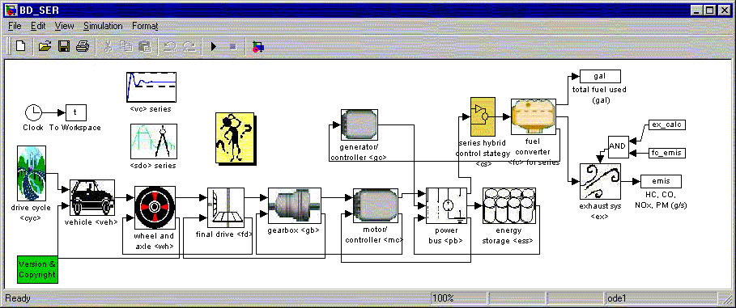 \
Figure 1.  ADVISOR’s series HEV block diagram’s top level

Figure 1 shows the top level of ADVISOR’s series HEV model, programmed
in the MATLAB^®^/Simulink^®^ environment. Arrows indicate data flow;
boxes represent data processing elements or groups thereof. For example,
the box labeled “gearbox” contains all data processing elements, such as
“Sum” and “Product” blocks and look-up tables, necessary to model the
vehicle’s single- or multi-speed gearbox. Arrows feeding data from left
to right, such as the arrow going from the “motor/controller” block to
the “power bus” block, are generally part of the backward-facing part of
the model, passing torque, speed, and power requirements up the
drivetrain. The arrows that loop back to pass data from right to left,
such as the arrow from the “motor/controller” to the “gearbox” block,
are part of the forward-facing part of the model, transmitting available
torque, force, speed, and electrical power through the drivetrain. Each
block references MATLAB^®^ data, such as a loss or efficiency table,
that describes the performance of the appropriate component.

To illustrate the way ADVISOR’s backward- and forward-facing parts
relate to each other, we consider the simulation of a hypothetical
series HEV’s maximum-effort acceleration. This will make an interesting
and appropriate example because ADVISOR is unique in the way it handles
drivetrain performance limits, and the drivetrain will always be
operating at its limit during the acceleration. ADVISOR describes a
maximum-effort acceleration by requiring a 322-km/h step, assuming that
this is a greater speed than the vehicle will ever reach. Below, we step
through ADVISOR’s calculation paths—first the ‘required’ values of the
variables (backward-facing results) and then the ‘available’ values
(forward-facing results).

### 3.4.2 Backward-facing calculation path

The leftmost block in Figure 1’s chain of drivetrain components is
labeled “drive cycle.” This is where the required speed versus time
trace data is input to the simulation. The vehicle and component data
defined by text files in the database are referenced in the appropriate
component model. For example, all motor performance data are referenced
in the “motor/controller” block.

The “drive cycle” block transmits the required speed trace to the
“vehicle” block. The “vehicle” block includes no drivetrain performance
limits, and straightforwardly uses the required trace to compute the
average tractive force and average speed required over the time step.
These requirements are passed from the “vehicle” block to the
“wheel/axle” block via the lead that connects the two in Figure 1.

The “wheel/axle” block includes the transformation of force and linear
speed to torque and rotational speed and the effects of tire slip, wheel
and axle bearing drag, and wheel and axle rotational inertia. Only the
tire slip model includes performance limits and therefore merits further
discussion.

The tire slip model relates weight on the tire, longitudinal force,
vehicle speed, and slip in an equation or set of tables, where

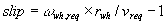. (EQ. 1)

(A list of parameters is included at the end of this document.)  The
tire slip is limited to some maximum value, and this in turn limits the
transmissible tractive force. Using vehicle loss parameter information
borrowed from the “vehicle” block, the required speed is limited
according to the acceleration possible with the traction-limited force. 
ADVISOR solves the following equations simultaneously at the maximum
slip condition to determine the maximum force and acceleration:

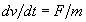(EQ. 2)

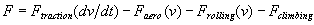. (EQ. 3) \
See the block ‘\<vc\>/traction control’ in any of ADVISOR’s vehicle
block diagrams for details.

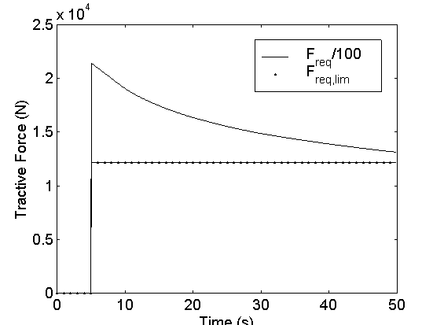

Figure 2. Required tractive force: *F~req~*, required to meet trace;
*F~req,lim~*, subject to tire traction limits

As shown in Figure 2, the tractive force required to meet the trace in
the example peaks at roughly 2.1x10^6^ N, coincident with the step in
the trace speed, and then falls off as the vehicle accelerates to
approach the trace.  (Figure 3 shows the calculated vehicle speed.)  The
maximum tractive force the tires can transmit is constant at roughly
1.2x10^4^ N.

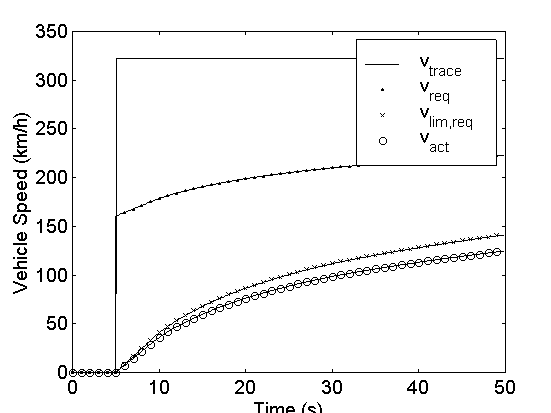 \
Figure 3. Required and actual vehicle speed

Figure 3 shows the various required vehicle speeds in the model.  The
required trace that is output by the “drive cycle” block is shown as
*v~trace~*.  The average speed required over the time step that is
output by the “vehicle” block is shown as *v~req~*.  The influence of
the tire slip model can be seen by comparing *v~req~* with *v~lim,req~*,
which is the vehicle speed possible given the tire’s traction limit. 
Finally, *v~act~* is the vehicle’s actual speed, shown here for
reference.  Note that the actual vehicle speed is lower than the tire
limit because in this example it is limited by the components “upstream”
of it.

With tire slip limits enforced, the required wheel speed is calculated
as follows:

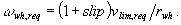 (EQ. 4)

Required torque input to the axle is computed by summing the torque
required to provide the necessary average tractive force, the torque
required to overcome bearing losses and brake drag, and the torque
required to accelerate the wheels’ and axles’ rotational inertia.

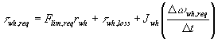 (EQ. 5)

The “wheel/axle” block sends its torque and speed requirements to the
“final drive” block, which includes no limits and straightforwardly
transforms the torque and speed requirements with its gear ratio and
torque loss.  The next in line in Figure 1, the “gearbox” block,
likewise includes no performance limits. After transforming the torque
and speed required of it, the “gearbox” passes the requirements upstream
to the “motor/controller” block.

The next section will focus on the motor and motor controller model
because it enforces a number of performance limits, and is perhaps the
component model most representative of ADVISOR’s hybrid backward/forward
approach. Although the motor is not the end of the line of
backward-facing calculations in ADVISOR, it will be the most ‘upstream’
component discussed here.  Discussion of the components further upstream
such as the energy storage system would not significantly further
illuminate ADVISOR’s unique approach. \
 

### 3.4.3 Details of motor and motor controller

Figure 4. ADVISOR’s motor/controller block diagram

The top half of ADVISOR’s motor/controller model, shown in Figure 4, is
dedicated to the backward-facing part of the simulation. The required
output torque and speed are input at the top left-hand corner of the
block diagram, and the required input power is output at the top
right-hand corner.

Three different performance limits are enforced in the backward-facing
part of the “motor/controller” block. The required speed is limited to
the motor’s maximum speed. The required torque is limited to the
difference between the motor’s maximum torque at the limited speed and
the torque required to overcome the rotor inertia. The limited torque
and speed are then used to interpolate in the motor/controller’s input
power map. Finally, the interpolated input power is limited by the motor
controller’s maximum current limit. This behavior is described in the
following equations:

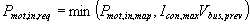 (EQ. 6) \
where \
, (EQ. 7) \
*f* is the functional relationship described by the motor map, \
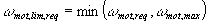, (EQ. 8) \
and \
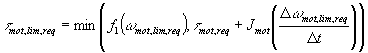(EQ. 9)

where *f~1~*is the functional relationship described by the motor’s
torque envelope. For cases where the vehicle missed the required trace
by more than 1 mph (1.6 km/h) in the previous time step,
*w~mot,lim,req~* is replaced in Equations 7
and 8 and in the *f~1~*function evaluation in Equation 9 by the previous
time step’s actual motor speed, given by Equation 10.

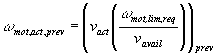 (EQ. 10)

Equation 10 gives an estimate of the previous time step’s motor speed
using the only speed that is truly calculated in ADVISOR–the actual
achieved vehicle speed, given by the MATLAB variable ‘mpha’ and
represented in the equation above as *v~act~*.  *v~avail~* is the
vehicle speed associated with the available driveline speeds given by
MATLAB variables such as mc\_spd\_out\_a, which is equivalent to
w*~mot,lim,req~*in Equation 10 above.  (See
Equation 12 below for more information on *v~avail~*.)  Therefore, the
ratio (w*~mot,lim,req~*/*v~avail~*) includes
the effects of gear ratio, tire rolling radius, and tire slip that
relate motor speed to vehicle speed. \
 

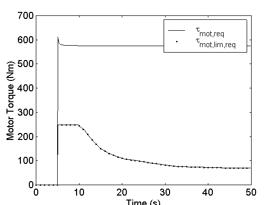 \
Figure 5. Required motor torque:
t*~mot,req~*, required into gear reduction;
t*~mot,lim,req~*, subject to motor torque
limit

Figure 5 illustrates the effect of Equation 9. In the maximum-effort
acceleration example, the motor is asked to produce more than its
maximum torque. At times after 5 s, the maximum torque capability
represented by t*~mot,lim,req~*is used to
formulate the motor/controller input power requirement.

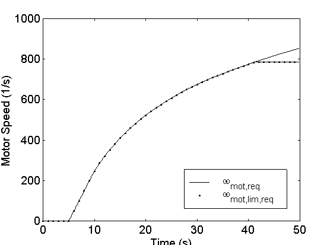 \
Figure 6. Required motor speed: w*~mot,req~*,
required into gear reduction;
w*~mot,lim,req~*, subject to motor speed
limit

Figure 6 illustrates the effect of Equation 8. After about 42 s, the
motor is required to exceed its maximum speed to provide the wheel and
axle (via a gear reduction) the maximum speed they are capable of
handling. w*~mot,lim,req~*, coincident with
w~*mot,req*~curve for most of the
acceleration, is used to formulate the motor input power requirement. \
 

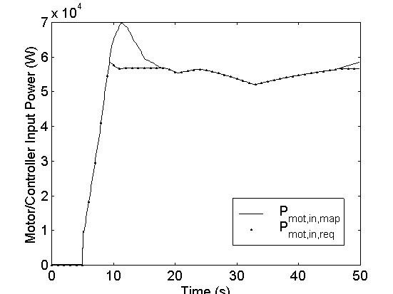 \
Figure 7. Required motor/controller input power: *P~mot,in,map~*,
computed by map; *P~mot,in,req~*, subject to controller current limit

Figure 7 illustrates the effect of Equation 6. *P~mot,in,map~* is the
input power required to power the motor at its maximum-limited torque
and speed.  *P~mot,in,req~*is the power that the motor/controller
requires of the power bus, which must in turn be provided by the
batteries and/or the generator.  For the example case of a maximum
effort acceleration, Figure 7 indicates that between about 9 s and 18 s
the motor requires more power than it is capable of handling, according
to its current limit, to meet the limited torque and speed requirements.

The bottom part of Figure 4, not enclosed in a dashed box, is the
forward-facing part of the motor/controller model. It accepts as input
the available input power, on the bottom left of the figure, and
produces as outputs the available rotor torque and speed.

To compute the torque that can be produced by the motor/controller given
the available input power, the motor/controller efficiency computed
during the backward-facing calculations is used, modeled as
*t~mot,lim,req~/P~mot,in,map~*in Equation 11
below.

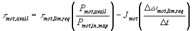.        (EQ. 11)

Note that the model accounts for the torque required to accelerate the
motor’s rotor using the motor shaft’s required acceleration. For
maximum-effort acceleration runs, the required acceleration is limited
by the tire slip, and this acceleration is usually greater than what is
possible given the drivetrain limits. Therefore, the motor’s inertial
effect is overestimated for maximum-effort acceleration runs. We see
below that this overestimation has negligible effect on ADVISOR’s
fidelity.

The motor speed that the “motor/controller” block outputs, which is
termed “available” speed, is the motor’s actual speed only if there are
no torque or power limits active during the current time step. Figure 6
indicates that the motor model’s output available speed is equal to
w~mot.lim,req~ as computed in Equation 8.
This means that the “available” motor speed is the required motor speed
subject to the motor’s speed limit. If the available motor torque is
less than the required motor torque, however, there is insufficient
torque for the motor to accelerate to its required speed. This would
cause the “available” motor speed output by the “motor/controller” block
to be greater than the actual speed of the motor.

### 3.4.4 Forward-facing calculation path (downstream of the motor)

The available motor torque is transformed by the efficiencies of the
gearbox and the final drive (which are computed during the
backward-facing calculations), and their gear reductions.  This results
in available drivetrain torque and speed input to the wheel and axle.
Wheel slip plays a role in transforming the available speed only if it
is different from the required speed, as is the case if a drivetrain
component’s speed limit is encountered.  This is described in the
equation below:

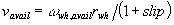*,*(EQ. 12)

where slip is recomputed here using the available tractive force and
*v~avail~* is the component speed capability-limited vehicle speed.

Slip plays no role in computing tractive force beyond limiting the
request in the backward-facing calculations. Because no calculation in
the upstream components acts to increase the tractive force, the limit
enforced by the slip model remains in place through the forward-facing
calculations in the “wheel/axle” block.

After accounting for losses in the axle and dividing by the tire’s
rolling radius, ADVISOR arrives at an available tractive force. Solving
Equation 3 for the speed at the end of the time step, ADVISOR arrives at
an estimate of the actual vehicle speed. ADVISOR compares this
force-based estimate of vehicle speed with that derived from Equation
12, and chooses the minimum of the two for the actual vehicle speed,
*v~act~*, plotted in Figure 3. In this way, the computed vehicle speed
never exceeds that possible given the torque and force available from
the drivetrain or the speed that corresponds to any drivetrain component
speed limits that might be active. \
 

### **List of parameters**

 

  ---------------------------------------------- -----------------------------------------------------------------------------------------------
  *F~req~*                                       tractive force required to meet trace, ADVISOR variable=’veh\_force\_r’
  *I~con,max~*                                   maximum motor controller current, ADVISOR variable=’mc\_max\_crrnt’
  *J~mot~*                                       motor rotational inertia, ADVISOR variable=’mc\_inertia’
  *J~wh~*                                        wheel/axle assembly rotational inertia, ADVISOR variable=’wh\_inertia’
  *P~mot,avail~*                                 (electrical) input power available to the motor/controller, ADVISOR variable=’mc\_pwr\_in\_a’
  *P~mot,in,req~*                                (electrical) input power required by the motor/controller, ADVISOR variable=’mc\_pwr\_in\_r’
  *r~wh~*                                        tire rolling radius, ADVISOR variable=’wh\_radius’
  *slip*                                         tire slip fraction, ADVISOR variable=’wh\_slip\_r’ for required slip
  *V~bus~*                                       bus voltage (equal to battery pack voltage), ADVISOR variable=’pb\_voltage’
  *v~act~*                                       actual vehicle speed at end of time step, ADVISOR variable=’mpha’
  *v~req~*                                       required vehicle speed (average over the time step), ADVISOR variable=’veh\_spd\_r’
  *v~trace~*                                     required vehicle speed (at end of time step), ADVISOR variable=’cyc\_mph\_r’
  t*~mot,avail~*      available motor torque, ADVISOR variable=’mc\_trq\_out\_a’
  t*~mot,lim,req~*    required motor torque, subject to motor torque limit
  t*~mot,req~*        required motor torque, ADVISOR variable=’mc\_trq\_out\_r’
  t*~wh,req~*         torque required to wheel/axle from driveline, ADVISOR variable=’wh\_trq\_r’
  w*~mot,act,prev~*   motor’s rotor speed during previous time step, ADVISOR variable=’mc\_spd\_est’
  w*~mot,max~*        maximum motor speed
  w*~mot,req~*        required motor speed, ADVISOR variable=’mc\_spd\_out\_r’
  w*~mot,lim,req~*    motor speed required, subject to motor speed limit, ADVISOR variable=’mc\_spd\_out\_a’
  w*~wh,avail~*       available wheel speed, ADVISOR variable=’wh\_spd\_a’
  w*~wh,req~*         required wheel speed, ADVISOR variable=’wh\_spd\_r’
  ---------------------------------------------- -----------------------------------------------------------------------------------------------

* * * * *

[Beginning of Chapter 3](advisor_ch3.html) \
[Back to Chapter 2](advisor_ch2.html) \
[Forward to Appendices](advisor_appendices.html) \
[ADVISOR Documentation Contents](advisor_doc.html)

Last Revised: 7/20/00:AB
