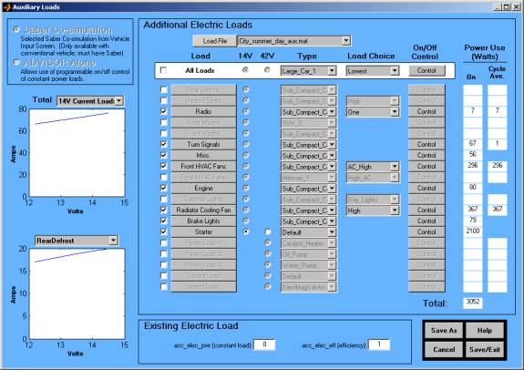

% aux\_loads\_help
% 
% 

<!DOCTYPE html> **Auxiliary Loads
Help**

<!--[if gte vml 1]><v:shapetype id="_x0000_t75"
 coordsize="21600,21600" o:spt="75" o:preferrelative="t" path="m@4@5l@4@11@9@11@9@5xe"
 filled="f" stroked="f">
 <v:stroke joinstyle="miter"/>
 <v:formulas>
  <v:f eqn="if lineDrawn pixelLineWidth 0"/>
  <v:f eqn="sum @0 1 0"/>
  <v:f eqn="sum 0 0 @1"/>
  <v:f eqn="prod @2 1 2"/>
  <v:f eqn="prod @3 21600 pixelWidth"/>
  <v:f eqn="prod @3 21600 pixelHeight"/>
  <v:f eqn="sum @0 0 1"/>
  <v:f eqn="prod @6 1 2"/>
  <v:f eqn="prod @7 21600 pixelWidth"/>
  <v:f eqn="sum @8 21600 0"/>
  <v:f eqn="prod @7 21600 pixelHeight"/>
  <v:f eqn="sum @10 21600 0"/>
 </v:formulas>
 <v:path o:extrusionok="f" gradientshapeok="t" o:connecttype="rect"/>
 <o:lock v:ext="edit" aspectratio="t"/>
</v:shapetype><v:shape id="_x0000_i1025" type="#_x0000_t75" style='width:431.25pt;
 height:304.5pt' o:allowoverlap="f">
 <v:imagedata src="./aux_loads_help_files/image001.png" o:title=""/>
</v:shape><![endif]--><!--[if !vml]--><!--[endif]-->

**Overview**

The auxiliary load figure provides the following functions:

-   Load File
-   [Custom Load Creation and Modification](aux_loads_help2.html) through
    the [Manage List](aux_loads_help4.html) Figure
-   Vehicle Type Selection
-   Load Choice Selection
-   [Auxiliary Load On-Off Control](aux_loads_help3.html)

These options provide a means of modeling the magnitude and time
dependent nature of auxiliary loads. \
   \
  

**Model Options**

Two modeling options are displayed; Saber co-simulation and ADVISOR
alone. They are determined by the vehicle input screen
selections.  The Advisor alone
option limits the load selection to 14-volt loads
only.  All the loads can be
selected using the dual voltage [Saber
co-simulation](Saber_cosim_help.html). 
\
   \
  

**Plots**

Below the modeling options are two plots. The first displays the total
loads based on their definition type. For example, the sum of the
14-volt loads defined by current and voltage can be displayed. The
second plot displays each individual load. \
   \
  

**Defined Loads**

To the right of the plots is the load definition area. The top white row
consists of switches. Selecting one of these changes the corresponding
column to be the same. The first column consists of checkboxes used to
select the corresponding load. The second column of push buttons
identifies the load. Pushing the button provides a means of adding,
editing, and creating new loads. The next column consists of radio
buttons that switch between 14 volts and 42 volts. The fourth column is
composed of pull down menus used to choose the type of load. Typically,
the type refers to choices like sub compact car, medium sized car, large
car, or SUV. The next column specifies the load choice, or level, of the
load. For example, for the front HVAC fans, there are load choices max
ac and min ac. The final push button column specifies the on/off
control. For example, the heated seats can be assigned “on” during the
first half of the drive cycle, and then “off” the remaining. Some loads’
on/off control are automatically controlled, such as brake lights and
starter, because they are dependent on vehicle operation. The final
column displays the power use. The “on” power is the average power when
a load is “on.” The cycle average power is the “on” power multiplied by
the percentage of time the load is on. \
   \
  

* * * * *

[Back to Chapter 2](advisor_ch2.html#2.1.2) \
 [ADVISOR Documentation Contents](advisor_doc.html)

Last Revised: [29-April-2002]: ab

