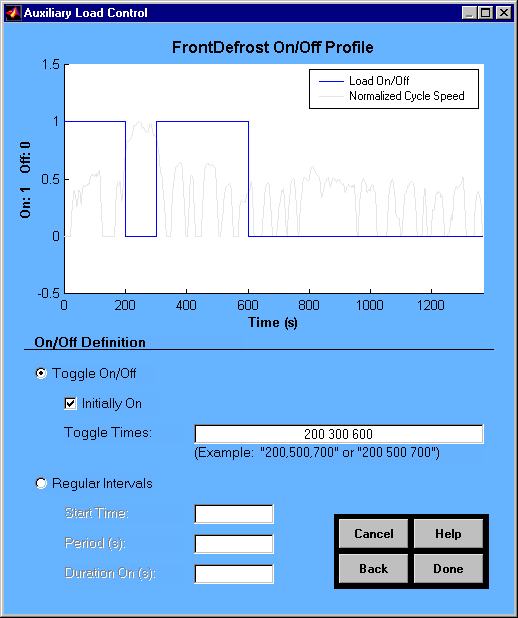

% aux\_loads\_help3
% 
% 

<!DOCTYPE html public "-//w3c//dtd html 4.0 transitional//en">

****

Auxiliary Loads Help</b>

******

Auxiliary Load Control</b></i>

Overview</b>

The auxiliary load control figure is used to define the on/off profile
relative to the drive cycle.  Two definition options exist. The on/off
control can be defined by entering the times it will toggle on and off
during the cycle. If this method is used, the initial condition of the
load can be input using the “Initially On” checkbox. The other option is
to define the load on/off in intervals. This method requires entering
the start time, period, and “duration on” time. If the drive cycle is
changed after the control is specified, the control definition method
used will expand or shrink to fit the new drive cycle. For example, say
a 600-second SCO3 cycle was chosen. Then the on/off control was defined
with regular intervals. The start time was set at 200 seconds, the
period at 300 seconds, and the duration on at 50 seconds. The on times
would be from 200-250 and 500-550. If the cycle was then changed to a
1369 second UDDS, the on times would be between, 200-250, 500-550,
800-850, and 1100-1150 seconds.

* * * * *

[Back to Auxiliary Loads Help](aux_loads_help.html)\
 [ADVISOR Documentation Contents](advisor_doc.html)

Last Revised: [31-July-2001]: ab
