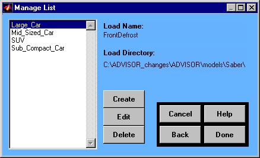

% aux\_loads\_help4
% 
% 

<!DOCTYPE html public "-//w3c//dtd html 4.0 transitional//en">

****

Auxiliary Loads Help</b>

******

Manage List</b></i>

Overview</b>

The “Manage List” figure is used to create, edit, and delete auxiliary
load files.  Creating a new load file brings up another figure to define
a new load.  The default data in the new figure is based upon the load
file highlighted in the “Manage List” figure.  Editing and deleting load
files can only be done with files generated using the “Create” button. 
This preserves the original ADVISOR load file data.

* * * * *

[Back to Auxiliary Loads Help](aux_loads_help.html) \
 [ADVISOR Documentation Contents](advisor_doc.html)

Last Revised: [10-August-2001]: ab
