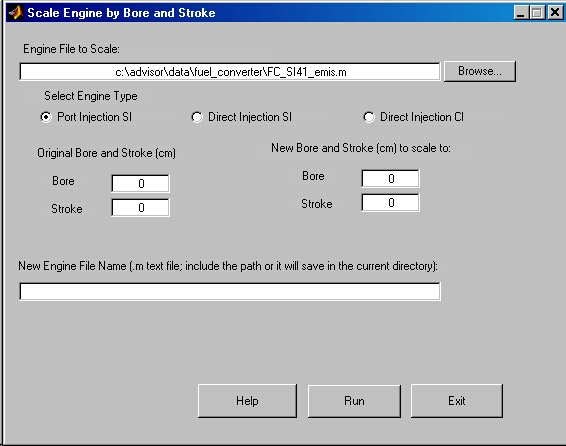

% Fuel Converter
% 
% 

### Fuel Converter Scaling 

#### <u>Bore and Stroke Scaling</u>

This functionality is available by clicking on the button named fuel
converter in the input screen and selecting the button named “Scale
Bore/Stroke”.  The procedure for this scaling is described in the Final
Report dated August 31, 2001 and named “An Algorithm for Scaling Engine
Performance and Emissions with changes in Bore and Stroke” by TECAT
Engineering Inc. under DOE Subcontract 4000003049 for Scott Sluder at
Oak Ridge National Laboratories. The fortran code provided with this
report was converted over to Matlab code and is now found under the main
ADVISOR menu/extras/Scale\_Bore\_Stroke.   The files named interpolator
and interpolator\_data contain the main algorithm.  The screen capture
below shows the fuel converter button, that when pressed, opens a new
figure containing the button for Bore/Stroke scaling.

This scaling is limited to three types of engines for which WinKIVA and
TRANSIS simulations were run to obtain scalar tables.  The user has to
make sure he/she is inputing the correct type of data to be able to
obtain reasonable results.  Three types of engines are valid for this
scaling and they are:  port injected gasoline engine, direct injection
diesel engine and direct injection stratified charge SI engine.  The
user has to select what type of engine is to be scaled.  For the port
injected gasoline engine, brake specific quantities are scaled and for
the direct injected engines, the indicated quantities are scaled (Since
KIVA does not incorporate a friction model).

The scaling algorithm first re-normalizes the simulated scalar tables by
the user selected baseline engine.  The new baseline engine emissions
scalars are now unity while all other simulated emissions scalar tables
at the various bore and stroke values are now somewhat less than or
greater than unity.  The new scalar tables are multiplied by the
user-supplied baseline engine maps to create new scaled engine maps. 
Below is the GUI for Bore and Stroke Scaling.

* * * * *

[Back to Chapter 3](advisor_ch3.html)

Created: 04/29/02: SS
