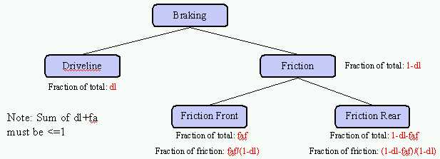
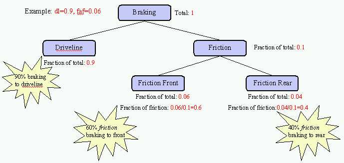

% ADVISOR Braking
% 
% 

### Vehicle Braking

Details on the block diagram for [Brake control:
achievable](brake_cont_ach.html). \
Details on the block diagram for [Brake control:
req’d](brake_cont_req.html). \
More on [regenerative braking](regen.html), including an example.

**<u>Role of subsystem in vehicle</u>** \
Braking in ADVISOR is distributed between driveline braking (regen) and
friction braking (normal).  In the figure below, dl refers to the
variable wh\_fa\_dl\_brake\_frac and faf refers to the variable
wh\_fa\_fric\_brake\_frac.

The following example sets the driveline to receive 90% of the desired
braking, and the front friction brakes to receive 6% of the total brake
request. \

* * * * *

[Back to Chapter 3](../ADVISOR3.0/documentation/advisor_ch3.html)

Last Revised: 1/10/01:VHJ
