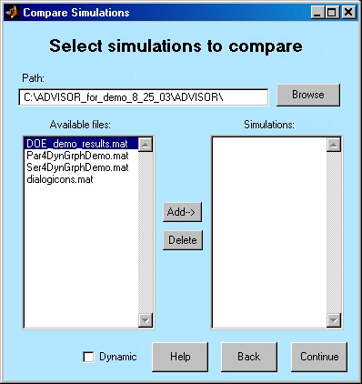
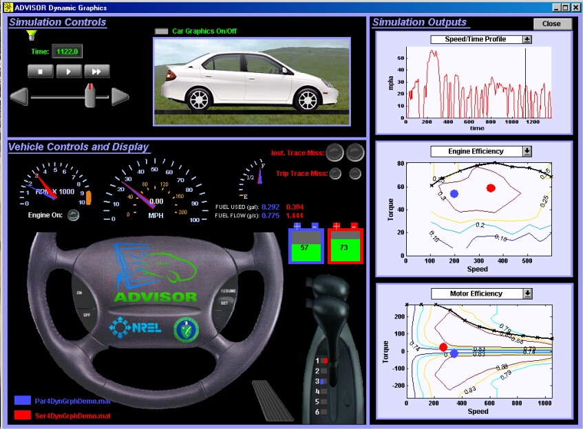
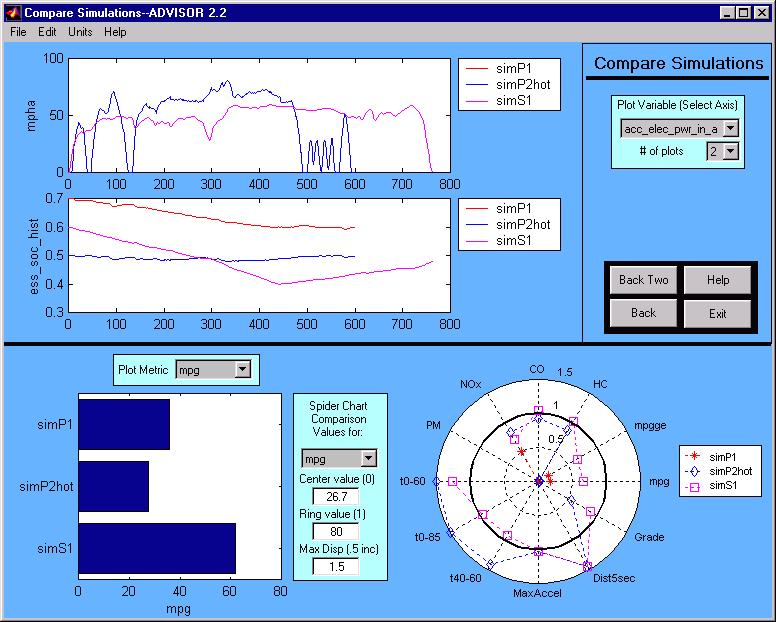

% Comparing Simulations
% 
% 

**Comparing Simulations**

* * * * *

**Setup Description** \
The ‘Compare Simluations’ functionality allows the user to compare up to
8 simulations.  The simulations must be previously saved ADVISOR runs. 
To save a simulation, choose ‘Save Simulation’ from the File menu on the
main ADVISOR results screen.  Simulations for different cycles or with
different drivetrains may be compared.  If the simulations are for
different drivetrains, the list of available time plots is determined by
the time variables of the first selected simulation.  The Compare
Simulations screen may be invoked for a single simulation.

**Results Comparison Screen (when Dynamic checkbox is
picked)**

\
**Results Comparison Screen** \
The Compare Simulations results screen is shown below.  The time
variables are plotted for each simulation.

**Bar Chart** \
The metrics for the individual simulations are plotted on the bar chart.

**Spider Plot** \
A spider plot is a way of comparing simulated results to desired
targets.  If the simulated result lies inside the band of value 1, the
target was not met.  If the result lies outside of the band, the target
performance was exceeded.  The value is calculated as follows:

*Normalized value=(Original value-Inner value)/(Outer(at 1)-Inner)*

The inner value is less than the outer if the goal is to maximize the
variable (e.g. fuel economy).  The inner value is greater than the outer
value if the goal is to mnimize the variable (e.g. NOx emissions).  The
inner value is restriced such that there are no negative normalized
variables.  The 12 metrics shown, and their default targets are as
follows:

1.  Fuel economy/consumption, target: 80 mpg (2.94 lp100km)
2.  Gasoline equivalent fuel economy/consumption, target: 80 mpg (2.94
    lp100km)
3.  HC emissions, target: 0.125 gpm (0.078 gpkm)
4.  CO emissions, target: 1.7 gpm (1.056 gpkm)
5.  NOx emissions, target: 0.07 gpm (0.043 gpkm)
6.  PM emissions, target:  0.08 gpm (0.05 gpkm)
7.  Acceleration time 0-60 mph (0-97 kph), target: 12 sec
8.  Acceleration time 0-85 mph (0-137 kph), target: 23.4 sec
9.  Acceleration time 40-60 mph (64-97 kph), target: 5.3 sec
10. Maximum acceleration, target: 16 ft/s^2^ (4.9 m/s^2^)
11. Distance in 5 seconds, target: 135 ft (41 m)
12. Grade, target: 6%

These targets, or outer and inner values, can be changed by the user
through the edit boxes.  The spider plot’s outermost value displayed is
adjusted with the Max Disp (maximum displayed) edit box.  This can be
adjusted in increments of 0.5. \
 

* * * * *

[Return to Chapter 3](advisor_ch3.html#3.3)

