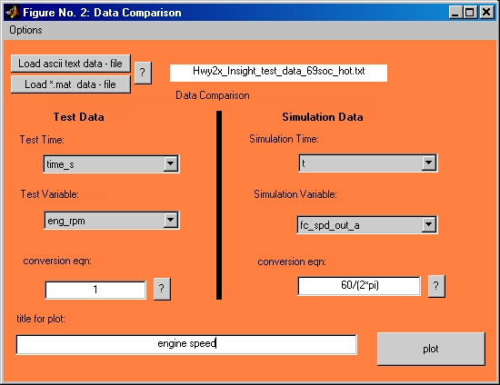
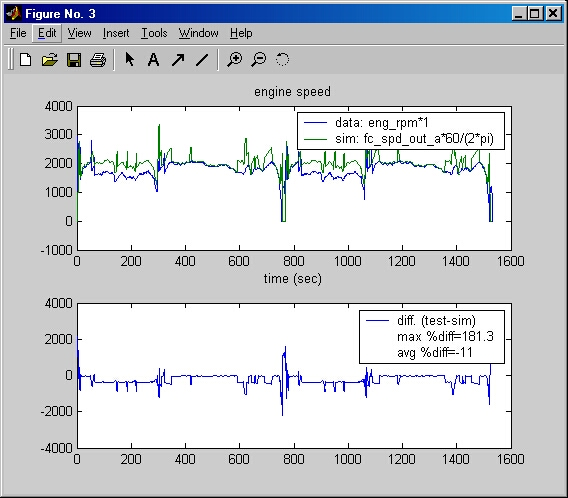

% Comparing Simulations
% 
% 

**Comparing Simulation Results with Test Data**

* * * * *

**Setup Description** \
The ‘Compare Results with Test Data’ functionality allows the user to
load in time dependent data and compare it with the current simulation
results.  This functionality can be accessed from the simulation results
figure.  Test data for comparison can be loaded from an ASCII text file
with delimited data including headers or from variables saved in a
MATLAB \*.mat file.  The OPTIONS menu allows the saving of the variables
loaded from a text file to a \*.mat file.

**Plot Figure** \
The Compare Results with Test Data plot figure is shown below.  The
selected time variables are plotted for each set of data.  A simple
difference analysis between signals is also plotted to get an idea of
the match between the data sets.

\
 

* * * * *

[Return to Chapter 3](advisor_ch3.html#3.3)

