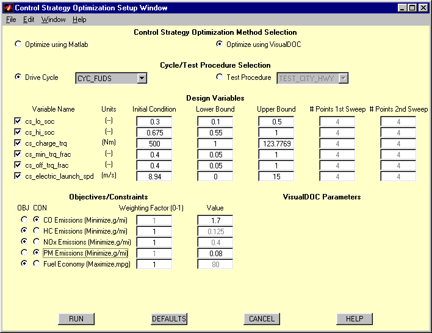
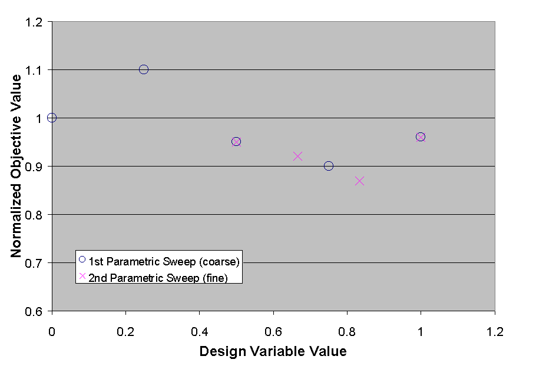
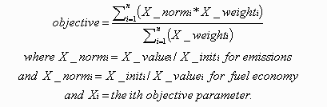
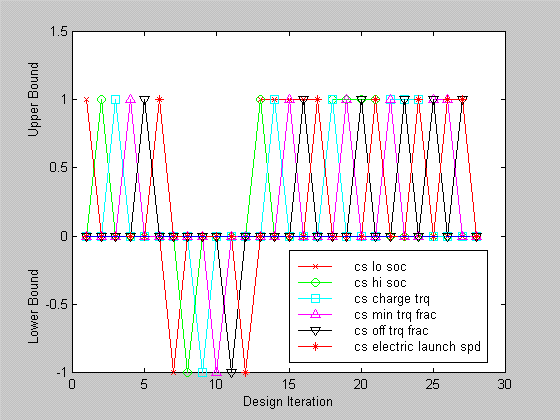
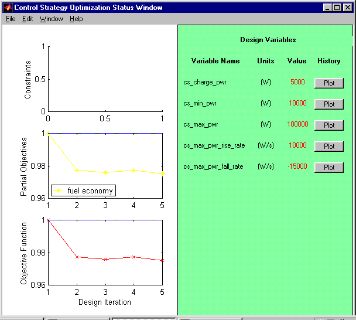
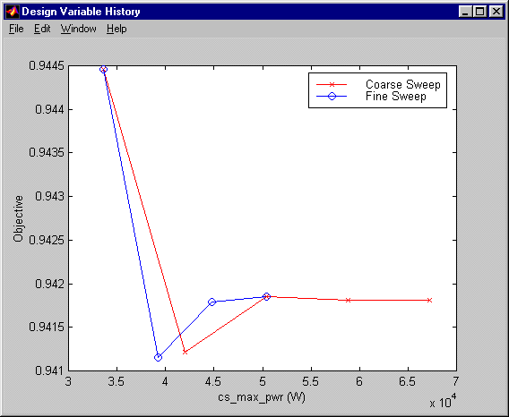
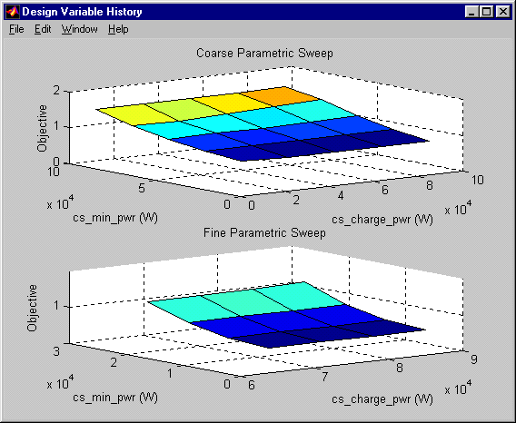
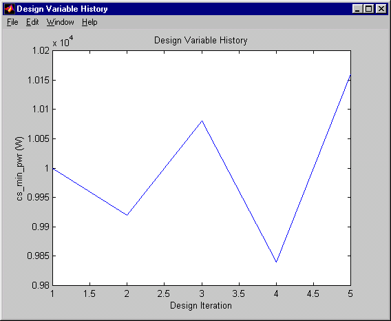
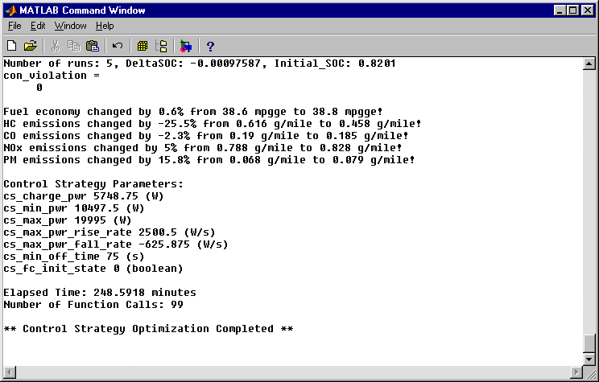

% control\_strategy\_help
% 
% 

Control Strategy Optimization
-----------------------------

**Overview** \
The purpose of the control strategy optimization routine is to determine
the set of control strategy parameters that meet the user-specified
objectives and constraints. It accomplishes this by adjusting the
control strategy parameters and reevaluating the performance criteria
until all of the specifications have been met. Currently, two forms of
this function are active in ADVISOR. The first is Matlab-based and uses
one- and two-dimentional multi-level parametric sweeps and some built-in
logic to determine the appropriate settings. The second uses VisualDOC
optimization software to determine the appropriate settings. Either
control strategy optimization routine only provides a single solution to
the optimization problem. Therefore, the results should only be used as
guide. In both cases, it is recommended but not necessary that the
vehicle first be autosized.  The control strategy optimization routine
will require access to the performance (grade and acceleration)
constraint information defined during the autosizing routine. The
control strategy optimization routine will confirm that the vehicle
continues to meet these constraints while adjusting the design
variables. This optimization routine is available for series (includes
fuel cell) and parallel hybrid vehicles. The conventional and electric
vehicles in ADVISOR don’t have control strategy parameters to be
optimized.

**Control Strategy Optimization Setup Window** \
Figure 1 displays the Control Strategy Optimization Setup Window. This
interface allows the user to define how the optimization routine will
progress and to configure the design variables, objectives, and
constraints. \
 

**Figure 1: Control Strategy Optimization Setup Window**

*Optimization Method Selection* \
Here the user must select the computation engine for the optimization
routine. If the “Optimize using VisualDOC” radiobutton is selected
ADVISOR will use the VisualDOC optimization software to determine the
solution. Otherwise, a custom Matlab-based routine will be used. A
limited version of VisualDOC is provided with ADVISOR.  If you don’t
have a full licensed version of VisualDOC installed on your machine your
problem will be limited to 5 design variables.

*Cycle/Test Procedure Selection* \
The user must decide whether to optimize the control strategy parameters
for a single drive cycle or for a test procedure. All drive cycles and
test procedures available within the Simulation Setup Window are
available to the user. Note that optimizing over a test procedure can
significantly increase the time required to solve the optimization
problem. Also note that a vehicle optimized for a single cycle may not
necessarily provide good results on other drive cycles or test
procedures.

*Design Variable Configuration* \
In this section, the user must define which design variables should be
modified by the optimization routines. Only those design variables
selected will by modified, all others will be left unchanged. If using
the Matlab-based optimization routine, the cs\_lo\_soc and the
cs\_hi\_soc variables are unavailable as design variables because these
parameters can be more efficiently set within the Matlab-based autosize
routine.  The user must then define the initial conditions, lower bound,
and upper bound for each of the selected design variables. By default
the initial conditions are the current parameter values in the Matlab
workspace. In addition, if using the Matlab-based routine, the user must
specify the number of points in each level of the parametric sweep to be
performed. The number of points in the first parametric sweep level
defines the course resolution or the number of points to be evaluated
between the upper and lower bounds. The number of points in the second
parametric sweep level defines the fine resolution or the number of
points to be evaluated around the best value of the first parametric
sweep. For example, given the following set of inputs, \
 

  ---------------------------- ------------------------------------------
            upper bound = 1    number of points in the first sweep = 4
            lower bound = 0    number of points in the second sweep = 3
  ---------------------------- ------------------------------------------

** Figure 2: Multi-level Parametric Sweep Graphical Example**

 

During the first parametric sweep the vehicle performance will be
evaluated at X = [0 0.25 0.5 0.75 1.0]. Assuming the best results
occurred at X = 0.75 then during the second parametric sweep the vehicle
performance will be evaluated at X = [0.5 0.666 0.833 1.0]. This example
is shown graphically in Figure 2.  The optimal setting is determined
from the combined data set of both parametric sweeps.

*Objective/Constraint Configuration* \
The user must configure the constraints and objectives to be used in
selecting the optimal design variable values. If the “OBJ” radiobutton
is selected the parameter will be considered in calculating the
normalized objective function. Otherwise, the parameter will be
considered as a constraint. To simply ignore a certain parameter select
the “CON” radiobutton and enter -1 for the Value. For those parameters
specified as objectives the user must specify the weighting factor
associated with that parameter. This will determine it’s overall
importance in the normalized objective function. Only those parameters
specified as active objectives will be included in the objective
function calculation. The normalized objective function will be
minimized and is calculated as follows, \
**Equation 1                               **  \
Now the optimization routine can be executed by selecting the “RUN”
button. You will be offered the opportunity to edit and accept the
existing or the default (if autosize routine was not executed)
performance constraints that will be enforced. Before the routine will
execute an estimate of the time to complete the optimization routine
based on the inputs provided is calculated. At this point the user may
either continue to execute the routine by selecting “OK” or cancel the
routine by selecting “CANCEL”. Selecting cancel will return you to the
Control Strategy Optimization Setup Window and allow you to either
reconfigure the optimization parameters or exit the setup process. Note
that the time estimate is only an estimate and will vary depending on
computer processing speeds and the length of the cycle/test procedure
selected.

*VisualDOC Parameters* \
This section has been provided for future use.  Currently, there are no
user-modifiable VisualDOC parameters.

**Control Strategy Optimization Plots** \
During the control optimization routine, various plots are displayed to
provide feedback to the user. When using VisualDOC, you will receive two
different plots. The first, Figure 3, is displayed during the Design of
Experiments stage of the optimization process and shows the value of
each design variable relative to its upper and lower bounds. Currently,
the routine executes a full second-order Koshal design with interactions
(for more information on the Koshal design method please refer to the
documentation for VisualDOC). This plot will be updated periodically as
the routine executes.  The second plot, shown in Figure 4, is displayed
during the Optimization Stage of the routine and displays the progress
made towards minimizing the normalized objective function at each design
iteration.  In addition, it shows the value of the variables being
optimized.  The variable values that have changed from one iteration to
the next will be shown in red. The status of the constraint parameters
and the contribution to the normalized objective function due to each
partial objective are shown.  This figure will be updated at each
iteration of the optimization process.  When the optimization has
completed the Plot history buttons will become active and will allow you
to view how the design variables were adjusted during the optimization
process. \
 

**Figure 3: Design Variable Plot Provided During Design of Experiments
Stage**

 

**Figure 4: Control Strategy Optimization Status Figure**

 

 

When using the Matlab-based routine, the plot history function will
provide plots similar to those shown below in Figures 5 and 6. \
 

**Figure 5: One-Dimensional Parametric Sweep Results Plot**

**Figure 6: Two-Dimensional Parametric Sweep Results Plot**

 

When using VisualDOC the plot history function will provide plots
similar to Figure 7.

**Figure 7: Two-Dimensional Parametric Sweep Results Plot**

**Control Strategy Optimization Results** \
After the control strategy optimization routine has completed, all
modifications to the vehicle configuration will be detailed in the
Matlab command window and all values will be updated in the ADVISOR
edited variable list as shown in Figure 9. At this point, it is
recommended that you return to the Vehicle Setup Window and save your
vehicle so that the results will be available for future analysis.

 

 

**Figure 9: Matlab Command Window Summary Messages**

**Control Strategy Optimization using Matlab-based Routine** \
The Matlab-based control strategy optimization routine uses one- and
two-dimensional multi-level parametric sweeps to determine the optimal
control strategy parameter settings based on the user-specified
objectives and constraints. This routine also uses built-in logic and
knowledge of the optimization problem to find a solution relatively
quickly. It does not ensure that this is the global optimum and it does
not consider the interactions between all design variables.

First the performance of the current vehicle is evaluated and stored for
use in calculating the objective function. Then the active design
variables are set to values that will not restrict the performance of
the vehicle. These initial parameter values are listed in Table 1 below.
\
 

**Table 1: Initial Parameter Settings**

<table border cellspacing="2" cellpadding="7" width="272">
<tr>
<td valign="TOP" width="58%">

**Variable Name**

</td>
<td valign="TOP" width="42%">

**Value**

</td>
</tr>
<tr>
<td valign="TOP" colspan="2">

*Series*

</td>
</tr>
<tr>
<td valign="TOP" width="58%">
cs\_charge\_pwr

</td>
<td valign="TOP" width="42%">

0

</td>
</tr>
<tr>
<td valign="TOP" width="58%">
cs\_min\_pwr

</td>
<td valign="TOP" width="42%">

0

</td>
</tr>
<tr>
<td valign="TOP" width="58%">
cs\_max\_pwr

</td>
<td valign="TOP" width="42%">

Inf

</td>
</tr>
<tr>
<td valign="TOP" width="58%">
cs\_max\_pwr\_rise\_rate

</td>
<td valign="TOP" width="42%">

Inf

</td>
</tr>
<tr>
<td valign="TOP" width="58%">
cs\_max\_pwr\_fall\_rate

</td>
<td valign="TOP" width="42%">

-inf

</td>
</tr>
<tr>
<td valign="TOP" width="58%">
cs\_min\_off\_time

</td>
<td valign="TOP" width="42%">

0

</td>
</tr>
<tr>
<td valign="TOP" width="58%">
cs\_fc\_init\_state

</td>
<td valign="TOP" width="42%">

0

</td>
</tr>
<tr>
<td valign="TOP" colspan="2">

*Parallel*

</td>
</tr>
<tr>
<td valign="TOP" width="58%">
cs\_charge\_trq

</td>
<td valign="TOP" width="42%">

0

</td>
</tr>
<tr>
<td valign="TOP" width="58%">
cs\_min\_trq\_frac

</td>
<td valign="TOP" width="42%">

0

</td>
</tr>
<tr>
<td valign="TOP" width="58%">
cs\_off\_trq\_frac

</td>
<td valign="TOP" width="42%">

0

</td>
</tr>
<tr>
<td valign="TOP" width="58%">
cs\_electric\_launch\_spd

</td>
<td valign="TOP" width="42%">

0

</td>
</tr>
</table>

 

The routine then explores the user-defined range of each active design
variable and sets the variable to its optimal setting. The order in
which the variables are evaluated and assigned new values follows the
order of the variable listings in Table 1 for the specific vehicle-type.
This order has been determined based on relative impact (from most to
least effective) of each parameter on vehicle performance and is the
same as the order in which the variables are displayed in the Control
Strategy Optimization Setup Window.

In addition, for both series and parallel vehicles, there are linked
variables that must be evaluated together if both variables are active
design variables. For series vehicles, cs\_charge\_pwr and cs\_min\_pwr
are linked variables. For parallel vehicles, cs\_charge\_trq and
cs\_min\_trq\_frac are linked variables. Two-dimensional multi-level
parametric sweeps are used for these variables. All other variables are
evaluated independently using one-dimensional multi-level parametric
sweeps.

Once the routine has set all parameters to the best values it compares
the resulting vehicle performance to the initial vehicle performance
(prior to any overrides) to ensure that the objective function has
improved. If the objective function has not improved the initial vehicle
settings are restored. If it has improved, the summary information is
provided in the Matlab command window.

### Control Strategy Optimization using VisualDOC-based Routine

VisualDOC is a gradient based optimization software package to be used
with various other codes and software packages. The control strategy
optimization routine using VisualDOC proceeds as follows,

1.  The current vehicle configuration is saved by ADVISOR
2.  VisualDOC performs a Design of Experiments (DOE) using ADVISOR as
    the solution engine
3.  VisualDOC performs an optimization of the control strategy
    parameters using response surface approximations based on the
    initial DOE results and the subsequent responses from each function
    call
4.  ADVISOR updates the current workspace with the VisualDOC results.

To use the VisualDOC-based routine, a licensed version of VisualDOC 1.2
must be installed on the computer. To obtain a full licensed version of
VisualDOC 1.2, contact VanderPlatts R&D at http:\\\\www.vrand.com. A
limited demonstration version of VisualDOC is inclued with ADVISOR and
this allows the user to execute optimization problems with 5 or less
design variables.

The VisualDOC-based routine does consider interactions between design
variables but still does not ensure that the solution is a global
optimum.

When using the VisualDOC-based routine it is possible to perform
multiple optimization runs using the same DOE data set. During the first
execution of the control strategy optimization routine a DOE data set
will be created. The response surface approximations routine uses this
data set to determine the optimum settings based on the user-defined
objectives and constraints. On completion of the optimization, the user
may decide that he/she would like to optimize for a different set of
objectives and constraints. When the Optimize Control Strategy button is
selected, the user will be prompted to use the existing DOE or generate
a new DOE data set. If you use the existing data set you will only be
allowed to change the objective and constraint settings and edit the
conditions of the previously active design variables. All simulation
parameters must be left unchanged for the DOE data set to be valid. If
you decide to generate a new data set you will be able to modify any of
the input parameters, but the routine will take significantly more time
to complete. \
  \
Last Revised: 10/27/99:tm
