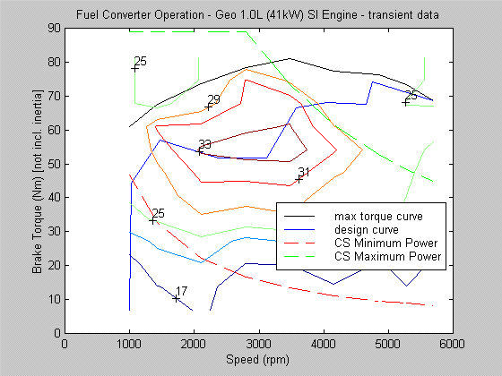

% ADVISOR 2
% 
% 

Control Strategy Tips
---------------------

(Updated 3/1/99:TM)

### **Series**

*cs\_lo\_soc and cs\_hi\_soc*

<dir>
<dir>
For efficient operation these two parameters should be set such that the
minimum discharge and minimum charge resistances of the energy storage
system fall between cs\_lo\_soc and cs\_hi\_soc. The powertrain
controller will work to maintain an SOC equal to the average of
cs\_lo\_soc and cs\_hi\_soc. See Figure 1.

</dir>
</dir>
*cs\_charge\_pwr*

<dir>
<dir>
Represents the addition power requested from the fuel converter to
charge the energy storage system. The powertrain controller tries to
maintain an SOC equal to the average of cs\_lo\_soc and cs\_hi\_soc. To
achieve this, additional power is requested from the fuel converter that
is equal to, cs\_charge\_pwr\*((0.5\*(cs\_lo\_soc+cs\_hi\_soc))-(actual
SOC))/(0.5\*(cs\_hi\_soc-cs\_lo\_soc)) to be used to recharge the energy
storage system. As a result; when actual SOC = cs\_lo\_soc,
cs\_charge\_pwr\*1.0 is requested; when actual SOC = cs\_hi\_soc,
cs\_charge\_pwr\*-1 is requested;

and when actual SOC equals the average of cs\_hi\_soc and cs\_lo\_soc,
nothing is requested. Typically, the lower this value is set the better
the resulting fuel economy will be. However, if the cs\_charge\_pwr is
set too low, the vehicle will not be charge sustaining over certain
drive cycles. Also note that if no effect is observed while adjusting
cs\_charge\_pwr parameter, the cs\_min\_pwr parameter (see below) may be
set high enough that it is overriding the effects of the cs\_charge\_pwr
parameter.

</dir>
</dir>
*cs\_spd*

<dir>
<dir>
Defines the vector of allowable speeds of the genset (fuel
converter/generator) and is determined based on the fuel converter and
generator efficiency maps. This vector is automatically generated and
adjusted when any changes are made to the generator or fuel converter
parameters and should not needed to be edited by the user.

</dir>
</dir>
*cs\_pwr*

<dir>
<dir>
Defines a vector of genset (fuel converter/generator) output powers
corresponding to the speeds defined by cs\_spd. This vector is
determined based on the fuel converter and generator efficiency maps and
is automatically generated and adjusted when any changes are made to the
generator or fuel converter parameters. It should not needed to be
edited by the user.

</dir>
</dir>
*cs\_fc\_init\_state*

<dir>
<dir>
Defines the initial state of the fuel converter (0
*è off, 1è
on).*Typically this is set to 0 so that the vehicle starts in an
electric-only mode of operation.

</dir>
</dir>
*cs\_max\_pwr\_fall\_rate*

<dir>
<dir>
Defines the maximum decreasing rate of change of the power requested of
the fuel converter. The best value for this parameter will depend both
on the vehicle configuration and the drive cycle. In general, the
smaller the value the faster the engine will be allowed to respond to
aggressive transients in the drive cycle.

</dir>
</dir>
*cs\_max\_pwr\_rise\_rate*

<dir>
<dir>
Defines the maximum increasing rate of change of the power requested of
the fuel converter. The best value for this parameter will depend both
on the vehicle configuration and the drive cycle. In general, the larger
the value the faster the engine will be allowed to respond to aggressive
transients in the drive cycle.

</dir>
</dir>
*cs\_min\_off\_time*

<dir>
<dir>
Defines the minimum time the fuel converter must stay off once it is
turned off by the control strategy. It is only overridden if the SOC
drops below the cs\_lo\_soc value. Typically, a shorter time will result
in improved fuel economy. However, a shorter duration may also produce
an undesirable on/off cycling pattern.

</dir>
</dir>
*cs\_min\_pwr*

<dir>
<dir>
Defines the minimum power requested of the fuel converter. A higher
value will typically force the fuel converter to operate in high
efficiency region. However, it may also provide more power than is
needed. See Figure 2.

</dir>
</dir>
*cs\_max\_pwr*

<dir>
<dir>
Defines the maximum power requested of the fuel converter. Typically set
to the highest power available in the fuel converter. However, depending
to the specific fuel converter it may be beneficial to set this to a
value lower than the highest power to avoid low efficiencies at
extremely high power output levels. See Figure 2.

</dir>
</dir>
### Parallel

*cs\_lo\_soc*

<dir>
<dir>
For efficient operation this parameter should be set to a value
approximately equal to the lowest SOC corresponding to the minimum
charge/discharge resistance of the energy storage system module. See
Figure 3.

</dir>
</dir>
*cs\_hi\_soc*

<dir>
<dir>
This parameter should be set slightly higher than the cs\_lo\_soc. More
specifically, it should be set to a value less than the SOC at which the
either the charge or discharge resistance increases dramatically. For
efficient operation, both the minimum charge and the minimum discharge
resistances should lie between the cs\_hi\_soc and the cs\_lo\_soc. See
Figure 3.

</dir>
</dir>
*cs\_charge\_trq*

<dir>
<dir>
Defines the additional torque requested of the fuel converter to
maintain an energy storage system SOC between cs\_lo\_soc and
cs\_hi\_soc. The parallel control strategy tries to maintain an SOC
equal to the average of cs\_lo\_soc and cs\_hi\_soc. To accomplish this,
it requests an additional torque from the fuel converter equal to,
cs\_charge\_trq\*((0.5\*(cs\_lo\_soc+cs\_hi\_soc))-actual\_SOC) to be
used to recharge the energy storage system. Ideally this value should be
set as low as possible because it acts as additional load on the fuel
converter. However, below some value, the vehicle will no longer be
charge-sustaining during operation on certain drive cycles. The Highway
Fuel Economy Test cycle (CYC\_HWFET) using the delta SOC correction can
be used to verify that this value is high enough in many cases.

</dir>
</dir>
*cs\_electric\_launch*

<dir>
<dir>
Below this vehicle speed the vehicle will operate as a pure electric
vehicle, above this speed the fuel converter will be used as the primary
power source. Typically, the lower this speed is set the better the
efficiency of the vehicle. Nearly all battery power is derived from the
fuel converter in a parallel vehicle. Thus setting this value to a
higher speed causes the batteries to be drained to a greater extent,
only to be recharged by the fuel converter. Setting the value lower
forces the fuel converter to be the primary power source more often and
results in better overall efficiency. However, if emissions are of
interest then operating more often as a pure electric maybe of more
importance.

</dir>
</dir>
*cs\_off\_trq\_frac*

<dir>
<dir>
Represents the fraction of max torque at each speed at which the engine
should turn off. This parameter should be set to a value equal to the
fraction of max torque at each speed at which the fuel converter
efficiencies begin to drop dramatically. See Figure 4.

</dir>
</dir>
*cs\_min\_trq\_frac*

<dir>
<dir>
Represents the minimum fraction of max torque at each speed that the
engine will operate at when lower torque fractions are requested. This
parameter is typically set to a mid to high value (0.5-0.8) in order to
force the fuel converter to operate in a high torque region of its
efficiency map. IC engines quite often are most efficient at torque
output levels near their max torque at a given speed. See Figure 4.

 

</dir>
</dir>

*Figure 1: Selection of Control Strategy High and Low SOC Parameters*

*Based on Battery Internal Resistance Curves for Series Vehicles*

 

*Figure 2: Selection of Control Strategy Minimum and Maximum Power
Parameters*

*Based on Fuel Converter Efficiency Map*

 

*Figure 3: Selection of Control Strategy High and Low SOC Parameters*

*Based on Battery Internal Resistance Curves for Parallel Vehicles*

 

*Figure 4: Selection of Parallel Control Strategy Minimum and Off Torque
Fractions*

*Based on Fuel Converter Efficiency Map*

