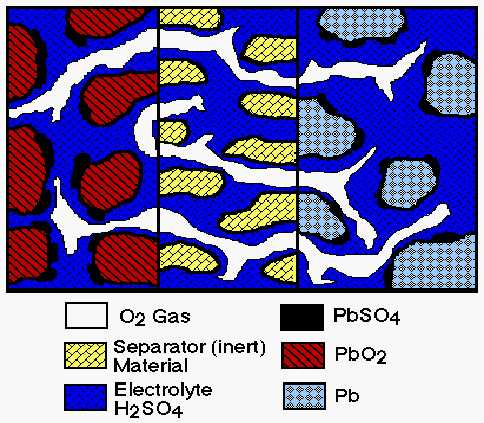
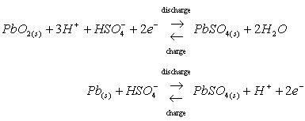
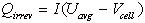
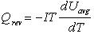

% Alternative Battery Models
% 
% 

### **Alternative Battery Models**

ADVISOR’s alternative battery models are a [fundamental lead acid
model](#Fundamental) and a [neural network model](#Neural%20Network). 
The simulink block diagrams can be found under
/gui/advisor\_ess\_options.mdl.

**<u>Fundamental Lead Acid Battery Model</u>**
\
A fundamental lead acid battery model was developed for NREL by John
Harb (Professor of Chemical Engineering) at Brigham Young University. 
The model is based on the physical and chemical processes that occur
during both discharge and charge, and includes performance/material
property variation with temperature.

To run the model, select ESS\_PB16\_fund\_optima or
ESS\_PB16\_fund\_generic from the Energy Storage options in ADVISOR’s
first Vehicle Input Screen.  These options refer to the two versions of
the model that are included in ADVISOR: one with parameters from
Optima’s spiral wound lead acid battery (proprietary values are compiled
in the fortran-based executable) and the second with generic lead acid
parameters.  This second version has more user-definable input
parameters.  To see a list of the variables in the models, look at the
two m files.  ADVISOR will automatically create a new block diagram
(e.g. BD\_SER\_fund) with the new ESS model and ask the user if he wants
to save it after running the simulation.

<u>Model Details</u> \
The details presented below were taken from the report “Development and
Integration of a Fundamentally Based Battery Model for Low-Emission
Vehicle Simulations,” John N. Harb, June 1999.

Figure 1 is a schematic diagram that illustrates the key features of the
one-dimensional model used in this study. The figure shows a unit cell
which extends from the center of one electrode to that of the opposite
(facing) electrode.

 \
Figure 1.  Schematic diagram of cell used in fundamental model

The principal reactions at the positive electrode and negative
electrodes were as follows:

During charge, both oxygen evolution at the positive electrode and
hydrogen evolution at the negative electrode were included in the
model.  Oxygen recombination at the negative electrode was also included
in an approximate way.  No attempt was made to model the pressure
build-up or mass transfer of gas in the cell.  It was believed that the
simulation of multiple charge/discharge cycles and the presence of a
pressure relief valve in real systems would make detailed tracking of
gas compositions and recombination rates difficult.  Also, there is
still debate in the literature as to what the controlling mechanisms
are.  Therefore, the present model simply integrated the amount of
oxygen evolved in the positive electrode during the previous time step
and allowed a specified fraction of that oxygen to recombine at the
negative electrode.  The recombination was assumed to occur quickly in
the outermost computational cell of the negative electrode (closest to
the separator).  The amount that recombines is also arbitrarily
constrained to change by no more than 10% of the total oxygen evolved
during the previous time step.

Because the system consisted of three coexistent phases (gas, liquid,
and solid), the convective terms that are important in flooded lead-acid
cells were not included. In other words, the liquid did not flow due to
squeezing out by the solid phase or due to volume changes in the liquid
resulting from the reactions at the two electrodes. It was envisioned,
however, that the liquid and gas phases would redistribute due to
wicking or capillary forces. Mechanistic modeling of such forces was
beyond the scope of the present work and inconsistent with the level of
assumptions made elsewhere in the model. Consequently, as a first
approximation, it was assumed that capillary forces would lead to a
volume ratio of gas to liquid that was approximately constant.  The
volume fraction of liquid was assumed to be constant across the
separator, and was updated after each time step based on an overall acid
balance.

The equation used are based on the macroscopic description of porous
electrodes and use concentrated solution theory to characterize species
transport in the electrolyte (20,21). The reversible lead electrode was
used as a reference electrode for the solution potential. Activity
coefficients (as a function of acid concentration) were approximated by
fitting data (22) to a polynomial expression over the range of
concentrations from approximately 0.05M to 8M sulfuric acid. The partial
molar volumes of electrolyte species were assumed to be constant. The
expressions used to describe the reaction rates accounted for mass
transfer limitations due to dissolution of Pb+2 (18,23).  Finally, the
matrix potential (potential of the solid phase) was assumed to be
constant over the thickness of each electrode (i.e. in the radial
direction). Calculations showed that the matrix potential changed very
little relative to the change in the solution potential across the
electrode. This assumption allowed elimination of an equation and hence
simplified and increased the efficiency of the calculations. A detailed
listing of the model equations for the negative electrode only are
listed below, in an effort to keep this document as short as possible. 
A similar set of equations was used for the positive electrode.  The
equations in the separator were the same as those of Bernardi and
Carpenter (17).  In addition, an overall volume balance for the
electrolyte was used to determine the liquid volume fraction in the
separator.

<u>Heat Generation Rates</u> \
Heat generation rates due to irreversible losses were calculated for the
battery. These losses include Joule heating in the electrolyte and
energy dissipated in electrode overpotentials, and were determined from
the following relationship:

where Q~irrev~ (W) is the heat due to irreversibilities, I is the cell
current (A) associated with reactions shown in equations 1 and 2, Vcell
is the cell voltage, and U~avg~ is the theoretical open-circuit
potential evaluated at the average concentration. The current, I, is
positive during discharge and negative during charge.

There is also a reversible heat term which is associated with the change
in entropy during charge and discharge of the cell. This term is
evaluated as follows:

where Q~rev~ (W) is the reversible heat, T is the temperature (K), and
dU~avg~/dT is the derivative of the open circuit potential with respect
to temperature. dU~avg~/dT was assumed to be constant and was
approximated as 2 x 10-4 V/K from the data of Bode (1977).

<u>SOC</u> \
The State of Charge of the battery was found by tracking the amount of
charge associated with the conversion fo Pb to PbSO~4~in the negative
electrode and PbO~2~to PbSO~4~in the positive electrode.  This amount of
charge was used with a user capacity to approximate the SOC for each
electrode:

SOC= (Specified Capacity - Charge removed from Electrode)/Specified
Capacity

Since one of the electrodes is often limiting, the minimum value of the
SOC calculated for the two electrodes was reported as the SOC.

References: \
17. D.M. Bernardi and M.K. Carpenter, J. Electrochem. Soc., 142, 2631
(1996). \
18. J. Newman and W. Tiedemann, J. Electrochem. Soc., 144, 3081 (1997).
\
19. SIMULINK (Version 2) and MATLAB (Version 5.2), The Math Works, Inc.,
1998. \
20. J. Newman and W. Tiedemann, AIChE Journal, 21, 25 (1975). \
21. J. Newman, Electrochemical Systems, 2nd Ed., Prentice-Hall,
Princeton, NJ (1991). \
22. H. Bode, Lead Acid Batteries, Wiley and Sons, New York, NY (1977). \
23. J.S. Dunning, D.N. Bennion, and J. Newman, J. Electrochem. Soc.,
118, 1251 (1971).

**<u>Neural Network Model for the Hawker
Genesis Lead Acid</u>** \
A neural network battery model was developed for NREL by S. R. Bhatikar
and R. L. Mahajan at the University of Colorado.  The model was created
by using power, voltage, current, and SOC data from a Hawker Genesis
Lead Acid battery by running a 12V battery over a power cycle derived
from a US06 drive cycle.

In their most basic form, neural networks are hyper-dimensional curve
fits for nonlinear data.  Research on mathematical models describing the
functionality of the human brain led to the development of the basic
theory for these networks.  An additional caveat of these networks is
the ability to modify themselves to a changing input output
relationship. This modification is called learning.  Since neural
networks are in essence nonlinear curve fits they can be used to
reproduce data in real time.

To run the model, select ESS\_PB12\_nnet from the Energy Storage options
in ADVISOR’s first Vehicle Input Screen.  ADVISOR will automatically
create a new block diagram (e.g. BD\_SER\_nnet) with the new ESS model
and ask the user if he wants to save it after running the simulation.

Neural networks are only as good as the data they are trained on,
therefore the use of the battery model should be restricted.  The
training data ranges were as follows:

SOC ranged from 0.27 to 0.74 \
Power ranged from 1200 W discharge to 750 W charge \
Output Current ranged from 85 A discharge to 79 A charge \
Output Voltage ranged from 9.5 V to 16.9 V

The model does not include variation with temperature as data was
unavailable for training over a significant range of temperatures.

Last Revised: 5/29/01: vhj
