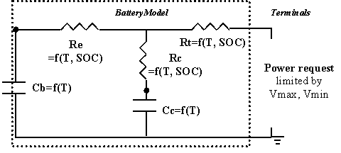
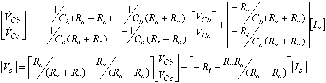
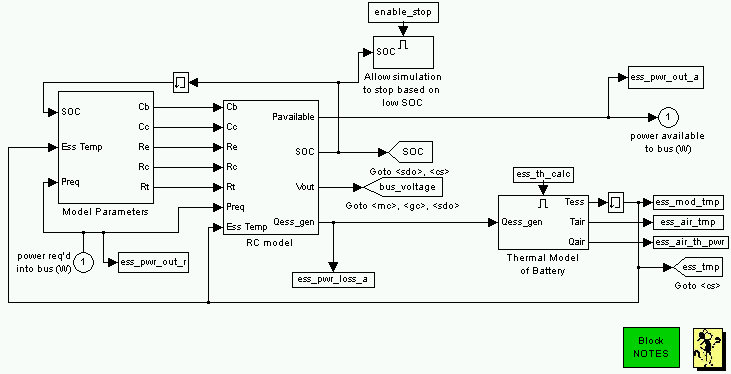
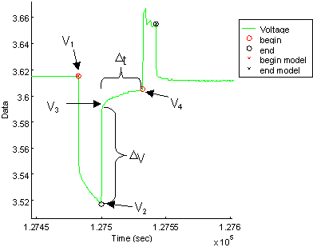
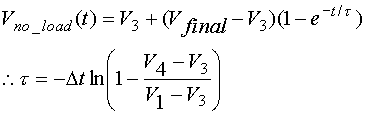
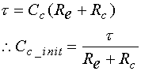

% RC Model
% 
% 

### **RC Battery Model**

**<u>Role of subsystem in vehicle</u>** \
The Energy Storage System (ESS) block represents the battery pack that
stores energy on board the modeled vehicle.  This block accepts a power
request and returns available/actual power output from the battery, the
battery voltage and current, and the battery State of Charge (SOC).  By
convention, positive power is discharge.

**<u>Description of modeling approach</u>** \
ADVISOR’s RC model is shown in circuit form in Figure 1. The RC model
uses power as an input and limits the battery operation to the high and
low voltage limits.  Power delivered by the battery is limited to the
maximum that the equivalent circuit can deliver or the maximum that the
motor controller can accept, given its minimum voltage requirement.  A
simple single-node thermal model of the battery is implemented with
parallel flow air cooling.  More detail can be found in the [battery
thermal model explanation](ess_therm.html).  The governing state
equations of the model are shown in Equation 2, and implemented in the
S-function RC.m.

The capacitor Cb is very large and represents the ample capability of
the battery to store charge chemically. The capacitor Cc is small and
mostly represents the surface effects of a spiral-wound cell, e.g. the
limiting behavior of a battery to deliver current based on time
constants associated with the diffusion of materials and chemical
reactions.

**Figure 1: ADVISOR RC Battery Model**

**Equation 1**

**<u>Variables used in subsystem</u>**

> [See Appendix A.2: Input
> Variables](advisor_appendices.html#Input%20Energy%20Storage%20System%20RC)

**<u>Implementation</u>** \
The model was implemented in Matlab via an S-function that was called
through a Simulink block. In this way, the parameters of the state space
system (Equation 1) could vary with SOC and temperature and then be
passed to the S-function. The S-function limited power to keep the
battery within operating limits, and calculated SOC and heat generated
from the battery. The block diagram implmentation of the model is shown
in Figure 2.

**Figure 2: Block Diagram implementation of RC battery model**

**<u>Parameter Generation</u>** \
Basic physics and select experimental values were used to determine
initial values used in the data processing and optimization (e.g. over
the HPPC profile) to determine the five unknown parameters (cb, cc, re,
rc, rt) for a given temperature or SOC.  See
[Batmodel](../extras/batmodel/documentation/batmodel_doc.html) for more
detail.

<u>Bulk Capacitor Cb</u> \
The experimentally determined open circuit voltages at 0% SOC and 100%
SOC were used along with the rated Amp-hour capacity to determine the
energy that could be stored in the bulk capacitor Cb, by using the
following equation:

**Equation 2**

<u>Resistances</u> \
To determine initial values for the three resistances, a relationship
between the terminal resistance (Rt), the end resistance (Re), and the
capacitor resistance (Rc) was assumed. This relationship was that Re and
Rc were the same value (R\*), and Rt was ½ the value of R\*. R\* was
taken to be Rbulk/1.24 as determined by the step-response impedance of
the circuit. The relative relationships were taken from initial values
that Saft had applied to their 2-cap model. The bulk resistance was
taken from experimental values and determined separately for each SOC
(see also Figure 3):

Rbulk=DV/current **Equation 3** \
 

**Figure 3: HPPC values to determine initial R’s and C’s**

<u>Surface Capacitor Cc</u> \
The initial value for the surface capacitor Cc was derived from the
observed time constant for the ‘no-load’ voltage response between
voltage V~3~ and V~4~ (see Figure 3). The time constant was approximated
by the following equation:

**Equation 4**

The time constant associated with Cc (see Equation 1) was then used to
determine an initial guess for Cc:

**Equation 5**

* * * * *

[Back to Chapter 3](advisor_ch3.html)

Last Revised: 5/29/01: vhj
