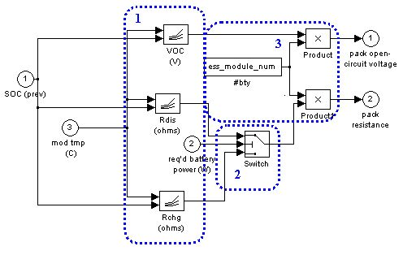
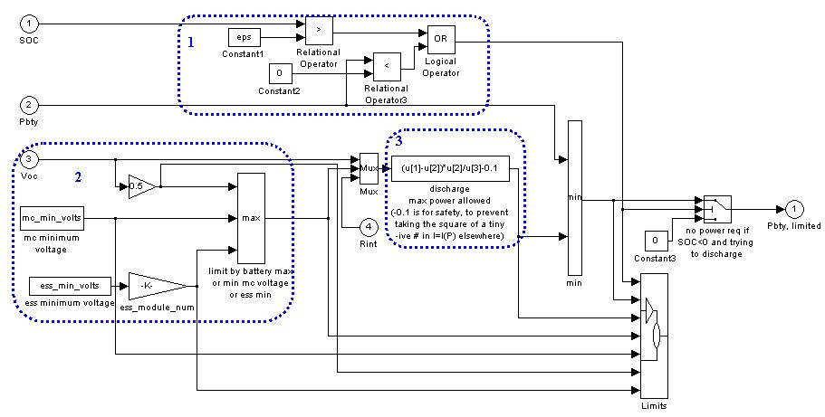

% Rint Model
% 
% 

### **Rint Battery Model**

[Battery Model Update Impacts](ess_update.html)

**<u>Role of subsystem in vehicle</u>** \
The Energy Storage System (ESS) block represents the battery pack that
stores energy on board the modeled vehicle.  This block accepts a power
request, usually from the power bus, and returns available/actual power
output from the battery, the battery voltage and current, and the
battery [State of Charge (SOC)](glossary.html#SOC).  By convention,
positive power is discharge.

**<u>Description of modeling approach</u>** \
The ESS block models the battery pack as a charge reservoir and an
equivalent circuit whose parameters are a function of the remaining
charge in the reservoir.  The equivalent circuit accounts for the
circuit parameters of the battery pack as if it were a perfect [open
circuit voltage](glossary.html#O) source in series with an [internal
resistance](glossary.html#I).   The amount of charge that the ESS can
hold is taken as constant, and the battery is subject to a minimum
voltage limit.  The amount of charge that is required to replenish the
battery after discharge is affected by [coulombic
efficiency](glossary.html#Coulombic%20efficiency).  The charging of the
battery is limited by a maximum battery voltage.  While the battery is
treated as a perfect electrical voltage source with a known resistance,
the components to which the battery would be connected, such as a motor
or a generator, are treated as power sources or sinks.  Power delivered
by the battery is limited to the maximum that the equivalent circuit can
deliver or the maximum that the motor controller can accept, given its
minimum voltage requirement.

Other relevant glossary terms include: [Capacity](glossary.html#C),
[Rated Capacity](glossary.html#R), [C/N rate,](glossary.html#CNrate) [N
hour rate](glossary.html#N), and [Peukert’s
equation](glossary.html#Peukert's%20Equation).

A simple single-node thermal model of the battery is implemented with
parallel flow air cooling.  More detail can be found in the [battery
thermal model explanation](ess_therm.html).

**<u>Variables used in subsystem</u>**

> [See Appendix A.2: Input
> Variables](advisor_appendices.html#Input%20Energy%20Storage%20System) \
> [See Appendix A.3: Output
> Variables](advisor_appendices.html#Output%20Energy%20Storage%20System)

**<u>Implementation</u>**

**Energy Storage System (Top level)**

As described above, the energy storage model computes the battery SOC in
response to the requirements of the power bus and outputs the available
power.  Power loss is computed as I^2^R losses plus losses due to
Coulombic (in)efficiency.  A step-by-step explanation follows.

1.  The battery is modeled as an equivalent circuit comprising a perfect
    open circuit voltage source ([Voc](glossary.html#O)) in series with
    an effective internal resistance ([Rint](glossary.html#I)).  Voc and
    Rint are computed as piecewise linear functions of SOC. There are
    two such functions for computing Rint, one for discharge power and
    another for charge power.
2.  The total <u>power that the battery can deliver</u> is limited to be
    in an allowable range.
3.  The set of parameters–Voc, Rint, and actual Power–are the variables
    of a quadratic equation to solve for equivalent circuit’s
    <u>current</u>.
4.  The battery current is then used to update the effective <u>SOC</u>
    of the battery.
5.  The thermal model of the battery calculates the module temperature,
    which is fed back to be used in determining the performance
    parameters.

Each of these sub-blocks is explained below.

**1. Pack Open Circuit Voltage and Internal Resistance:** This block
calculates Voc and Rint given the current SOC and required battery
power.

1.  Interpolated lookup tables for open circuit voltage (Voc) and the
    charging and discharging resistance are used to determine these
    parameters as functions of SOC and the module temperature.
2.  The appropriate resistance is chosen, based on whether the power
    requirement is to charge (negative power) or discharge (positive
    power) the battery.
3.  The two parameters are scaled by the number of battery modules in
    series.

\
**2. Limit Power:**This block prevents the power that is used to compute
the battery current from exceeding limits imposed by three limits: SOC,
equivalent circuit parameters, and the motor controller’s minimum
allowable voltage.

1.  If an attempt is made to draw power from a depleted battery, the
    power request is limited to zero.
2.  The maximum power available from the battery is limited by three
    parameters, all related to the available voltage.  The operating
    voltage cannot drop below either the motor’s minimum voltage or the
    battery’s minimum voltage.  If neither of these limits are exceeded,
    the maximum power available will be observed when the voltage is
    equal to Voc/2.
3.  The maximum power limit is calculated, according to the
    formula:  where Vbus is either Voc/2, the minimum
    motor controller voltage, or the minimum battery voltage, whichever
    is larger.

\
**3. Compute Current:**This block solves the quadratic equation for
current that is derived by starting with the definition of electrical
power and Kirchoff’s voltage law (KVL) for the equivalent circuit shown
below.

> > > *Block Diagram*

> 1.  <u>Current</u> is determined.  Power is defined as: *P=V x I*, or
>     *V=P/I*.  Combining the power equation with KVL yields:
>     *P/I=Voc-(R x I)*.  Multiplying both sides of the equation by I
>     yields *P = (Voc x I) - RI^2^* .  This is the equation that is
>     solved in the block diagram: *RI^2^ - (Voc x I) + P = 0*.  There
>     are actually two solutions for this equation, but the larger
>     solution is not considered because it would require larger
>     current, and thus a lower terminal voltage, to produce the same
>     power. All solutions that require a terminal (or bus) voltage less
>     than half the battery’s open circuit voltage are thus not
>     considered.  During charge, the maximum voltage must not be
>     exceeded.  This maximum charge current (or minimum raw value of
>     current since charging is a negative current) is found from
>     *I=(Voc-Vmax)/R*.
> 2.  <u>Bus voltage</u> is determined.  Kirchoff’s voltage law, applied
>     along the equivalent circuit loop, requires that: *V=Voc-(RxI).*

\
**4. SOC algorithm:**The state of charge (SOC) algorithm in ADVISOR is
responsible for determining the residual capacity, in units of Amp-hours
(charge), that remains available for discharge from the battery. It
approximates this value in a series of steps.  Note that the coulombic
efficiency and maximum capacity are functions of temperature.

1.  The sum of all discharging current and all charging current (scaled
    by an estimate of average coulombic efficiency) determines an
    <u>effective total Ah change</u> in the battery since the beginning
    of the simulation.
2.  The initial SOC is accounted for by taking having a non-zero initial
    A-h used.
3.  The SOC is calculated by using the equation: *SOC=(Max Capacity-Ah
    used)/Max Capacity*.

**5. Thermal model:** A simple, single-node lumped-parameter thermal
model was added to the ESS (energy storage system) sub-block of the
ADVISOR. This thermal model predicts the average internal battery
temperature and surface (case) temperature as a function of time while
the vehicle is driven and during soak periods. Currently there is only
one cooling option: parallel-flow air cooling (each module has the same
air flow and inlet air temperature, which are specified by the user). 
See the [battery thermal model explanation](ess_therm.html) for more
details.

* * * * *

[Back to Chapter 3](advisor_ch3.html)

Last Revised: 5/29/01: vhj
