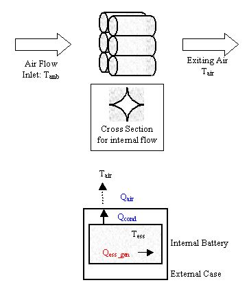
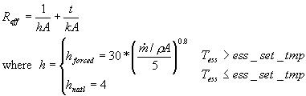
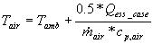
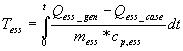
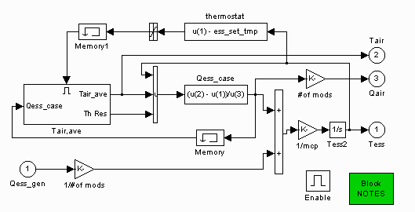
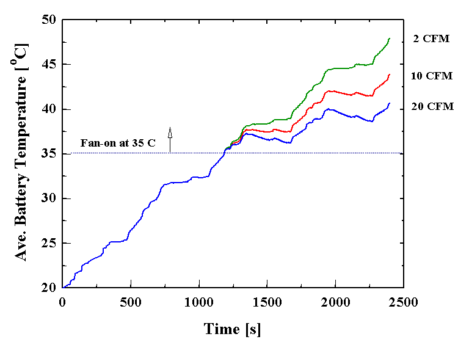
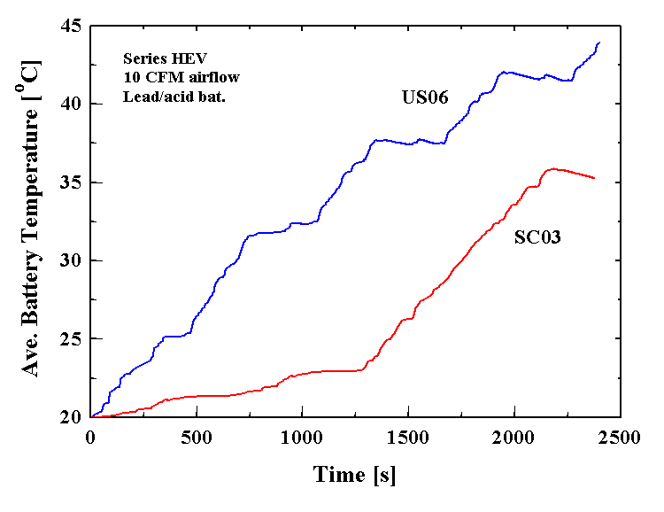
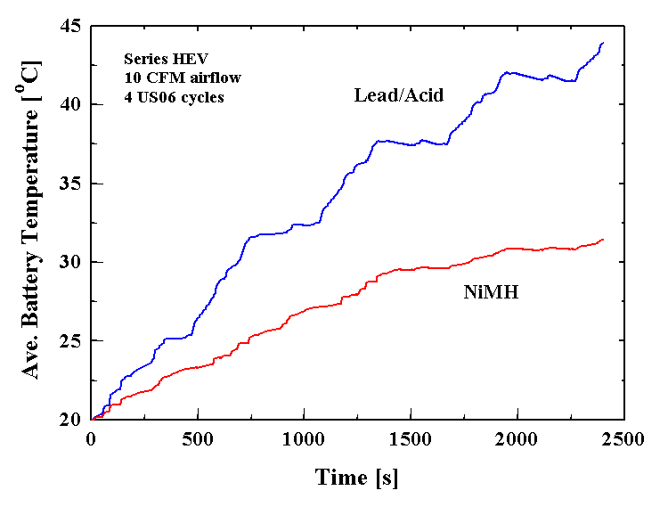

% ADVISOR Battery Thermal Model
% 
% 

### **ADVISOR Battery Thermal Model**

[Back to ADVISOR ESS Model](energy_storage.html)

**<u>Summary</u>** \
A simple, single-node lumped-parameter thermal model within the ESS
block predicts the average internal battery temperature and exiting air
temperature as a function of time while the vehicle is driven and during
soak periods. Currently there is only one cooling option: parallel-flow
air cooling (each module has the same air flow and inlet air
temperature, which are specified by the user).

 \
**Figure 1: Schematic of ESS thermal model**

<u>Qess\_case</u> \
This is a combination of the conduction and convection from the internal
battery to the air.  Airflow over the battery begins once the
temperature has exceeded a setpoint, ess\_set\_tmp.  The effective
thermal resistance is calculated as follows:

and *Q~ess\_case~=(T~ess~-T~air~)/R~eff~*. \
<u>Tair</u> \
The effective air temperature to which the battery convects is slightly
warmer than ambient temperature.  50% of the energy going into the air
is assumed to go towards warming the air up.  \
<u>Tess</u> \
The heat generated by the battery is calculated from coulombic and
internal resistance losses.  The temperature of the battery is
calculated to be: 

**<u>Battery Thermal Model</u>** \
This model provides preliminary indication of the battery temperature
versus time for a variety of battery, vehicle, and drive cycle
combinations. In some cases, active battery thermal management may not
be required. In many others, battery temperature objectives may be able
to be met with simple air cooling. In some extreme cases, air cooling
may not be sufficient and liquid cooling may need to be considered.

The top level of the new ADVISOR battery thermal model is shown in
Figure 2. It consists of a single lumped thermal mass representing one
module, excluding its case. Since many modules have a plastic case, and
this case can provide a significant thermal resistance to heat flow, the
module case was treated separately. Although its thermal resistance can
be significant, its thermal mass relative to that of the module is very
small. Hence, the case thermal mass is not explicitly modeled (whatever
heat flows into the case from the module is assumed to flow out via
convection and radiation).

#### Figure 2 – Top level of ADVISOR battery thermal model block diagram

A variety of active cooling conditions are possible with battery packs,
including air versus liquid and parallel flow versus series. Initially,
only one common approach has been modeled: that of parallel air flow.
This approach is used in the Toyota Prius (Japanese) and has also been
used at NREL for domestic automaker HEV pack development. In this
approach, the cooling air is distributed (usually) under the pack and
flows up along each module, then is collected in a space above the pack
and exhausted. This has the advantage that every module sees the same
inlet air temperature, which leads to a more uniform pack temperature.
From a modeling standpoint, it means that the pack thermal behavior can
be reasonably represented by modeling a single module.

After specifying the module mass, average heat capacity, case thickness,
and case thermal conductivity, the two additional items needed are the
module heat generation rate (versus time) and the heat loss from the
surface of the module case. As mentioned previously, the battery heat
generation is currently modeled via I^2^R losses plus losses due to
Coulombic (in)efficiency. The Coulombic efficiency is a measure of the
heat generated or absorbed due to the chemical reactions of the battery
cell. For the current empirical-based model, this efficiency is assumed
to be a constant. For theoretical battery models, the chemical reactions
can be solved for explicitly. This will be the case with the new model
by Dr. Harb of BYU, when it is incorporated into ADVISOR in the next few
months.

Concerning the heat loss from the module case surface, radiative and
convective heat losses were both estimated. The radiative heat loss is
estimated from the surface area exposed to ambient and the case
emissivity. The convective loss is a function of the case surface area
exposed to the cooling air and the average air heat transfer coefficient
over the case. This heat transfer coefficient is estimated from
correlations from “Fundamentals of Heat and Mass Transfer”, by Incropera
& DeWitt and includes a minimum value based on natural convection. The
user specifies the mass flow rate of cooling air per module. In parallel
flow, the total pack air flow is the product of this per-module air flow
and the number of modules in the pack. Currently the cooling air inlet
temperature is set to ambient. A cabin thermal model will soon be added
to ADVISOR, after which the user will have the option to have the
battery cooling air match the cabin air temperature.

A thermostat feature is also included. By specifying a set temperature,
the airflow will start only after the battery temperature rises above
this value. An example of the thermostat and airflow effects is shown in
Figure 3. In this case (series HEV running 4 US06 cycles), the set
temperature was 35 C, after which the fan came on to deliver either 2,
10, or 20 CFM per module (50, 250, or 500 CFM for the pack).

#### Figure 3 – Effect of cooling air flow on battery temperature

The effect of drive cycle on battery temperature can be seen in Figure
4. The same vehicle (series HEV with lead/acid batteries, 10 CFM cooling
air, 35 C set temperature) is run on 4 US06 cycles and 4 SC03 cycles.
Because the US06 cycle is much more energy-intensive, there is more
waste heat generated in the batteries, resulting in a more rapid
heat-up.

#### Figure 4 – Effect of drive cycle on battery temperature

Finally, Figure 5 shows the effect of battery type. A series HEV with 10
CFM cooling air per module is run on 4 US06 cycles using lead/acid and
NiMH batteries. The NiMH pack remains cooler because it has a lower
internal resistance and generates less heat.

#### Figure 5 – Effect of battery type on battery temperature

**<u>Future Activities</u>** \
The current ADVISOR battery model now includes thermal effects.  In the
future, the battery thermal model will be enhanced to include other
types of active cooling such as liquid cooling and series flow.

Last revised: 1/18/01, vhj
