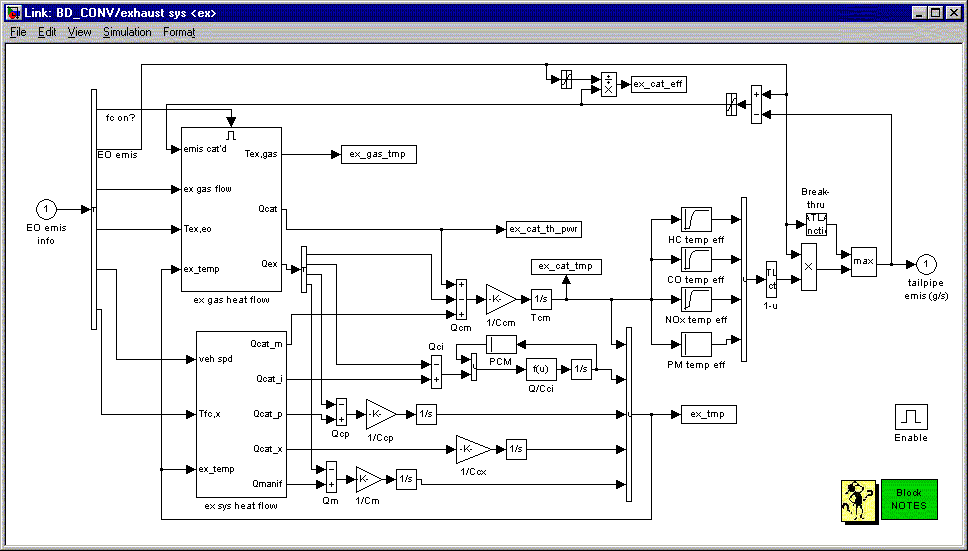
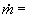
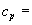
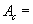
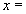
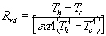
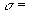
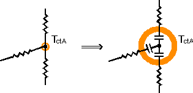

% exhaust
% 
% 

**Exhaust System**

*[Exhaust System Block Diagrams](ex.gif)*

*[Diesel Oxydation Catalyst Model Information](emis_ornl.html)*

**<u>Role of subsystem in vehicle</u>** \
The exhaust system model simulates a fuel converter exhaust
aftertreatment system for the vehicle. In the case of an internal
combustion engine, it is composed of the exhaust manifold, downpipe,
catalytic converter, and muffler.  It can be incorporated into various
vehicle configurations including, series, parallel, and conventional
vehicles.   The primary output of the exhaust system model is the
tailpipe emissions (HC, CO, NOx, and PM) in g/s, as a function of time. 
Other outputs include the temperature of various exhaust system
components and of the exhaust gas temperature into and out of each
system component.

**<u>Description of modeling approach</u>** \
Catalyst conversion efficiencies as a function of temperature are stored
in vectors.  Additionally, there is a catalyst efficiency adjustment
(decrease) made at high exhaust flow rates (face velocities) and an
upper “breakthrough” limit in g/s for each emission component.  The
tailpipe emissions are then the product of the fuel converter out
emissions and the total effective catalyst efficiency.  Catalyst
temperature is calculated using a lumped-capacitance approach.  A mass
and heat capacity are assigned not only to the major converter
components (monolith, exterior shell, and remainder), but also to the
manifold and downpipe.  Heat transfer correlations are used to estimate
the convective heat transfer coefficients from the hot exhaust gas to
the components, as well as from the components to ambient.  Radiative
loss to the ambient is also included.  Within the converter, the heat of
catalysis is estimated based on the g/s of each emission component (HC,
CO, NOx, and PM) being catalyzed.  This heat adds to the rate of
converter warmup.  NOTE:  An older approach to estimating the catalyst
temperature as a simple exponential curve fit of typical warmup and
cooldown versus time has been retained.  This old approach can be
compared to the current approach by comparing the variable
ex\_cat\_temp\_old with ex\_cat\_temp and emis\_old with emis. \
 

**<u>Equations used in subsystem</u>**

There are many equations encompased in the exhaust system modeling. 
Additional information on thermal modeling is provided in the section
below.  In general, the following types of equations are used:

    (change in temperature with time)=(net heat flow)/[(mass)\*(heat
capacity)]

    where:  (net heat flow) can be: \
              convective:  (heat transfer coef)\*(surface
area)\*(surface-to-fluid temperature difference) \
 conductive:  (thermal conductance)\*surface-to-surface temperature
difference) \
            or radiative:  (emissivity)\*(surface
area)\*(Steffan-Boltzman constant)\*(Th4 – Tc4)

       (catalyst efficiency) = (catalyst temperature efficiency) \*
(catalyst exhaust flow efficiency)

       (catalyst efficiency) = max(catalyst efficiency, “breakthrough”
limit)

       (tailpipe emissions) = (engine out emissions) \* [1 – (catalyst
efficiency)] \
 

**<u>Exhaust aftertreatment thermal model</u>**

**Figure 1. Top level of catalyst model**

The prediction of tailpipe emissions is based on the engine emissions
multiplied by the catalyst conversion efficiency. The catalyst
conversion efficiency is a function of catalyst temperature.  ADVISOR
has a detailed and accurate methodology for predicting catalytic
converter temperature.

The top level of the exhaust system thermal model is shown in Figure 1.
The converter thermal model uses two outputs from the fuel converter as
its inputs: the exhaust gas flow rate and engine-out temperature. The
exhaust gas loses heat to the exhaust manifold and downpipe prior to
reaching the catalytic converter (which in turn lose heat to the engine
and ambient). The catalytic converter is modeled via a three-node lumped
capacitance model including 1) monoliths, 2) inner steel shell, and 3)
outer steel shell. Heat exchange from the gas to the converter nodes,
between converter (and pipe) nodes, and from the converter to the
ambient was modeled via appropriate advection, conduction, convection,
and radiation thermal resistances, as shown in Figure 2 and Table 1. \
  \
  \
 \

**Figure 2. Thermal network representing the catalyst and associated
thermal elements** \
  \
 

**Table 1. Modes of heat transfer and representative thermal
resistances**

<table border cellpadding="7" width="564">
<tr>
<td valign="CENTER" width="21%" height="40">
Mode

</td>
<td valign="CENTER" width="27%" height="40">
Resistance

</td>
<td valign="CENTER" width="52%" height="40">
Variable definitions

</td>
</tr>
<tr>
<td valign="CENTER" width="21%" height="29">
Advection

</td>
<td valign="CENTER" width="27%" height="29">

</td>
<td valign="CENTER" width="52%" height="29">
mass flow rate, heat capacity

</td>
</tr>
<tr>
<td valign="CENTER" width="21%" height="96">
Conduction

</td>
<td valign="CENTER" width="27%" height="96">

</td>
<td valign="CENTER" width="52%" height="96">
thermal conductivity, 

cross-sectional area, 

representative distance between nodes

</td>
</tr>
<tr>
<td valign="CENTER" width="21%" height="67">
Convection

</td>
<td valign="CENTER" width="27%" height="67">

</td>
<td valign="CENTER" width="52%" height="67">
convective heat transfer coefficient, 

surface area

</td>
</tr>
<tr>
<td valign="CENTER" width="21%" height="66">
Radiation

</td>
<td valign="CENTER" width="27%" height="66">

</td>
<td valign="CENTER" width="52%" height="66">
emissivity,  \
Stefan-Boltzmann constant

</td>
</tr>
</table>

A thermal network diagram is often used to show the flow of thermal
energy (heat) through a system approximated with nodes. In such a
network, heat flow is analogous to current, and temperature to voltage
(Q=D T/R). Note that each lumped capacitance
node (represented in Figure 3 with a circle around a dot) has a thermal
mass associated with it, analogous to an electrical capacitance with a
value of mass\*heat capacity, as shown in Figure 2.

 \
**Figure 3. Thermal capacitance at nodes in catalyst’s network**

\
 \
 \
 \
 \
 \

Within the converter, the heat of catalysis, Q~ct~, is estimated based
on the mass flow rate (g/s) of each emission component (HC, CO, and NOx)
being catalyzed. This heat adds to the rate of converter warm-up. This
detailed thermal model of the exhaust aftertreatment system also enables
much more flexibility in investigating aftertreatment options. Recently,
NREL and Benteler Automotive Corp. used this thermal model as part of
ADVISOR to look at the emissions reduction capability of a
vacuum-insulated catalytic converter. \

* * * * *

[Back to Chapter 3](advisor_ch3.html)

Last revised: 8/20/01:tm
