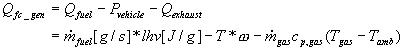
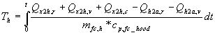

% Fuel Converter
% 
% 

### Fuel Converter

[Updates to Fuel Converter Cold-to-Hot Correction Factors, January
2001](Engine%20Cold-Hot%20Comparison.html)**

*[Fuel Converter block diagram](fc.gif)* \
*[Fuel Use and EO emissions block diagram](fc_tmp.gif)*

**<u>Role of subsystem in vehicle</u>** \
The fuel converter model simulates a power source for the vehicle. In
the case of an internal combustion engine, it is the device that
converts the fuel into useable energy (mechanical shaft work) for the
drivetrian. It can be incorporated into various vehicle configurations
including, series, parallel, and conventional vehicles.

**<u>Description of modeling approach</u>** \
Given a requested speed and torque calculated by the other submodels,
the fuel converter model determines the engine operating point required
to meet these requirements while also accounting for inertial losses and
accessory loads. The engine controller module does not allow the fuel
converter to operate outside of its normal operating speed and torque
ranges. The controller also determines the engine speed if the clutch is
disengaged. Once the achievable speed and torque have been determine
these values are passed back to the rest of the vehicle model. These
values are also used to determine the fuel use and emissions for each
time step. The fuel use and fuel converter out emissions values are
stored in tables indexed by fuel converter speed and torque. Temperature
correction factors have been incorporated to scale the fuel use and
emissions for cold starts.

**<u>Variables used in subsystem</u>**

> [See Appendix A.2: Input
> Variables](advisor_appendices.html#Input%20Fuel%20Converter) \
> [See Appendix A.3: Output
> Variables](advisor_appendices.html#Output_Fuel_Converter)

**<u>[Fuel Converter Scaling](bore_stroke_scaling.html)</u>**

**<u>Implementation: Thermal Model</u>** \
The thermal model of the engine breaks the engine assembly into four
temperatures: the cylinder, the engine block, the exterior engine
accessories, and the hood of the vehicle.  The coolant operates as a
thermostat, with the setpoint set by the user.  Heat is generated by
combustion, conducted to the engine block, and removed through  forced
liquid cooling, conduction, natural convection, and radiation (see
Figure 1).

 \
**Figure 1: Schematic of engine thermal model**

The calculations for the individual heat transfer paths are detailed
below, and the temperatures of the four nodes are then given.  See
Figure 1 for subscript notation (example: Qc2i,c = heat transferred from
the cylinder to the inner block via conduction)..

<u>CYLINDER</u> \
<u>Qfc\_gen</u> \
The heat generated by the engine is found from the fuel used, the usable
power, and the heat contained in the exhaust.

<u>Qc2i,c</u> \
Heat is removed from the cylinder to the engine block through
conduction.  This conductance (W/K) is specified by the user in the
engine input file; a representative value is 500 W/K.
*Q~c2i,c~=fc\_c2i\_th\_cond\*(T~c~-T~i~)*

<u>INNER/ENGINE BLOCK</u> \
<u>Qi2x,c</u> \
Some of the input heat (Qc2i,c) is removed from the engine block to the
exterior/engine accessories through conduction.  Again, this conductance
(e.g. 500 W/K) is specified by the user in the engine input file.
*Q~i2x,c~=fc\_i2x\_th\_cond\*(T~i~-T~x~)* \
<u>Qfc,coolant</u> \
The remaining heat input into the engine block (Qc2i,c-Qi2x,c) is
assumed to be absorbed into the coolant if the coolant flow is on.  The
coolant operates on a thermostat setpoint, turning on when the block
temperature exceeds the setpoint of fc\_tstat.

> <u>Qfc,htr</u> \
> If the key is on, some of the coolant heat is used for the cabin
> heater.  This amount is based on a user specified heat exchanger
> effectiveness from the coolant to the heater (e.g. fc\_cl2h\_eff=0.7),
> and a given heater air flow (e.g. fc\_h\_air\_flow=1kg/s). 
> *Q~fc,htr~=fc\_cl2h\_eff\*fc\_h\_air\_flow\*c~p,air~\*(T~coolant~-T~amb~)*
> \
> <u>Qfc,rad</u> \
> If the key is on, the remaining heat input into the coolant  is
> released through the radiator. *Q~fc,rad~=Q~fc,coolant~-Q~fc,htr~*

<u>EXTERIOR/ENGINE ACCESSORIES</u> \
The surface area used below was scaled by the power scale of the engine:
*Scale=fc\_pwr\_scale^0.67^* (based on a spherical surface area of an
engine). \
<u>Qx2h,r</u> \
Radiative heat from the exterior to the hood is given by:
*Q~x2h,r~=es\*A\*(T~x~^4^-T~h~^4^)=fc\_emisv\*5.67E-8\*fc\_ext\_sarea\*(T~x~^4^-T~h~^4^).*Here
the temperatures are in Kelvin. \
<u>Qx2h,v</u> \
For an explanation of the chosen heat transfer coefficient, see [Qair
under the motor thermal model description](motor_controller.html#Qair). 
The heat removed from the exterior to the hood through natural and
forced convection is given by
*Q~x2h,v~=h~air~\*A\*(T~x~-T~h~)=h~air~\*fc\_ext\_sarea\*(T~x~-T~h~)* \
<u>Qx2h,c</u> \
Some of the input heat (Qi2x,c) is removed from the engine accessories
to the hood through conduction.  This conductance (e.g. 10 W/K) is
specified by the user in the engine input file.
*Q~x2h,c~=fc\_h2x\_th\_cond\*(T~x~-T~h~)* \
<u>Qx2a,r</u> \
Heat was also radiated from the exterior directly to ambient air.  This
surface area was assumed to be 50% of the exterior surface area.
*Q~x2a,r~=es\*A\*(T~x~^4^-T~amb~^4^)=fc\_emisv\*5.67E-8\*(.5\*fc\_ext\_sarea)\*(T~x~^4^-T~amb~^4^)*
\
<u>Qx2a,v</u> \
Again, the surface area available for convection to ambient was assumed
to be 50% of the exterior surface area.  For an explanation of the
chosen heat transfer coefficient, see [Qair under the motor thermal
model description](motor_controller.html#Qair).  The heat removed from
the exterior to the ambient air through natural and forced convection is
given by
*Q~x2a,v~=h~air~\*A\*(T~x~-T~amb~)=h~air~\*(.5\*fc\_ext\_sarea)\*(T~x~-T~amb~)*

<u>HOOD</u> \
<u>Qh2a,r</u> \
Radiative heat from the hood to the ambient surroundings is given by:
*Q~h2a,r~=es\*A\*(T~h~^4^-T~amb~^4^)=fc\_hood\_emisv\*5.67E-8\*fc\_hood\_sarea\*(T~h~^4^-T~amb~^4^).*
\
<u>Qh2a,v</u> \
For an explanation of the chosen heat transfer coefficient, see [Qair
under the motor thermal model description](motor_controller.html#Qair). 
The heat removed from the hood to the ambient air through natural and
forced convection is given by
*Q~h2a,v~=h~air~\*A\*(T~h~-T~amb~)=h~air~\*fc\_hood\_sarea\*(T~h~-T~amb~)*

<u>TEMPERATURE EQUATIONS</u> \
<u>Tc</u> \
The base mass (cylinder and engine block) was assumed to have a 1.8
kg/kW value (and can also be explicitely defined in the FC file).  Of
this mass, 20% was assumed to be associated with the cylinders.

<u>Ti</u> \
The mass of the engine block was assumed to be 80% of the base mass.

<u>Tx</u> \
The accessory mass may be explicity defined in the FC file.  As a rule,
a mass of 0.8 kg/kW was assumed (based on 1994 OTA report, Table 3).

<u>Th</u> \
The mass of the hood was assumed to be 10% of the vehicle glider mass.

**<u>Equations used in subsystem</u>** \
(torque available) = (engine torque available) – (accessories torque)

> (accessories torque) = (accessories mechanical power) \* (engine
> speed) \
> (engine torque available) = max((closed throttle torque), min((torque
> requested), (max torque)))
>
> > (torque requested) = (torque requested by clutch) + (inertial
> > torque) + (accessories torque)
> >
> > > (inertial torque) = (shaft rate of acceleration) \* (engine
> > > inertia) \
> > > (accessories torque) = (accessories power) / (shaft speed)

(speed available) = min((speed requested), (max engine speed)) \*
(clutch state = engaged) + (spin-down speed) \* (clutch state \~=
engaged)

> (spin-down speed) = max((idle speed),(closed throttle speed))
>
> > (closed throttle speed) = ((closed throttle torque) - (accessories
> > torque)) / (engine inertia) \* (time step)
>
> (speed requested) = (speed requested by clutch)

(gallons of fuel used) = sum(fuel used per time step)

> (fuel used per time step) = (engine out fuel used) \* (engine
> temperature fuel use correction factor)
>
> > (engine temperature correction factor) = 1+ ((fc\_tstat-(engine
> > coolant temperature))/(75))\^3.1 \
> > (engine coolant temperature) = Ti as calculated above (see Figure 1)

(engine-out emissions per time step) = (fully-hot engine out emissions
as a function of speed and torque)\*(engine temperature emissions
correction factor)

> > (normalized temperature)=(fc\_tstat-(engine coolant
> > temperature))/(fc\_tstat-20) \
> > For HC: (engine temperature correction factor) = 1+7.4\* (normalized
> > temperature) \^ 3.072 \
> > For CO: (engine temperature correction factor) = 1 + 9.4 \*
> > (normalized temperature) \^ 3.21 \
> > For NOx: (engine temperature correction factor) = 1+ 0.6 \*
> > (normalized temperature) \^ 7.3 \
> > For PM: assumed to be the same as HC, (engine temperature correction
> > factor) = 1+7.4\* (normalized temperature) \^ 3.072

**<u>References</u>** \
The temperature corrections for the emissions releases are based on a
report entitled “Emission Simulations: GM Lumina, Ford Taurus, GM
Impact, and Chrysler TEVan” by J. Dill Murrell and Associates, LLC.,
Saline, MI, January 1996.

* * * * *

[Back to Chapter 3](advisor_ch3.html)

Last Revised: 01/31/01: VHJ
