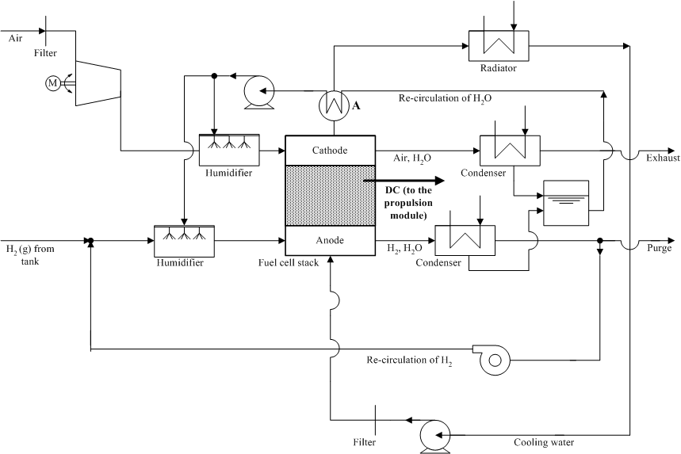

% Help on the KTH fuel cell system model fuel converter
% 
% 

The KTH fuel cell system model
------------------------------

This fuel cell system model (the KTH model) was developed by the Royal
Institute of Technology (KTH), Stockholm, Sweden, as a part of a
post-graduate project. It is a semi-empirical model with thermal and
water management. However, the KTH model is a steady-state model.
Furthermore, the fuel cell stack component of the model is theoretical,
partly based on work by Springer et al., 1991 and accounts for phase
changes of the water in the fuel cell stack. The model’s approach allows
for stack definition, i.e., calculation of the number of cells based on
the required maximum power output of the system. With assumptions of
active area and stoichiometric coefficients of hydrogen and air, it
could be used for any fuel cell stack, giving the model a significant
flexibility.

The auxiliary system includes a hydrogen tank and power demand
calculations for individual pumps and fans. It also contains maps with
compressor data from Opcon Autorotor. The system allows hydrogen to be
re-circulated and allows for the water produced in the stack to be
condensed and used in the humidifiers. Heat produced in the fuel cell
stack is transferred to a cooling loop. The model also accounts for
frictional losses found in lines, elbows and filters.

Figure 1 shows a schematic of the model. The PEM fuel cell system
operates on pure hydrogen. The inlet gases are humidified in separate
humidifiers. The stack outlet gases are assumed to be fully saturated
(i.e., RH = 100%). The exhaust flows are cooled in the condensers where
part of their water content is condensed out and recovered for reuse in
the humidification process.

<!--[if gte vml 1]><v:shapetype
 id="_x0000_t75" coordsize="21600,21600" o:spt="75" o:preferrelative="t"
 path="m@4@5l@4@11@9@11@9@5xe" filled="f" stroked="f">
 <v:stroke joinstyle="miter"/>
 <v:formulas>
  <v:f eqn="if lineDrawn pixelLineWidth 0"/>
  <v:f eqn="sum @0 1 0"/>
  <v:f eqn="sum 0 0 @1"/>
  <v:f eqn="prod @2 1 2"/>
  <v:f eqn="prod @3 21600 pixelWidth"/>
  <v:f eqn="prod @3 21600 pixelHeight"/>
  <v:f eqn="sum @0 0 1"/>
  <v:f eqn="prod @6 1 2"/>
  <v:f eqn="prod @7 21600 pixelWidth"/>
  <v:f eqn="sum @8 21600 0"/>
  <v:f eqn="prod @7 21600 pixelHeight"/>
  <v:f eqn="sum @10 21600 0"/>
 </v:formulas>
 <v:path o:extrusionok="f" gradientshapeok="t" o:connecttype="rect"/>
 <o:lock v:ext="edit" aspectratio="t"/>
</v:shapetype><v:shape id="_x0000_i1025" type="#_x0000_t75" style='width:429.75pt;
 height:268.5pt' o:ole="" fillcolor="window">
 <v:imagedata src="../../../DOCUME~1/kharalds/LOCALS~1/Temp/msoclip1/01/clip_image001.wmz"
  o:title=""/>
</v:shape><![endif]-->
<!--[if gte mso 9]><xml>
 <o:OLEObject Type="Embed" ProgID="Visio.Drawing.6" ShapeID="_x0000_i1025"
  DrawAspect="Content" ObjectID="_1123653892">
 </o:OLEObject>
</xml><![endif]--> 

Figure 1. Schematic view over the KTH model.

The drive cycle power demand translates into a vehicle power request and
that in turn into a net fuel cell power output request. The fuel cell
system power request takes into account the losses of the power
converters connecting the fuel cell system to the vehicle drivetrain.

Inputs for the KTH model are similar to those for the VT model. Examples
of unique features include the water transport across the fuel cell,
purge percentage (the amount of the anode exhaust to be removed from the
system) and pipe diameter and length.

The model outputs are the net fuel cell system power, the efficiency of
the fuel cell and system and system characteristics such as mass flow of
the reactants, product, inert material and coolant, heat developed in
the stack, individual auxiliary parasitic loads, water balance of the
fuel cell system (including humidifiers and condensers).

 

References
----------

For more information, please go to

K. Johansson
(Haraldsson), *Modelling of a Proton Exchange Membrane Fuel Cell System
for Automotive Applications*, Licentiate of Engineering Thesis, Royal
Institute of Technology, Stockholm, Sweden (2001),
<http://media.lib.kth.se:8080/licengrefhit.asp?licnr=1309>

KH 08/29/03
