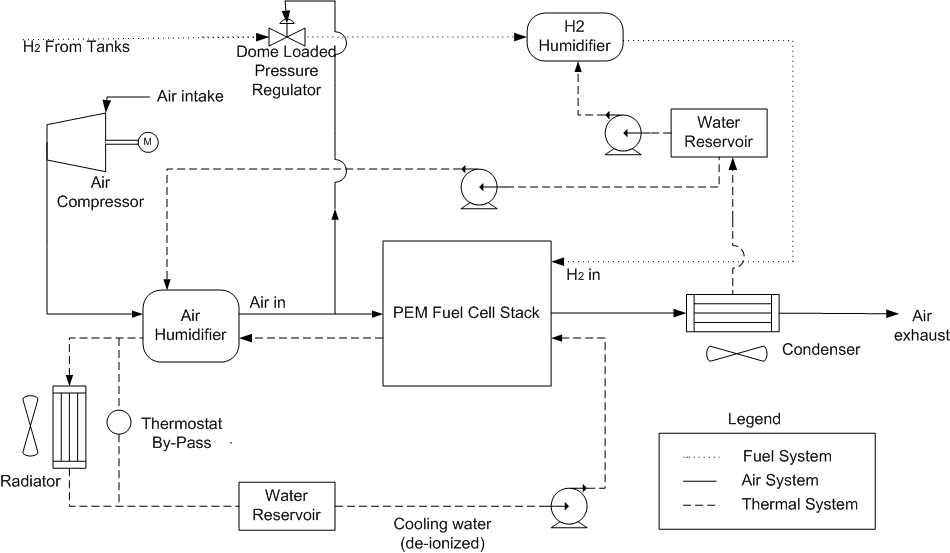

% Help on the Virginia Tech
% 
% 

**The Virginia Tech (VT) fuel cell system model**
-------------------------------------------------

This Proton Exchange Membrane (PEM) fuel cell system model was developed
by Virginia Tech (VT) in collaboration with NREL in 2001/2002. The VT
model is a semi-empirical model that accounts for the thermal management
and water balance in the system. The model provides hot- and cold-start
effects on vehicle fuel economy, power limitations due to temperature,
and a water balance for reactant humidification. The system operates on
pure hydrogen. 

Figure 1 shows a schematic of the model. The relevant components are a
compressor, reactant humidifiers, a fuel cell stack, a condenser and
water separator, a pressure release device and a cooling circuit
including a pump, water reservoir and radiator. 

The inlet gases are humidified in separate humidifiers. The stack outlet
gases are assumed to be fully saturated (i.e., RH = 100%). The cathode
exhaust is cooled in the condenser where part of its water content is
condensed out and recovered for reuse in the humidification process. The
system operating pressure varies as a function of the fuel cell load.

<!--[if gte vml 1]><v:shapetype id="_x0000_t75" coordsize="21600,21600"
 o:spt="75" o:preferrelative="t" path="m@4@5l@4@11@9@11@9@5xe" filled="f"
 stroked="f">
 <v:stroke joinstyle="miter"/>
 <v:formulas>
  <v:f eqn="if lineDrawn pixelLineWidth 0"/>
  <v:f eqn="sum @0 1 0"/>
  <v:f eqn="sum 0 0 @1"/>
  <v:f eqn="prod @2 1 2"/>
  <v:f eqn="prod @3 21600 pixelWidth"/>
  <v:f eqn="prod @3 21600 pixelHeight"/>
  <v:f eqn="sum @0 0 1"/>
  <v:f eqn="prod @6 1 2"/>
  <v:f eqn="prod @7 21600 pixelWidth"/>
  <v:f eqn="sum @8 21600 0"/>
  <v:f eqn="prod @7 21600 pixelHeight"/>
  <v:f eqn="sum @10 21600 0"/>
 </v:formulas>
 <v:path o:extrusionok="f" gradientshapeok="t" o:connecttype="rect"/>
 <o:lock v:ext="edit" aspectratio="t"/>
</v:shapetype><v:shape id="_x0000_i1025" type="#_x0000_t75" style='width:398.25pt;
 height:222pt' o:ole="" o:allowoverlap="f">
 <v:imagedata src="file:///C:/DOCUME~1/kharalds/LOCALS~1/Temp/msoclip1/01/clip_image001.wmz"
  o:title=""/>
</v:shape><![endif]--> <!--[if gte mso 9]><xml>
 <o:OLEObject Type="Embed" ProgID="Visio.Drawing.6" ShapeID="_x0000_i1025"
  DrawAspect="Content" ObjectID="_1123566955">
 </o:OLEObject>
</xml><![endif]-->

Figure 1. Schematic view over the fuel cell system model.

#### General Model Overview and Operation

At each time step during a drive cycle, the power demand of the drive
cycle translates into a vehicle power request. The control strategy of
the vehicle determines how much power to request form the fuel cell
system and the battery. Then the models supply the power requested to
the vehicle that may, or may not, meet the drive cycle power demand due
to power limiting effects in the system. 

The fuel cell system model includes two major parts: the
electrochemistry model and the thermal model. The electrochemistry model
relates the operating conditions (temperature, pressure, relative
humidity, etc.) to a fuel cell stack voltage and current. The vehicle
power request translates into a net power request to the fuel cell
system. To start the solution simulation, the iterative solver uses an
initial condition that related the net power request to a gross power
request. The inputs to the electrochemistry model are the gross power
request and the fuel cell stack temperature and the outputs are:

​1. heat generated by the fuel cell reaction within the stack

​2. gross fuel cell system power at the present operating conditions

​3. parasitic power required to run the fuel cell system at the present
gross power operating point.

The thermal model uses the result of the electrochemistry model to
estimate the operating temperatures in the fuel cell system. In
addition, some of the temperatures, eg. fuel cell stack and water
reservoir temperatures, are provided by a delayed feedback loop. At each
time step, the results of the previous time step (or initial conditions)
are used in the thermal model. Using the information of the water
balance and temperature from the previous time step and the thermal
system characteristics, the thermal model performs mass and energy
balances on the fuel cell system components. The outputs of the thermal
model are information on 

​1. water balance

​2. parasitic power load

​3. cathode operating conditions

​4. humidification and condensation

​5. heat rejection requirements.

With the information of the gross power operating point and the
parasitic power required from the electrochemistry and thermal models, a
net power operating point is established. During each time step, the
iterative solver repeats the electrochemical and thermal calculations to
refine the gross power input to meet the requested net power output of
the fuel cell system. Internal to the iterative solver, logic steps that
refine the solution to different goals in order to meet different
operating scenarios. 

The fuel cell system model has the ability to converge to three
different goals upon a net power request. Goal 1 is to generate the net
power requested, goal 2 is to generate a power that has been limited
duel to operating conditions and goal 3 is to generate zero gross
power. 

#### Additions

Following
additions of the VT model have been done:

The
impacts of elevation and oxygen concentration can now be evaluated under
real driving
conditions. The
vehicle speed has been linked to the heat transfer processes in the
radiator and the condenser, and the fuel cell model equations have been
updated to include inlet ambient pressure as a
variable. 
These improvements are significant because they allow the tool to
analyze the impact of altitude and ambient temperature on fuel cell
vehicle performance and fuel
economy.  

### How to Use the Fuel Cell System Model in ADVISOR

#### Vehicle Input figure

Load the fc\_vt\_compact\_r1\_in and you will have a compact hybrid
vehicle with a 50kW fuel cell system and 6 Ah Li-ion battery pack. Its
control strategy is to let the fuel cell system be on at all times
except when the key is manually turned off. 

Under Variable button, there are a number of fuel cell system parameters
that either can be kept as default or set to a new value. The parameters
are

fuel cell stack characteristics such as

fc\_min\_cell\_volts- the minimum cell voltage

fc\_min\_temp\_for\_heat\_rejection- the minimum temperature for heat
rejection of the fuel cell stack

fc\_target\_anode\_inlet\_humidity,
fc\_target\_cathode\_outlet\_humidity- the desired relative humidity of
the anode/cathode

fc\_allowable\_temp\_rise- the maximum temperature difference across the
fuel cell stack

or thermal system characteristics such as

fc\_system\_coolant\_capacity- system cooling medium capacity [liter]\
 fc\_radiator\_frontal\_area- frontal area of the radiator [m\^2]\
 fc\_condenser\_frontal\_area- frontal area of the condenser [m\^2]

The parameters shown under the Variable button can also be edited in
system\_characteristics.m

 <o:p> </o:p>

References
----------

For more information, please go to

S. Gurski,
*Cold Start Effects on Performance and Efficiency for Vehicle Fuel Cell
System*, Master of Science Thesis, Virginia Polytechnic Institute and
State University, (2002),
<http://scholar.lib.vt.edu/theses/available/etd-12192002-162600/> and
<http://scholar.lib.vt.edu/theses/available/etd-12192002-162600/unrestricted/sgurski@vt.edu_thesis.pdf.pdf>

J. Laramie and A. Dicks, Fuel Cell Systems Explained, John Wiley & Sons,
Ltd, 2002

KH 08/28/03
