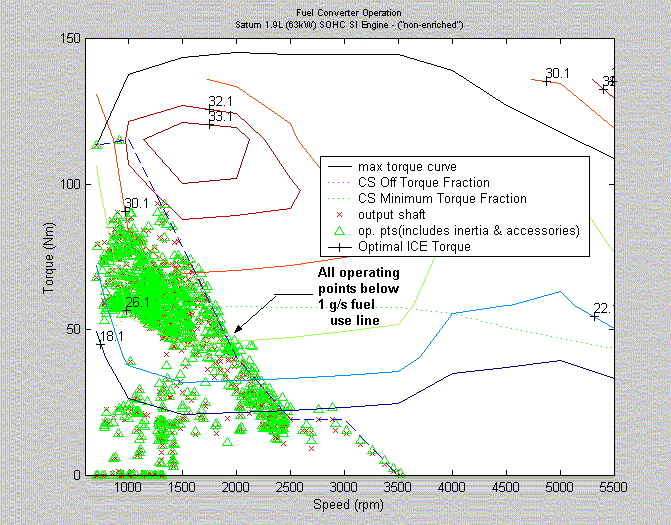
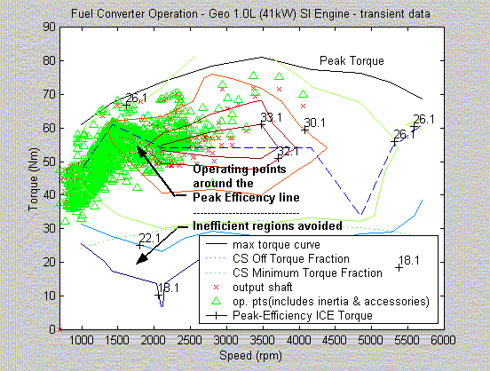
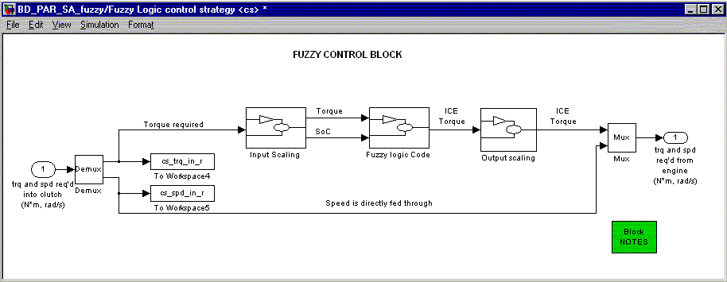
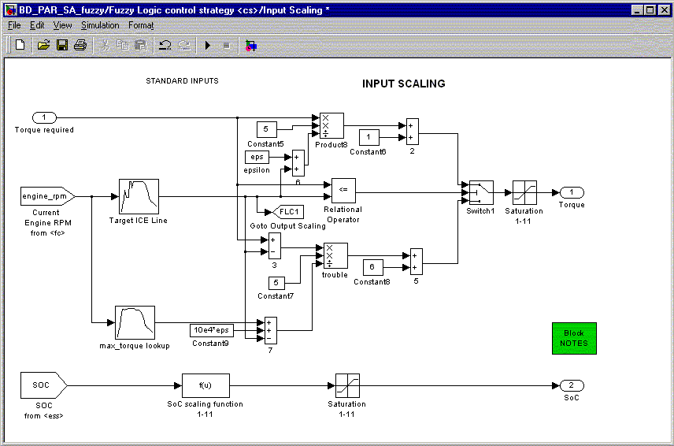
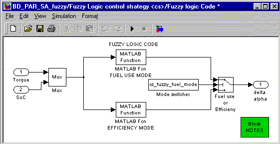
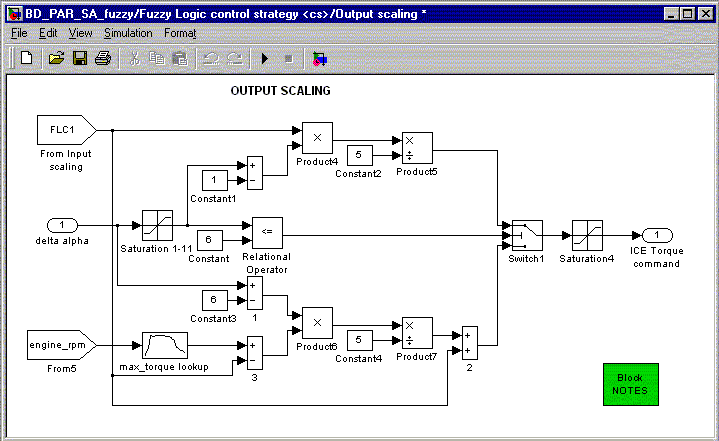

% Fuzzy Logic Control Strategy
% 
% 

<h2>

Fuzzy Logic Control Strategy</b>

</h2>

[Introduction](#intro)\
 [Why Fuzzy Logic](#why)\
 [Working of the strategy in ADVISOR](#working)\
 [Fuel use mode](#fuel)\
 [Efficiency mode](#eff)\
 [Block diagrams](#block)\
 <a name="intro">

### Introduction

</a> In the control of a parallel hybrid electric vehicle (HEV), one of
the primary goals is to set the IC engine operation in it’s peak
efficiency region. This improves the overall efficiency of the
powertrain. This is best achieved by a CVT. But in the absence of one,
the ICE operation must be set according to the road load and the battery
state of charge (SoC).

2 strategies are provided in ADVISOR that can be used to achieve this
goal.\

-   One is the fuel-use strategy, which limits the instantaneous fuel
    consumption as calculated from the fuel-use map. \
-   Another strategy is the Efficiency strategy, which tries to operate
    the engine in it’s peak efficiency regions.

Details of these 2 strategies are given below. <a name="why">

### Why Fuzzy Logic ?

</a> Due to the highly nonlinear, time varying nature of the plant, the
control strategy will be implemented with the use of a fuzzy logic
controller (FLC). The FLC will use two inputs: the battery pack SOC and
the desired ICE torque. Based on the above inputs, the ICE operating
point is set (according to the MODE selected). Along the simulation, in
the reverse loop, the desired electric motor torque is calculated from
the following equation:\

*T~EM\_Desired~ = T~LOAD~ - T~ICE\_Set~*

  where T~LOAD~ is the load required from the drive cycle due to
acceleration, drag, road grade, etc., and T~ICE\_Set~ is the desired
output torque of the ICE. The controller outputs the change of the
throttle command.\
 <a name="working">

### Working of the Fuzzy Logic Strategy in ADVISOR</a>

-   The Fuzzy logic control block is placed in the file
    *lib\_controls.mdl*. It replaces the conventional strategy when
    selected, and creates a new simulink file.
-   The fuzzy logic strategy can be selected from the 1st input screen
    for a parallel hybrid electric vehicle. (HEV).
-   The fuzzy logic algorithm is written as a MATLAB m-function which is
    called from one of the [block diagrams](#block). (Thus, these
    simulations may take longer, due to the slow executions of
    m-functions.)
-   Changes to the fuzzy logic algorithm can be made in the 2 m-function
    files:\
     *mfuzzy\_fuel\_mode.m* and\
     *mfuzzy\_eff\_mode.m*\
-   The target ICE torque for the fuzzy logic algorithm is calculated in
    *fuzzy\_target\_compute.m*. This file is called when the RUN button
    on the 2nd input screen is pressed. (executed from
    *gui\_run\_simulation.m*).

<a name="fuel">

### Fuel Use Mode

</a> This is a strategy that limits the instantaneous fuel use (in a
quasi-static simulation like in ADVISOR) of the IC Engine. This makes
sure that the fuel use (g/s) does not increase beyond a particular
value. Note that this strategy is not based on the efficiency of the
engine. It primarily limits the fuel use to a particular value. Each
engine in ADVISOR has an associated fuel use map (in g/s). This map is
used to determine the allowable range of speed and torque from the
engine.

The following variables are used in this strategy: \
 *cs\_fuzzy\_fuel\_mode*(boolean)\
 This is set to 1 for the fuel mode (and 0 for the efficiency mode)\
 \
 *cs\_fuzzy\_fuel\_limit*(g/s)\
 This variable holds the limiting value of fuel usage in the engine. You
may change this variable to suit different engines with varying fuel
maps.

The following graph depicts the IC Engine operating points for a 63 kW
SI Engine, where the fuel use has been limited to 1 g/s.\
 

#### Usage tips

The variable *cs\_fuzzy\_fuel\_limit* (g/s) contains the limiting fuel
value in grams per second. This variable is set to a default value of 2
(g/s). The user may define a vehicle and run the simulation once to
check the sizing of the engine, and whether it warrants to change the
value in the above variable. Suppose that the engine is small, and the
fuel use is limiting the performance of the vehicle, then the user can
change this value (for different g/s) and simulate again. This may be
repeated untill the user finds the lowest fuel use value, that :\

-   provides sufficient torque to meet the trace
-   maintain charge in the battery
-   provides acceptable fuel mileage

In case the user finds the operating points of the ICE engine to be much
below the fuel line, the value of the above variable may be reduced till
acceptable performance is reached. <a name="eff">

### Efficiency Mode

</a> This strategy is used to run the IC engine about it’s peak
efficiency region. In this strategy, the operating points of the IC
engine are set near the torque region, where efficiency is the maximum
for that particular engine speed (instantaneous control). **NOTE:** In
this strategy, speed is not a variable involved, since it is designed
for a discrete gear ratio system (not a CVT). \
 Since an electric motor (EM) is available to load-level, the HEV can
use its e-machine to force the engine to operate in a region that
consumes less fuel, while maintaining the state of charge (SoC) of the
battery pack over the majority of the drive cycle. This is achieved by
using the electric motor to compensate for the dearth in Torque required
to meet the road load. Load leveling has to be done, to meet the total
driveline torque request, and to prevent unecessary charges or
discharges of the battery pack.

The following graph depicts the IC Engine operating points for a 41 kW
SI Engine, where the operating points are located near the peak
efficiency region.\
 

#### Usage tips

The efficiency mode has it’s advantages and disadvantages. The advantage
is that, one can always run the engine near peak efficiency. The
disadvantage is that most peak efficiency points are near regions of
high torque. Thus, during most cases, the engine gives out more torque
than what is needed for the driving cycle. This results in the
following:\

-   Higher fuel consumption
-   Heavy regeneration by the electric motor due to load-leveling, thus
    increasing SoC

To avoid this, this strategy is to be used usually only with
***undersized IC Engines </b>*. For undersized engines, the peak torque
regions may correspond to the average torque requirements of a driving
cycle. <a name="block">**

### Block Diagram

</a> The following explains the block diagram used in the Fuzzy Logic
control strategy.\
 \
 The above is the main block. It takes in the inputs, scales the inputs,
runs the fuzzy logic algorithm, and gives out the scaled outputs.

\
 In this block, inputs to the Fuzzy Logic controller are computed. The
current torque demand on the ICE and the SoC are input as scaled
variables to the fuzzy controller. Both inputs are scaled from 1 to 11.
For SoC, a value of cs\_lo\_soc would correspond to 1 and a value of
cs\_hi\_soc would correspond to 11, linearly interpolating between them.
For the ICE Torque, any torque demand less than the target ICE torque
would scale from 1 to 6. Any torque demand greater than the target ICE
torque would scale from 6 to 11 (the 2 being piecewise linear).The
target ICE torque is the x g/s fuel use line, (FUEL USE MODE), or the
peak efficiency line (EFFICIENCY MODE).

\
 This block calls the Fuzzy Controller through the Matlab-Function
module. The Fuzzy Control algorithm is written in MATLAB script. This
makes it easy for the user to edit the fuzzy algorithm and make changes.
For more information on Matlab-functions, please refer to the MATLAB
help files.

\
 This block scales the outputs of the controller to match the size of
the components. The scaling affects the way the control signal is fed
into the actuators (in this case, the ICE). The scaling is done based on
the membership functions of the Fuzzy Control block. Here: DELTA ALPHA
is scaled from 1 to 11, 1 representing zero torque, 6 representing
target Torque and 11 representing Max ICE torque. (the 2 regions being
piecewise linear).

* * * * *

\
[Back to Chapter 3](advisor_ch3.html)

Last Revised: 08/08/01:AR
