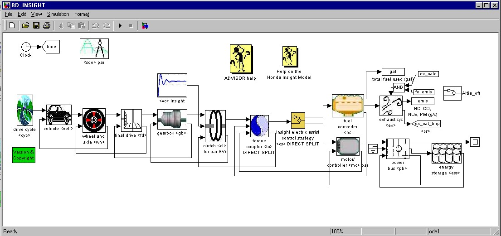
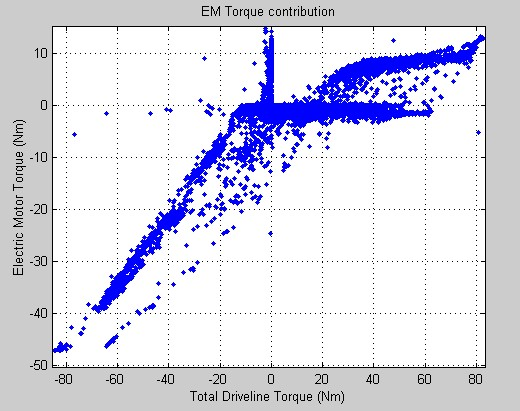
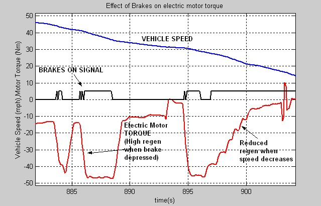
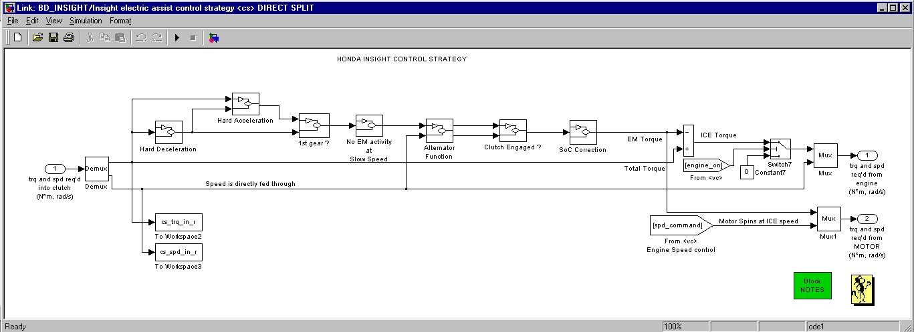
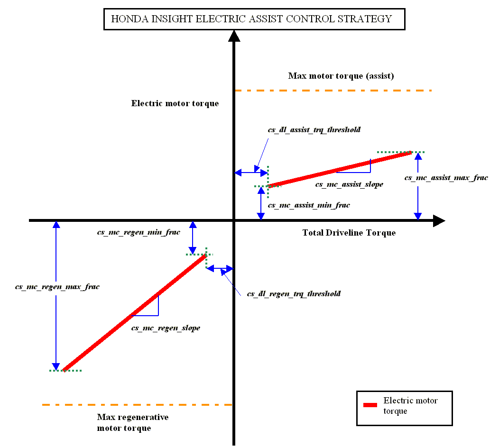
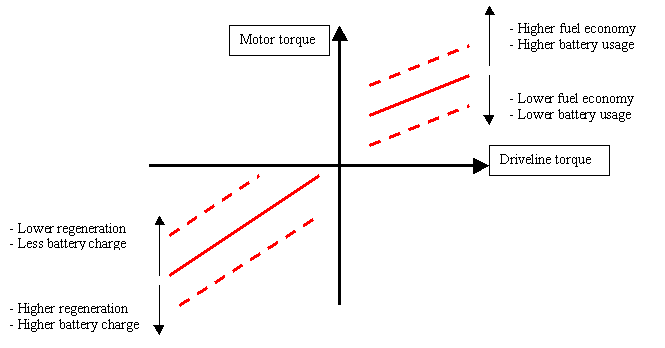
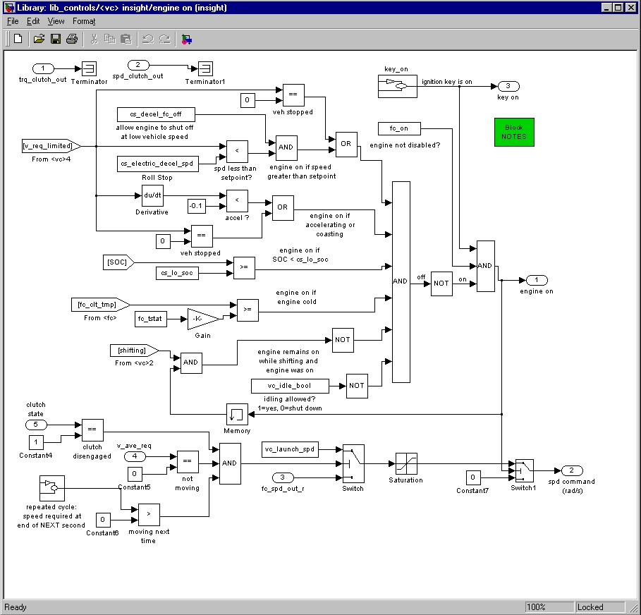

% ADVISOR Help on Honda Insight Model
% 
% 

Help On the Honda Insight Model
===============================

</b>

[Introduction](#intro)\
 [The control strategy](#control)\

-   [Test data - a basis for development](#test)
-   [A scalable control structure](#strategy)
-   [Engine on/off characteristics](#engine)

[Insight data files](#data)\

<u><a name="intro">Introduction</a></u>
---------------------------------------

The Honda Insight model is developed based on test data, provided by the
National Renewable Energy Laboratory, Golden, Colorado, and Argonne
National Laboratory, Illinois. The model aims at describing the control
strategy and the characteristics of the Honda Insight drivetrain.

The following is the ***base*** block diagram used in the simulation of
the Insight. Here, the control block directly commands the torques
required from the 2 power sources namely the IC engine and the electric
motor. \
 

<u><a name="control">Honda Insight Torque Split Control Strategy (scalable)</a></u>
-----------------------------------------------------------------------------------

The Honda Insight Torque Split control strategy is explained below. This
is developed as a result of test data analysis and observation of
component behaviour. This model is scalable, and can be used by the
user, to define his own control strategy.

The control strategy block \<cs\> receives the torque required into the
clutch. Based on this value and the vehicle speed, the electric motor
torque contribution is calculated. The remaining torque is demanded from
the IC engine. The electric motor torque is decided based on the
following criteria:\
\

-   When accelerating, based on the torque and rate of acceleration, the
    electric motor assists the IC Engine, producing around 10 Nm of
    torque.
-   During regeneration,(in reality, when the brake is depressed), the
    electric motor regens a portion of the negative torque availabe to
    the driveline.
-   At low vehicle speeds, typically below 10 mph, the braking is
    primarily only the friction brakes.
-   There is no electric assist in the first gear.

### <a name="test">Test data - a basis</a>

Test data from NREL and ANL were analysed to determine the hybrid
powertrain characteristics. Shown below, are some characteristics, based
on which the model has been developed.

The following graph depicts the contribution of the electric motor
torque based on the total driveline torque. The motor is seen to produce
around 10 Nm of torque during assist. \
\

The Insight IMA does not usually assist the IC Engine during 1st gear.
The following graph depicts this phenomenon from test data: \
 \
 This above plot shows engine rpm, COLOR CODED by gear ratio. (RED-1st
gear, GREEN-2nd gear, BLUE-3rd gear, MAGENTA-4th gear, CYAN-5th gear,
BLACK-unknown gear ratio / slip). The electric motor torque is shown by
BROWN. It is clearly seen that the motor does not assist in first gear.

The Insight electric motor regeneration torque depends on the
application of the brakes. Also, regeneration reduces, if the vehicle
slows down (typically belolw 10 mph). The following plot depicts this
phenomenon from test data. \
\
 \
 The following shows the control strategy block in ADVISOR for the Honda
Insight. \
  \
 The following conditions are incorporated in the above model:\

-   In the above block, the torque request is analysed for acceleration
    (positive torques) or deceleration (negative torques).
-   The 1^st^ gear condition is checked. Also, at slow speeds, the motor
    remains inactive.
-   Since there is no separate alternator in the Insight, the electric
    motor has to function as the alternator. Thus, the electric motor
    generates a small current, based on the power required by the
    accessories. The battery pack supplies the electrical accessory
    loads when the motor assists the engine.
-   The clutch has to be engaged for the electric motor to regenerate
    some of the energy from braking.
-   The battery SoC is checked, since it affects the operation of the
    motor at low and high ranges of SoC.

The electric motor torque is decided based on the above criteria and the
remaining torque is requested from the IC engine. Since the motor and
the IC engine are connected to the same shaft, the controlled IC engine
speed is requested from the electric motor also.

### <a name="strategy">Scalable control strategy</a>

A user can now change the above strategy using input variables, and can
define a new strategy. The scheme of the control strategy is shown
below: \
  \
 The strategy is used to determine the electric motor torque based on
the total driveline torque requested from the 2 power sources (IC engine
and motor). The electric motor torque is calculated based on a
slope-point formulation, as shown above. The following variables are
used:

<table border="1">
<tr>
<th>
Variable

</th>
<th>
Description

</th>
</tr>
<tr>
<td>
cs\_dl\_assist\_trq\_threshold

</td>
<td>
Driveline torque threshold below which the electric machine does not
assist

</td>
</tr>
<tr>
<td>
cs\_mc\_assist\_min\_frac

</td>
<td>
Minimum Torque normally provided by the electric motor when driveline
torque exceeds threshold (as a fraction of max torque)

</td>
</tr>
<tr>
<td>
cs\_mc\_assist\_slope

</td>
<td>
Fraction (slope of the line) of the driveline torque provided by the
electric motor when the driveline torque exceeds threshold

</td>
</tr>
<tr>
<td>
cs\_mc\_assist\_max\_frac

</td>
<td>
Maximum motor torque requested from the motor during assist (as a
fraction of max torque)

</td>
</tr>
<tr>
<td>
cs\_dl\_regen\_trq\_threshold

</td>
<td>
Driveline regenerative torque threshold above which the electric machine
does not regen at low speeds

</td>
</tr>
<tr>
<td>
cs\_mc\_regen\_min\_frac

</td>
<td>
Minimum regen Torque normally provided by the electric motor when
driveline torque exceeds regen threshold (as a fraction of max regen
torque)

</td>
</tr>
<tr>
<td>
cs\_mc\_regen\_slope

</td>
<td>
Fraction (slope of the line) of the negative driveline torque
regenerated by the electric motor when the driveline torque exceeds
threshold

</td>
</tr>
<tr>
<td>
cs\_mc\_regen\_max\_frac

</td>
<td>
Maximum regen motor torque requested from the motor during
regeneration/braking (as a fraction of max regen torque)

</td>
</tr>
<tr>
<td>
cs\_decel\_regen\_threshold

</td>
<td>
Speed during deceleration below which the electric motor does not
regenerate (all emphasis on friction braking)

</tr>
<td>
</table>
The following shows the effect of varying the structure of the
strategy.\
 

### <a name="engine">Engine on-off characteristics</a>

For the Honda Insight, the engine remains on in most cases.  The
following criteria define when the engine is allowed to shut off.  The
engine in the Insight will only shut down if all of the following
conditions are satisfied:

1.  engine is warm (as determined from fc\_clt\_tmp \>=
    vc\_fc\_warm\_frac\*fc\_tstat)
2.  battery SOC is greater than the low SOC set point
3.  vehicle is decelerating or stopped
4.  vehicle speed is less than cs\_electric\_decel\_spd (set at 4.5 m/s
    (10 mph))
5.  vehicle is not shifting gears

A boolean (cs\_decel\_fc\_off) was added to allow for an override of the
engine off condition during low speed decelerations.  When driving the
actual vehicle, this can be done by not putting the vehicle in neutral
during decelerations.  The boolean is defined in the powertrain control
file (PTC\_INSIGHT) and has a default value of 1 (1 allows the engine to
shut off during decel, 0 keeps the engine on during decel).

The engine ON/OFF function for the Insight is shown below. This block is
inside the vehicle controls \<vc\> block.\
 

<h2>
<a name="data">Data Files</a>

</h3>
The following information describes main parameters defined in the
Insight vehicle setup files.

### PTC\_INSIGHT

The Insight’s powertrain control model is based on test results and test
data from NREL and ANL. The HONDA INSIGHT tests provided enough test
data to understand the actual vehicle characteristics and the functions
of the Integrated Motor Assist(IMA).

The following indicate some of the characteristics of the vehicle
control strategy.

The Insight engine’s idle speed 94 rad/s (900 rpm) was taken from from
NREL testing.  Two parameters were added:

> cs\_decel\_fc\_off  allows the engine to be shut off during low speed
> decelerations, and \
> cs\_electric\_decel\_spd = 4.5 m/s (10 mph) defines the vehicle speed
> below which the engine can shut off. \
> vc\_fc\_warm\_tmp\_frac = 0.85 (–) defines the fraction of the coolant
> temperature at which the engine is assumed to be warm and is allowed
> to shut down once started.

The following parameters were removed from the file since they are not
used in the Insight controls:

> cs\_electric\_launch\_spd  - the Insight has no electric launch
> capability \
> cs\_off\_trq\_frac - the Insight engine does not shut down based on
> engine load

The following parameter values have been updated to correspond to actual
vehicle operation:

> cs\_hi\_soc = 0.80 \
> cs\_lo\_soc = 0.20

### VEH\_INSIGHT

The Insight vehicle is defined by the following published parameters:

> veh\_mass = 1000 kg, vehicle mass 2200 lbs with AC, Automotive
> Engineering, Oct ’99 \
> battery\_mass = 20 kg, Automotive News, July 12, 99 \
> engine\_mass = 60 kg, Automotive Engineering, Oct ’99 \
> vehicle\_height = 1.325 m, Automotive Engineering, Oct ’99 \
> vehicle\_width = 1.695 m, Automotive Engineering, Oct ’99 \
> veh\_CD = 0.25, coefficient of aerodynamic drag, Automotive
> Engineering, Oct ’99 \
> veh\_FA = 1.9 m^2^, taken from Car & Driver, Jan ‘00 \
> veh\_wheelbase = 2.4 m, Automotive Engineering, Oct ’99

All other vehicle parameters are from ADVISOR’s small car defaults.

### FC\_INSIGHT

The current data for the 1.0L Honda Insight VTEC-E Engine comes from
actual testing from Argonne National Labs (ANL). Fuel use data is
obtained from their testing. Currently, emissions data has not been
included in the model.

> peak power – 50 kW at 5700 rpm (engine only without IMA) \
> peak torque -  89.5 Nm at 4800 rpm (engine only without IMA)

### EX\_SI\_CC

ADVISOR’s standard close-coupled catalyst is used in the current model. 
The Insight catalyst is a lean-burn, NOx adsorption catalyst that is
close coupled to the engine.  An improved catalyst model will be
incorporated as data becomes available.

### ESS\_NiMH6

The battery pack of the Honda Insight is a Nickel Metal Hydride (NiMH)
pack. Analysis of this battery pack was performed by NREL’s Battery
Thermal Management (BTM) group. Data in the model file is from their
testing of the pack.\
 Key published battery parameters used in the model include:\

> battery type – Nickel metal hydrid (NiMH) \
> cell voltage – 1.2 V \
> total cells – 120 cells (6 cells x 20 modules) \
> total voltage – 144 V \
> rated capacity – 6.5 Ah

### MC\_INSIGHT\_draft

The electric motor model is based on ADVISOR’s MC\_PM49 (Data Source:
Honda R&D Americas).  This is a 49kW motor that has been scaled down to
10kW.  Maximum torque curve has been updated based on published speed
vs. torque for the Insight engine and engine with integrated motor
assist (Honda presentation at UC Davis Ultra-Clean Vehicle Workshop).  
Key operating points that were incorporated into the model include:

> power – 10 kW at 3000 rpm \
> peak power of engine plus integrated motor assist – 54.4 kW at 5700
> rpm \
> peak torque of engine plus integrated motor assist – 123.4 Nm \
> mass – 60 kg

### TX\_5SPD\_SI\_INSIGHT

The Insight transmission model is based on ADVISOR’s TX\_5SPD\_SI and
modified to reflect published Honda Insight gear ratios (data source:
Car & Driver, Jan ’00).  Published gear ratios are shown below:

> Final drive  3.21:1 \
> 1st gear ratio  3.46 \
> 2nd gear ratio   1.75 \
> 3rd gear ratio  1.10 \
> 4th gear ratio  0.86

Note: The gear shifting pattern is based on vehicle speed, according to
test procedures laid out by the EPA. It can be set to ADVISOR’s default
engine load and speed-based strategy, by setting the variable
“tx\_speed\_dep” to 0. (default=1)

### WH\_INSIGHT

The Insight tire model is based on ADVISOR’s WH\_SMCAR model.  The only
update to this file is the wheel radius (0.275 m) which was calculated
from mph/1000rpm data from Car&Driver 1/2000

> Gear I   5.8 mph/1000rpm, 3.46 gear ratio \
> Gear II   11.5 mph/1000rpm, 1.75 gear ratio \
> Gear III   18.3 mph/1000rpm, 1.10 gear ratio \
> Gear IV   23.4 mph/1000rpm, 0.86 gear ratio \
> Gear V   28.3 mph/1000rpm, 0.71 gear ratio

This could also be calculated from Honda Insight wheels P165/65R14 78S
low rolling resistance

> wheel diameter = (2\*165\*.65)+ 14"(25.4)= 0.5701 m \
> wh\_radius = wheel diameter/2 - squish (assumed squish of 10mm)

* * * * *

[Back to ADVISOR Documentation Contents](advisor_doc.html) \
[Back to Chapter 3](advisor_ch3.html)

\
created: 8/18/00 (tm,kk) \
Modified based on new model: 08/07/01 (ar) \
 
