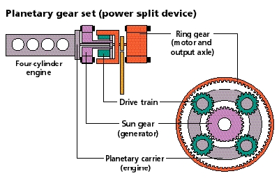

% Prius Model in ADVISOR
% 
% 

Toyota Prius Model in ADVISOR (Japanese Prius ’98)
==================================================

Powertrain Operation
--------------------

A planetary gear is used for transmitting power from/to the motor,
engine, generator, and  front wheels.  The motor is attached to the ring
gear, the engine is attached to the planetary carrier, and the generator
is attached to the sun gear.  The ring gear is coupled directly to the
final drive. \

The speed of the motor is directly proportional to the linear speed of
the vehicle through the radius of the front tires and the final drive
ratio.  The ring gear speed and the motor speed are identical.

The speed of the engine is controlled with the torque on the generator. 
Basically, the generator torque is adjusted so that the engine turns at
the desired speed.

The Engine is limited from 0 to 4000 rpm. \
The motor is limited from a small negative rpm for reverse and up to
6000 rpm (\~103 mph or 165 km/h). \
The generator is limited to +/- 5500 rpm.

Nr=number of teeth on ring gear and Ns=number of teeth on sun gear. \
Nr=78 & Ns=30 for the Japanese version of the Prius. \
The 4 planet gears each have 23 teeth. \
fd\_ratio=3.93 for Prius \
effective\_wheel\_radius = 0.287 m

Engine speed:

> engine\_spd = [ Nr / (Nr + Ns) ] \* motor\_spd + [ Ns / (Nr + Ns) ] \*
> generator\_spd \
>     = 7.2222\*motor\_spd + 0.2778 \* generator\_spd

Motor speed:

> motor\_spd(rpm) = veh\_spd(m/s) / effective\_wheel\_radius(m) \*
> fd\_ratio \* (60 s/min) / (2\*pi (rad/rev)) \
>     =veh\_spd(m/s) \* 130.762 \
>     =veh\_spd(mph) \* 58.4663 \
>     =veh\_spd(km/h) \* 36.3228
> 

> motor\_spd = (1 + Ns/Nr) \* engine\_spd - ( Ns/Nr) \* generator\_spd \
>     =1.3846 \* engine\_spd - 0.3846 \* generator\_spd

Generator speed:

> generator\_spd= (1 + Nr/Ns) \* engine\_spd - ( Nr/Ns) \* motor\_spd \
>     = 3.6 \* engine\_spd - 2.6 \* motor\_spd

Vehicle speed:

> veh\_spd (m/s) = motor\_spd(rpm)\*effective\_wheel\_radius(m)
> /fd\_ratio / (60 s/min) \* (2\*pi (rad/rev)) \
>         = motor\_spd(rpm) / 130.762 \
> veh\_spd(mph) = motor\_spd(rpm) / 58.4663 \
> veh\_spd(km/h) = motor\_spd(rpm) / 36.3228

\
Torque relations:

> Nr\*(Tc-Ic\*wc’) + (Nr + Ns)\*(Tr-Ir\*wr’) = 0 \
> Ns\*(Tc-Ic\*wc’) + (Nr + Ns)\*(Ts-Is\*ws’) = 0
>
> rearranged: \
> Tc = Ic\*wc’ - (Nr + Ns) / Nr \* (Tr - Ir\*wr’) \
> Tc = Ic\*wc’ - (Nr + Ns) / Ns \* (Ts - Is\*ws’)
>
> 

> Ts = Is\*ws’ - Ns / (Nr + Ns) \*(Tc - Ic\*wc’) \
> Tr = Ir\*wr’ - Nr / (Nr + Ns) \* (Tc - Ic\*wc’) \
>  

Control Strategy

> The Basics.: \
> For a given vehicle speed, and a desired output power (determined by
> drive cycle, or driver inputs)
>
> -   determine desired operating point of the engine (based on max
>     efficiency curve)
> -   determine generator speed (which is controlled by generator
>     torque) to have engine at the desired operating point
> -   determine motor torque (power or regen) to provide necessary power
>     to the wheels (or recapture energy from wheels)
> -   batteries provide additional power when needed or take back extra
>     charge provided by generator or motor in regen.
>
> Hybrid control strategy is contained inside the coordinated controller
> block which is inside the vehicle control block

>     Control Inputs: \
>         Vehicle speed –\> through final drive and wheel radius this
> gives us ring (or motor) speed. \
>         Vehicle power request–\> this is the power needed to propel or
> decelerate the vehicle, based on drive cycle which is similar to
> driver request. \
>         Battery state of charge (SOC)–\>this will guide in deciding
> whether to charge or discharge the batteries. \
>   \
>  

>  
