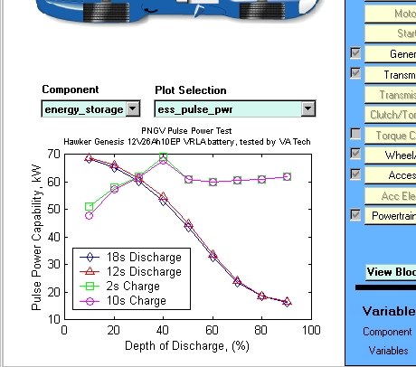

% What's New in ADVISOR
% 
% 

Energy Storage System Pulse Power Plot
======================================

A PNGV Pulse Power plot has been added to the menu of energy storage
system plots in v3.2.  Please refer to the PNGV Battery Test Manual
revision 3.0 for the background and application information for the
Pulse Power profiles.  The pulse power plot is different from the
instantaneous power plot in that it includes a discharge or charge
duration term.  Whereas the instantaneous power plot simply looks at the
voltage and resistance characteristics at a instantaneous point in
time.  It does not represent sustainable power performance. Also note
that the results are plotted with respect to Depth of Discharge (DOD)
rather than State of Charge (SOC).

Performance results are provided for both charge and discharge
operations and for power assist (very little if any battery only
operation) and for dual mode (ability to both load follow and provide
electric only operation) type tests.  The discharge power performance is
determined by iterating on the constant peak power value that can be
drawn from the batteries starting at the low soc setpoint (cs\_lo\_soc)
for the specified duration (power assist = 18s, dual mode = 12s) without
exceeding the minimum voltage limit (ess\_min\_volts).  Likewise, the
charge power performance is determined by iterating on the constant peak
power value that can be absorbed by the batteries starting at the high
soc setpoint (cs\_hi\_soc) for the specified duration (power assist =
2s, dual mode = 10s) without exceeding the maximum voltage limit
(ess\_max\_volts). Figure 1 provides an example of the results plot. 
Note that since the battery model must be run to determine these
results, the generation of the plot may take 30-60s.  Be patient. \
 

Figure 1: Sample PNGV Pulse Power Plot

\

* * * * *

[Return to ADVISOR Documentation](advisor_doc.html)

* * * * *

Last revised: [8/20/01] tm
