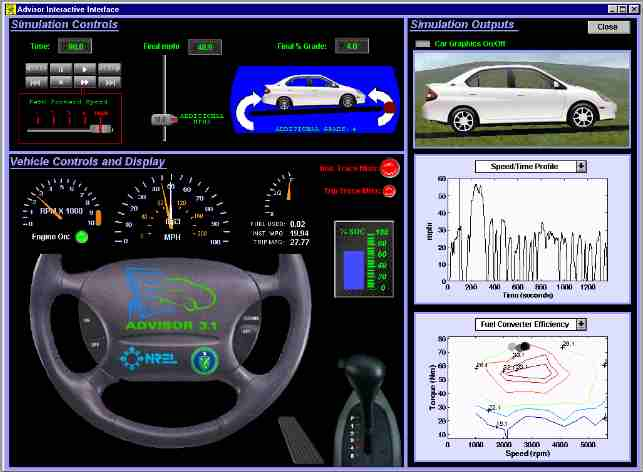
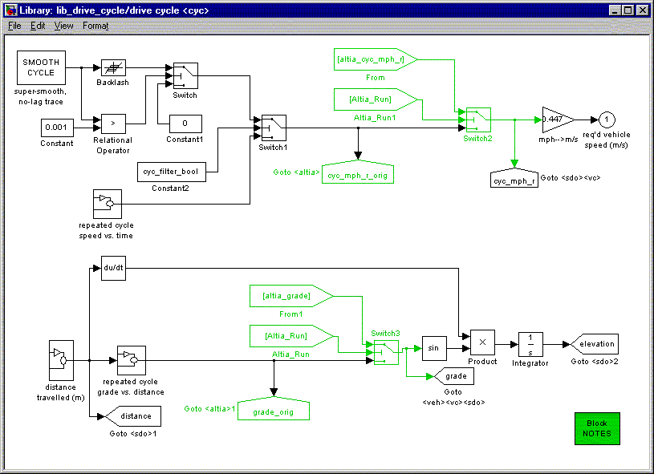
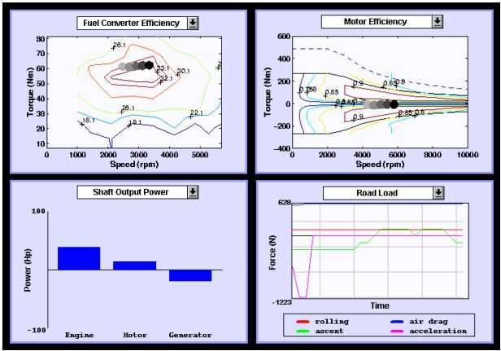

% realtime\_interface
% 
% 

**Real-time Interactive
Interface**

**Overview** \
As seen in Figure 1, the real-time interactive interface layout is
divided into three sections.  The top left section is *Simulation
Controls*.  The bottom left section is *Vehicle Controls and Display*. 
The right section is *Simulation Outputs*. The Real-time Interactive
Interface supports drive cycle inputs and shows dynamic outputs at each
time step of the simulation.  These input and output additions offer
several benefits. \
 \
**Figure 1. Real-time Interactive Interface** \
 

***Simulation Controls*** \
The *Simulation Controls* section has interactive drive cycle inputs. 
Buttons similar to a tape player control the simulation speed.  A slider
adds miles per hour requested (mphr) to the drive cycle at the current
time step of the simulation.  A round red spot on the curved arrow is
used to add or subtract grade to the drive cycle at the current time
step of the simulation.  The speed and grade are implemented into
ADVISOR’s drive\_cycle block diagram as illustrated in Figure 2. Below
the *Simulation Controls* is the *Vehicle Controls and Display*.

 \
**Figure 2. Block Diagram drive\_cycle**

***Vehicle Controls and Display*** \
The *Vehicle Controls and Display* section shows vehicle outputs.  These
outputs are similar to what are found in regular and advanced vehicles. 
They include engine rpm, vehicle miles per hour requested (white needle)
and vehicle miles per hour achieved, fuel used, instant fuel economy and
trip (cumulative) fuel economy, batter state of charge (%SOC), current
gear, and acceleration (proportional to gas pedal displacement).  To the
right of *Vehicle Controls and Display* is *Simulation Outputs*.

***Simulation Outputs*** \
The *Simulation Outputs* section displays vehicle graphics and technical
information.  The selection of technical outputs can be seen in Figure
2.  They include the position of operation on the fuel converter
efficiency map and motor efficiency map, the shaft output power from the
engine, motor, and generator, and the road load components.  The
*Simulation Outputs* section offers some of the greatest benefits. \
 \
**Figure 3. Technical Output Plots** \
 

**Benefits** \
Several benefits are derived from the interactive input and the dynamic
output capability offered by the interface.  The interactive input
allows for quickly testing vehicle behavior response to drive cycle
inputs.  For example, it can show how the fuel economy will respond to
an increase or decrease in grade.  The dynamic output capability goes
beyond some of the static plot capabilities.  It can trace the position
of operation of the fuel converter or motor on efficiency maps.  It can
also help provide the “feel” of driving.  For example, if the vehicle
control strategy results in a vehicle shifting every second, it is a
recognizable problem in the real-time environment.  It is easy to
imagine doing the shifting every time the interface shows it, and
deciding that it shifts more frequently than most drivers would
tolerate.  Conversely, it would be difficult to decide how frequently is
too frequently by looking at a static plot.  These are some of the
advantages that the real-time interactive interface brings to ADVISOR.

Last Revision: 01/16/01:ab
