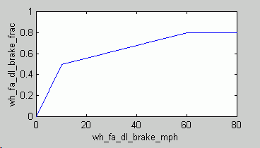
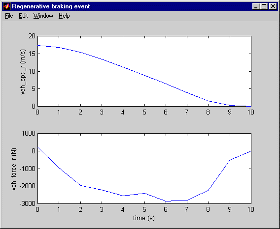
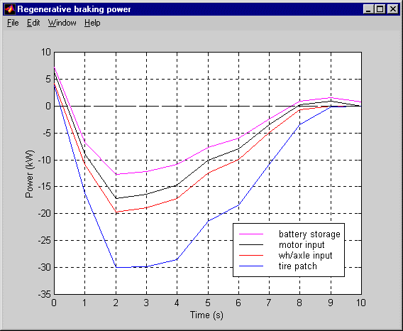
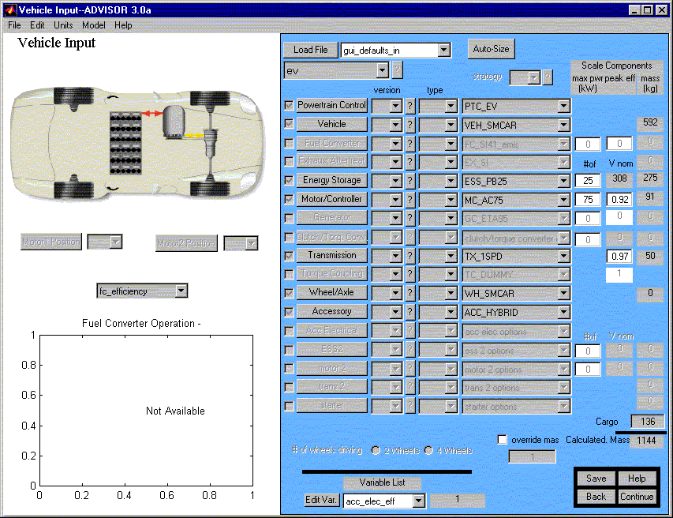
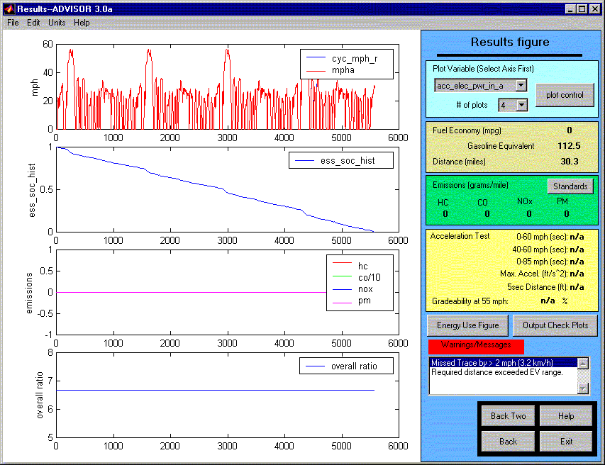

% Regenerative Braking
% 
% 

**Regenerative Braking**

Regenerative braking is the process by which some of the kinetic energy
stored in the vehicle’s translating mass is stored in the vehicle during
decelerations.  In most electric and hybrid electric vehicles on the
road today, this is accomplished by operating the traction motor as a
generator, providing braking torque to the wheels and recharging the
traction batteries.  The energy provided by regenerative braking can
then be used for propulsion or to power vehicle accessories.

*Overview* \
Of the total braking torque required, X% will be performed by the
driveline (motor, engine, trans, etc.) and 100-X% is performed by \
the friction brakes.  X is defined as a function of vehicle speed by the
inputs wh\_fa\_dl\_brake\_frac and wh\_fa\_dl\_brake\_mph.  By default,
driveline braking is used less at low vehicle speeds than at high
speeds.  Then, of the X% performed by the driveline, the available
regenerative braking energy minus any efficiency losses of components
through which the energy must flow (ie., gearbox, motor/controller,
energy storage system) is captured by the energy storage system.

*Example* \
This example shows how ADVISOR’s brake controller block cooperates with
the drivetrain component models to model a regenerative braking event.

In this example, an electric vehicle decelerates from 17.3 m/s (38.8
mph) to 0 in 10 s.  The figure below shows the vehicle speed and
tractive force required.

To achieve the required deceleration, the required tractive force is
negative.  (Note that if the required deceleration were at the same rate
as an unpowered coastdown, the required tractive force would be zero
because aerodynamic drag and rolling resistance would be enough to cause
the required deceleration.)  This indicates an opportunity for
regenerative braking.

The data in the figure above are passed from the [vehicle
\<veh\>](vehicle.html) block to the [wheel and axle
\<wh\>](wheel_axle.html) block which in turn exchanges data with the
[braking control](brake_cont_req.html) block.  This block uses required
speed and required force to determine how much braking will be done by
the front-axle friction brakes, the rear-axle friction brakes, and the
driveline.  The braking done by the driveline is the regenerative
braking.  However, it is important to recognize that not all of the
driveline braking energy can be stored–on its way from the wheel and
axle, through the drivetrain and electric motor, and into the energy
storage system (usually electrochemical batteries), this braking energy
incurs losses.

The figure above shows that the regenerative braking power required into
the wheel/axle assembly is whittled away by component losses as it moves
up the driveline.  At 2 s, the braking power required at the tire patch
(computed as veh\_spd\_r\*veh\_force\_r) is 30 kW, while the braking
power required where the wheel/axle interfaces with the final drive
(computed as wh\_trq\_r\*wh\_spd\_r) is 20 kW.  10 kW is consumed by
axle losses and by the friction brakes.  (The variables
wh\_fa\_fric\_brake\_frac, wh\_fa\_fric\_brake\_mph,
wh\_fa\_dl\_brake\_frac, and wh\_fa\_dl\_brake\_mph control how much
friction and driveline/regen braking is commanded as a function of
speed.  Follow this [link](advisor_appendices.html#Input%20Wheel/Axle)
for more info on these variables.)  About 3 kW is lost in the
transmission and motor, accounting for the difference between the red
and black curves at 2 s.  Another 5 kW or so is lost in the energy
storage system, leaving about 12.5 kW (x 1 s = 12.5 kJ) making it into
storage. \
 

<u>Measuring the effect of regenerative braking</u>

Let’s assume we wish to see how much a particular regenerative braking
scheme improves EV range.

First, we define our vehicle, with the regenerative braking scheme
active.  (The relevant data is the WH\_\*.m input data file.)

Then, we run the vehicle on CYC\_UDDS, using default Simulation Setup
parameters except for ‘\# of cycles,’ which we set at 5.  This results
in a distance of 30.3 miles, as seen below.

We now hit the ‘Back Two’ button to again see the Vehicle Definition
screen.  At the MATLAB command window, we enter
‘wh\_fa\_dl\_brake\_frac,’ and MATLAB responds:

wh\_fa\_dl\_brake\_frac =

         0         0    0.5000    0.8000    0.8000

To remove all regenerative braking, we enter

wh\_fa\_dl\_brake\_frac=[0 0 0 0 0];

We rerun the analysis using 5 x CYC\_UDDS, and find the new range to be
26.8 miles. \

* * * * *

[Back to Chapter 3](advisor_ch3.html)

Last Revised: 7/20/00:AB
