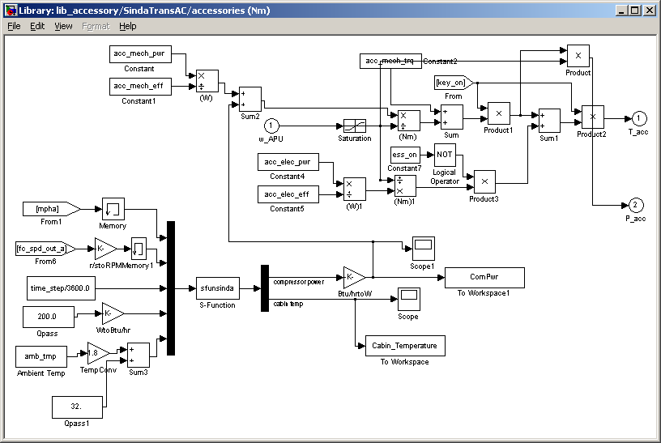

% Sinda
% 
% 

Sinda/Fluint Co-simulation
==========================

1.  Introduction
    ------------

2.  Current Status
    --------------

3.  Usage
    -----

 

  ----------------------------------------------------------------------------------------------------------------------------------------------------------------------------------------------------------------------------------------------------------------------------------------------------------------------------------------
  **Figure 1. SindaTransAC model in lib\_accessory.mdl**\
   <small>Note the s-function (sfunsinda.m located in \<ADVISOR main directory\>/models/Sindafluint) that passes variables back and forth between ADVISOR and Sinda/Fluint. Users interested in integrating their own Sinda/Fluint models in a co-simulation should reference this library block and the sfunsinda.m s-function.</small>

  
  ----------------------------------------------------------------------------------------------------------------------------------------------------------------------------------------------------------------------------------------------------------------------------------------------------------------------------------------

References
----------

1.  Hendricks, T. J. (2001). Vehicle Transient Air Conditioning
    Analysis: Model Development & System Optimization Investigations. 43
    pp.; NICH Report No. TP-540-30715. (available
    [here](http://www.nrel.gov/publications/))

* * * * *

[Return to Documentation](advisor_doc.html)

* * * * *

Created: 29-April-2002 [mpo]\
 Last Modified: NA
