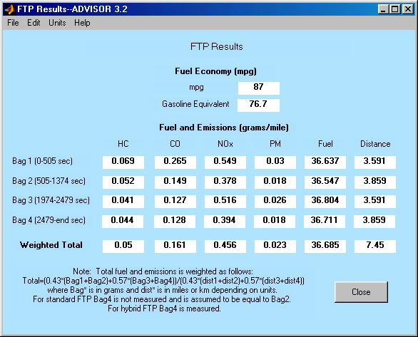

% City Hwy Test Procedure
% 
% 

**TEST\_FTP and TEST\_FTP\_HYBRID**

* * * * *

**Test Procedure Description** \
The FTP and FTP\_Hybrid test procedures in ADVISOR are provided to allow
the user to simulate the Federal Test Procedure (FTP-75) drive cycle
used by the Environmental Protection Agency (EPA) to certify the fuel
economy and emissions performance of consumer vehicles. This test sets
the initial conditions to represent a cold start and then simulates an
FTP-75 cycle.  An FTP-75 cycle is composed of one UDDS cycle followed by
a 10 minute soak in which the key is turned off.  This soak is then
followed by the first 505s of an second UDDS cycle.  For the FTP\_Hybrid
test procedure, the 10 minute soak is followed by a complete second UDDS
cycle.  The fuel economy and results of the drive cycle are then
partitioned into “bags”.  The bag results are then weighted to provide
the bag-weighted results.  The results window displays both the
individual bag results and the bag-weighted results.  The bag-weighting
equation is provided in the notes in the results figure.

The FTP\_hybrid test was introduced in ADVISOR v3.2 to account for the
variability in operating charactericts associated with hybrids.  When
the FTP-75 test was first created, based on the performance of
conventional vehicles, both the 4th bag and the 2nd bag were assumed to
provide similar results.  This assumption is valid for conventional and
most parallel hybrid vehicles. However, for series hybrids and hybrids
that use a significant portion of the energy storage system capacity,
the assumption may not be valid.  Due to SOC balancing requirements the
vehicle operation can be significantly different when comparing a 3 bag
test vs. a 4 bag test. \
 

* * * * *

[Return to Chapter 3](../documentation/advisor_ch3.html#3.3)

last revised: 8/19/01(tm)
